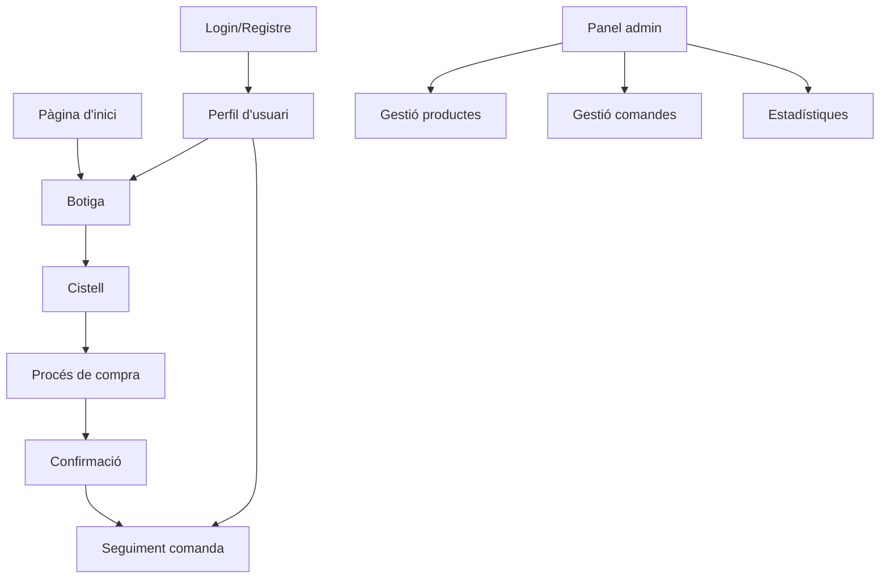

## 1. Visió general del producte

Eco-store és una botiga cooperativa online que permet als socis comprar productes ecològics i locals de manera sostenible.
La plataforma facilita la gestió d'una cooperativa de consum amb diferents nivells d'usuaris i funcionalitats adaptades a les necessitats cooperatives.

El producte resol la necessitat de les cooperatives de consum de tenir una plataforma digital per gestionar compres, socis i productes de manera eficient, promovent el consum responsable i fomentant la comunitat.

## 2. Funcionalitats principals

### 2.1 Tipus d'usuaris

| Tipus d'usuari     | Mètode de registre            | Permisos principals                                  |
| ------------------ | ----------------------------- | ---------------------------------------------------- |
| Soci client        | Registre amb codi de soci     | Comprar productes, veure historial, gestionar perfil |
| Administrador      | Només per superadministradors | Gestionar productes, comandes, socis i estadístiques |
| Superadministrador | Creat per defecte             | Control total del sistema                            |
| Visitant nou       | Sense registre                | Navegar productes, veure informació bàsica           |

### 2.2 Mòduls de funcionalitat

El projecte eco-store inclou les següents pàgines principals:

1. **Pàgina d'inici**: Presentació de la cooperativa, productes destacats, navegació principal
2. **Botiga**: Catàleg de productes, filtres per categories, cerca avançada
3. **Cistell de compra**: Gestió de productes seleccionats, càlcul de totals
4. **Procés de compra**: Formulari d'enviament, mètodes de pagament, confirmació
5. **Perfil d'usuari**: Dades personals, històrial de comandes, preferències
6. **Gestió de comandes**: Visualització d'estat, cancel·lació, seguiment
7. **Sistema de valors**: Puntuacions i comentaris de productes
8. **Centre d'ajuda**: Xat amb IA, formulari de contacte, FAQ
9. **Panel d'administració**: Gestió de productes, usuaris, comandes i estadístiques

### 2.3 Detalls de pàgines

| Nom de pàgina      | Nom del mòdul           | Descripció de la funcionalitat                                            |
| ------------------ | ----------------------- | ------------------------------------------------------------------------- |
| Pàgina d'inici     | Secció hero             | Mostra imatges rotatives de productes locals i missió cooperativa         |
| Pàgina d'inici     | Navegació principal     | Menú amb accés a botiga, perfil, ajuda i administració                    |
| Pàgina d'inici     | Productes destacats     | Mostra 6-9 productes populars amb imatge i preu                           |
| Botiga             | Llistat de productes    | Grid responsive amb imatge, nom, preu i botó d'afegir                     |
| Botiga             | Filtres i cerca         | Filtres per categoria, preu, disponibilitat i barra de cerca              |
| Botiga             | Detall de producte      | Imatges ampliades, descripció, stock disponible, valoracions              |
| Cistell            | Llista de productes     | Mostra productes afegits amb quantitat editable i preu total              |
| Cistell            | Accions                 | Botons per actualitzar quantitats, eliminar productes i procedir a compra |
| Procés de compra   | Formulari d'enviament   | Camps per adreça, horari preferit i instruccions especials                |
| Procés de compra   | Pagament                | Opcions de pagament (targeta, transferència)                              |
| Procés de compra   | Confirmació             | Resum de comanda amb número de referència i email de confirmació          |
| Login/Registre     | Formulari d'entrada     | Email i contrasenya amb opció de recuperació de contrasenya               |
| Login/Registre     | Registre de nous socis  | Formulari amb dades personals i codi de soci si escau                     |
| Perfil d'usuari    | Dades personals         | Edició de nom, email, adreça i preferències de contacte                   |
| Perfil d'usuari    | Historial de comandes   | Llista cronològica amb estat i detalls de cada comanda                    |
| Gestió de comandes | Visualització d'estat   | Timeline amb estats (pendent, preparant, enviat, lliurat)                 |
| Gestió de comandes | Cancel·lació            | Opció per cancel·lar comandes en estat "pendent"                          |
| Valoracions        | Sistema de puntuació    | Estrelles de 1-5 amb possibilitat d'escriure comentari                    |
| Valoracions        | Llistat de comentaris   | Mostra valoracions d'altres usuaris amb data i nom                        |
| Notificacions      | Confirmació de comanda  | Email automàtic amb detalls de la compra                                  |
| Notificacions      | Actualitzacions d'estat | Notificacions quan la comanda canvia d'estat                              |
| Descomptes         | Codis promocionals      | Camp per aplicar codis de descompte durant la compra                      |
| Descomptes         | Descomptes per volum    | Descomptes automàtics per compres superiors a cert import                 |
| Ajuda              | Xat amb IA              | Assistència automàtica per preguntes freqüents                            |
| Ajuda              | Formulari de contacte   | Enviament de consultes al servei d'atenció                                |
| UI                 | Canvi de tema           | Opció entre tema clar i fosc                                              |
| UI                 | Multi idioma            | Català i castellà com a mínim                                             |
| Legal              | Avís legal              | Informació sobre condicions d'ús                                          |
| Legal              | Política de privadesa   | Detall sobre tractament de dades                                          |
| Legal              | Política de cookies     | Gestió de consentiment de cookies                                         |
| Administració      | Dashboard               | Vista general amb estadístiques de vendes i usuaris                       |
| Administració      | Gestió de productes     | CRUD complet de productes amb imatges i categories                        |
| Administració      | Gestió de comandes      | Visualització i gestió de totes les comandes                              |
| Administració      | Gestió d'usuaris        | Llista de socis amb opcions d'edició i estat                              |

## 3. Fluxos principals

### Flux de compra per a socis registrats:

1. L'usuari accedeix a la botiga i navega pels productes
2. Afegeix productes al cistell amb la quantitat desitjada
3. Quan està llest, accedeix al cistell per revisar la compra
4. Inicia el procés de compra amb les seves dades pre-omplertes
5. Selecciona mètode de pagament i horari d'entrega
6. Rep confirmació per email i pot fer seguiment de la comanda

### Flux de registre per a nous socis:

1. El visitant accedeix a la opció de registre
2. Omple el formulari amb dades personals
3. Si té codi de soci, l'introdueix per accés immediat
4. Rep confirmació per email i pot accedir a totes les funcionalitats

### Flux d'administració:

1. L'administrador accedeix al panel d'administració
2. Pot gestionar productes (alta, modificació, baixa)
3. Pot veure i gestionar totes les comandes
4. Pot accedir a estadístiques de vendes i comportament

## 4. Disseny d'interfície

### 4.1 Estil de disseny

- **Colors principals**: Verd #2ECC71 (sostenibilitat), Blanc #FFFFFF (netedat), Gris #34495E (text)
- **Colors secundaris**: Taronja #E67E22 (accents), Groc #F1C40F (promocions)
- **Estil de botons**: Arrodonits amb ombra suau, colors vius per accions principals
- **Tipografia**: Font sans-serif moderna (Inter o Roboto), mides 16px cos, 24px títols
- **Layout**: Basat en targetes (cards) amb espais generosos i grid responsive
- **Icones**: Estil lineal minimalista, preferiblement amb emoji per proximitat

### 4.2 Visió general de pàgines

| Nom de pàgina  | Nom del mòdul       | Elements d'UI                                                        |
| -------------- | ------------------- | -------------------------------------------------------------------- |
| Pàgina d'inici | Hero section        | Imatge de fons amb superposició de text, botó CTA prominent          |
| Pàgina d'inici | Productes destacats | Grid de 3 columnes, targetes amb imatge 16:9, preu destacat          |
| Botiga         | Llistat productes   | Grid adaptable (4 cols desktop, 2 tablet, 1 mòbil), filtres laterals |
| Cistell        | Resum compra        | Llista scrollable, footer fix amb total i botó checkout              |
| Procés compra  | Formularis          | Steps visual amb progress bar, formularis per seccions               |
| Perfil usuari  | Dashboard           | Layout amb sidebar navegació, contenidor principal per dades         |
| Admin          | Dashboard           | Cards amb mètriques clau, taules amb accions inline                  |

### 4.3 Responsivitat

- **Mobile-first**: Disseny optimitzat per mòbils amb touch-friendly
- **Breakpoints**: 320px (mòbil), 768px (tablet), 1024px (desktop)
- **Adaptació**: Menú hamburguesa mòbil, filtres col·lapsables, taules amb scroll.
- **Touch optimitzat**: Botons mínim 44px, gestes de swipe on sigui útil
