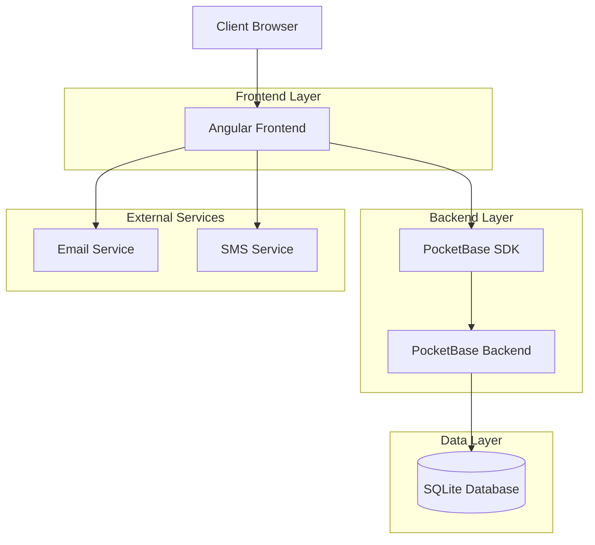
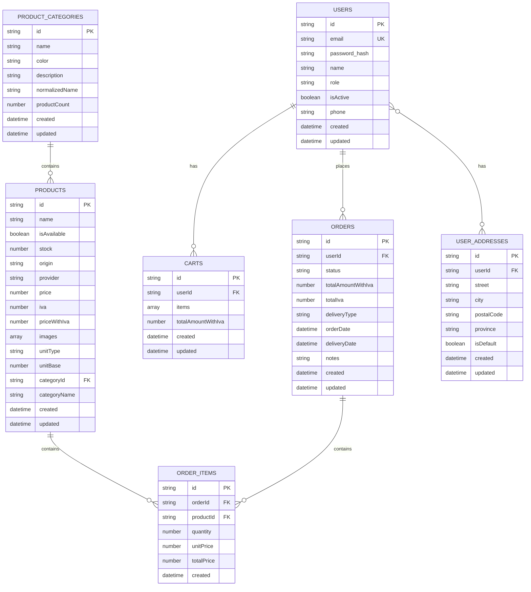
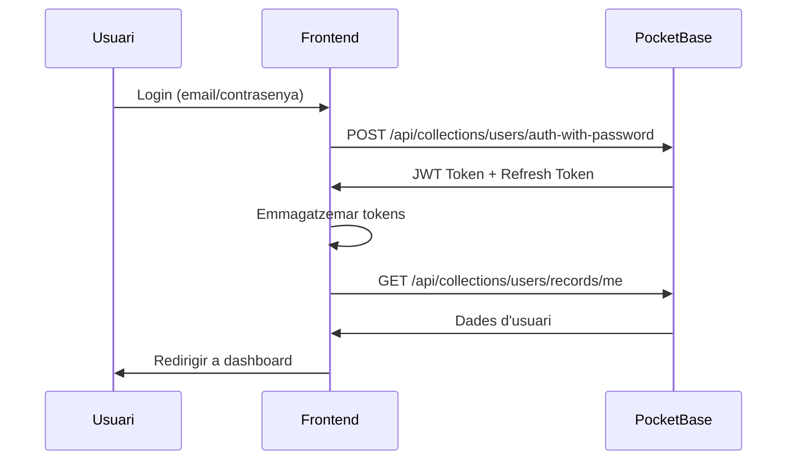

# Document d'Arquitectura Tècnica - Eco-Store

## 1. Arquitectura Global



## 2. Stack Tecnològic

### Frontend

- **Framework**: Angular 18+ amb Zoneless Change Detection
- **Build Tool**: Vite amb Angular CLI
- **Estils**: SCSS amb Tailwind CSS i Angular Material
- **Gestió d'Estat**: Angular Signals i RxJS
- **Routing**: Angular Router amb View Transitions
- **Formularis**: Angular Reactive Forms + Formly

### Backend

- **Backend-as-a-Service**: PocketBase (Go + SQLite)
- **SDK**: PocketBase JavaScript SDK
- **Base de Dades**: SQLite embebido
- **Autenticació**: JWT amb refresh tokens
- **Fitxers**: Emmagatzematge local amb CDN

### Desenvolupament

- **Monorepo**: Nx Workspace
- **Testing**: Jest (unitari) + Cypress (e2e)
- **Linting**: ESLint + Prettier
- **CI/CD**: GitHub Actions
- **Hosting**: Firebase Hosting / VPS

## 3. Estructura de Dades

### Models Principals



## 4. Sistema d'Autenticació

### Tipus d'Usuaris

| Rol           | Permisos             | Descripció            |
| ------------- | -------------------- | --------------------- |
| `guest`       | Lectura productes    | Usuaris no registrats |
| `member`      | Compra, perfil propi | Socis registrats      |
| `admin`       | Gestió completa      | Administradors        |
| `super_admin` | Sistema complet      | Super administradors  |

### Flow d'Autenticació



### Seguretat

- **Password Hashing**: bcrypt amb salt
- **JWT**: RS256 amb expiració 15 minuts
- **Refresh Token**: 7 dies amb rotació
- **Rate Limiting**: 5 intents per minut
- **CORS**: Domini específic
- **HTTPS**: Certificats SSL/TLS

## 5. API i Backend

### Endpoints Principals

#### Autenticació

```http
POST /api/collections/users/auth-with-password
POST /api/collections/users/auth-refresh
POST /api/collections/users/request-password-reset
POST /api/collections/users/confirm-password-reset
```

#### Productes

```http
GET /api/collections/products/records
GET /api/collections/products/records/:id
GET /api/collections/productCategories/records
```

#### Comandes (Autenticat)

```http
GET /api/collections/orders/records
POST /api/collections/orders/records
GET /api/collections/orders/records/:id
PATCH /api/collections/orders/records/:id
```

### Exemple de Resposta API

```json
{
  "page": 1,
  "perPage": 30,
  "totalItems": 150,
  "totalPages": 5,
  "items": [
    {
      "id": "abc123def456ghi",
      "name": "Tomàquets ecològics",
      "isAvailable": true,
      "stock": 50,
      "origin": "Catalunya",
      "provider": "EcoFarms S.L.",
      "price": 3.5,
      "iva": 0.21,
      "priceWithIva": 4.24,
      "images": ["tomatoes_1.jpg", "tomatoes_2.jpg"],
      "unitType": "weight",
      "unitBase": 1000,
      "categoryId": "cat_vegetables",
      "categoryName": "Verdures",
      "created": "2024-01-15T10:30:00Z",
      "updated": "2024-01-15T10:30:00Z"
    }
  ]
}
```

## 6. Estil i Disseny

### Sistema de Temes

- **Primary**: #1b8c4a (verd ecològic)
- **Secondary**: #3d7e5f (verd clar)
- **Tertiary**: #f1962b (taronja)
- **Error**: #ba1a1a (vermell)
- **Surface**: #f9fcf7 (fons clar)

### Tipografia

- **Font Principal**: Manrope (Google Fonts)
- **Pesos**: 400 (regular), 500 (medium), 700 (bold)
- **Mides**: 0.75rem - 3.562rem

### Components Angular Material

- **Buttons**: Mat-raised-button amb border-radius 8px
- **Cards**: Mat-card amb elevation i sombra suau
- **Forms**: Mat-form-field amb outline appearance
- **Tables**: Mat-table amb sorting i pagination

### Responsive Design

- **Breakpoints**: Tailwind CSS (sm: 640px, md: 768px, lg: 1024px, xl: 1280px)
- **Mobile-first**: Disseny optimitzat per mòbil
- **Touch-friendly**: Botons mínim 44px

## 7. Gestió d'Estat

### Angular Signals

```typescript
// Product state
export const productsSignal = signal<Product[]>([]);
export const selectedProductSignal = signal<Product | null>(null);
export const isLoadingSignal = signal<boolean>(false);

// Cart state
export const cartSignal = signal<Cart>({ items: [], totalAmountWithIva: 0 });

// User state
export const currentUserSignal = signal<User | null>(null);
export const isAuthenticatedSignal = computed(() => currentUserSignal() !== null);
```

### Serveis amb RxJS

```typescript
@Injectable()
export class ProductService {
  private productsSubject = new BehaviorSubject<Product[]>([]);
  products$ = this.productsSubject.asObservable();

  private loadingSubject = new BehaviorSubject<boolean>(false);
  loading$ = this.loadingSubject.asObservable();

  async loadProducts(filters?: ProductFilters): Promise<void> {
    this.loadingSubject.next(true);
    try {
      const products = await this.pbService.getProducts(filters);
      this.productsSubject.next(products);
    } finally {
      this.loadingSubject.next(false);
    }
  }
}
```

## 8. Sistema de Notificacions

### Email Service

- **Provider**: SendGrid / Nodemailer
- **Templates**: Handlebars amb variables dinàmiques
- **Events**: Registre, comanda confirmada, estat canviat

```typescript
interface EmailTemplate {
  to: string;
  subject: string;
  template: string;
  context: Record<string, any>;
}

class EmailService {
  async sendOrderConfirmation(order: Order, user: User): Promise<void> {
    const template: EmailTemplate = {
      to: user.email,
      subject: `Comanda #${order.id} confirmada`,
      template: 'order-confirmation',
      context: {
        userName: user.name,
        orderId: order.id,
        totalAmountWithIva: order.totalAmountWithIva,
        items: order.items,
      },
    };

    await this.sendEmail(template);
  }
}
```

### SMS Service

- **Provider**: Twilio
- **Use cases**: Codi verificació, estat comanda urgent
- **Rate limiting**: Màxim 3 SMS per hora per usuari

## 9. Seguretat

### Frontend

- **XSS Prevention**: Angular built-in sanitization
- **CSRF Protection**: Angular HttpClientXsrfModule
- **Content Security Policy**: Headers CSP estrictes
- **Input Validation**: Validació client i servidor

### Backend (PocketBase)

- **SQL Injection**: Prepared statements per defecte
- **File Upload**: Validació tipus i mida
- **Rate Limiting**: Per endpoint i IP
- **Audit Logs**: Totes les accions crítiques

### Dades Sensibles

- **Encriptació**: AES-256 per dades bancàries
- **Token Storage**: LocalStorage amb encriptació
- **HTTPS**: Certificat SSL amb HSTS
- **GDPR**: Compliment normativa europea

## 10. Desplegament

### Estratègia de Branques

```
main (production)
├── develop (staging)
├── feature/nom-caracteristica
├── bugfix/nom-error
└── hotfix/correccio-urgent
```

### Pipeline CI/CD

```yaml
name: Deploy Eco-Store

on:
  push:
    branches: [main, develop]

jobs:
  test:
    runs-on: ubuntu-latest
    steps:
      - uses: actions/checkout@v3
      - uses: actions/setup-node@v3
        with:
          node-version: 22
      - run: npm ci
      - run: npm run test:eco-store
      - run: npm run lint:eco-store

  build:
    needs: test
    runs-on: ubuntu-latest
    steps:
      - uses: actions/checkout@v3
      - run: npm run build:eco-store:production

  deploy:
    needs: build
    runs-on: ubuntu-latest
    steps:
      - name: Deploy to PocketHost
        run: |
          # El desplegament a PocketHost es fa automàticament
          # quan es fa push a la branca main amb la configuració correcta
          echo "Desplegant a PocketHost..."
          # Configuració de PocketHost es fa al panell de control
```

### Hosting

- **Frontend**: PocketHost (servidor allotjat per PocketBase)
- **Backend**: PocketHost (PocketBase com a servei)
- **Base de Dades**: SQLite amb backup automàtic inclòs a PocketHost
- **Monitoring**: Google Analytics + Sentry
- **CDN**: PocketHost proporciona CDN global per a assets

### Configuració de Producció

```typescript
// environment.prod.ts
export const environment = {
  production: true,
  pbUrl: 'https://api.eco-store.cat',
  pbApiUrl: 'https://api.eco-store.cat/api',
  emailServiceUrl: 'https://api.eco-store.cat/email',
  sentryDsn: 'https://xxx@sentry.io/xxx',
  gaTrackingId: 'G-XXXXXXXXXX',
};
```

## 11. Monitoratge i Manteniment

### Mètriques Clau

- **Performance**: Temps de carga < 3 segons
- **Disponibilitat**: 99.9% uptime
- **Errors**: < 0.1% taxa d'error
- **SEO**: Puntuació Lighthouse > 90

### Logs i Alertes

- **Aplicació**: Sentry per error tracking
- **Servidor**: Logs estructurats amb Winston
- **Base de Dades**: Queries lentes i errors
- **Monitoratge**: Uptime Robot + Pingdom

### Manteniment

- **Updates**: Dependabot per actualitzacions automàtiques
- **Backup**: Diari automàtic amb retenció 30 dies
- **Neteja**: Eliminar dades antigues mensualment
- **Optimització**: Anàlisi de queries i índexs
