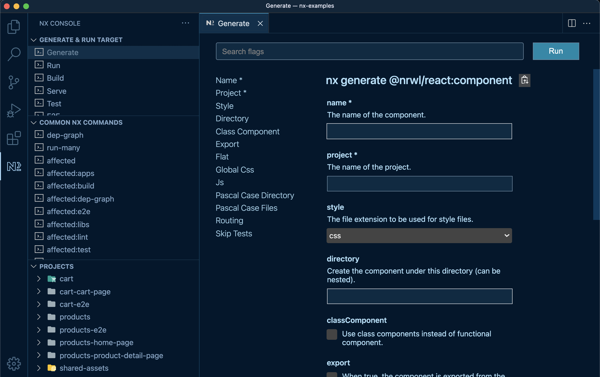

# Plastikspace

<div align="center">
  
  <p>A personal multi-repository to do tests and experiments with Nx and Angular. </p>
</div>

[](https://github.com/plastikaweb/plastikspace/actions/workflows/ci.yml)

[](https://cloud.cypress.io/projects/b47wpf/runs)


[](http://commitizen.github.io/cz-cli/)
[](https://github.com/facebook/jest)


This project was generated using [Nx](https://nx.dev).

## Install repo locally

> Please make sure you have [rimraf](https://www.npmjs.com/package/rimraf) package installed globally.

```bash
  npm install -g rimraf
```

- clone repo: `git clone git@github.com:plastikaweb/plastikspace.git`.
- run `yarn install:local`.
- **to serve it locally in development run `yarn <apn-name>:serve`**.

## Commands & generators

Some of the more usual generators and scripts:

- Run `ng g @nx/angular:app my-app` to generate an application.
- Run `ng g @nx/angular:lib my-lib` to generate a library.
- Run `ng serve my-app` for a dev server. Navigate to localhost:xxxx. The app will automatically reload if you change any of the source files.
- Run `ng g component my-component --project=my-app` to generate a new component.
- Run `ng build my-app` to build the project. The build artifacts will be stored in the `dist/` directory. Use the `--prod` flag for a production build.
- Run `yarn test` to execute the unit tests via [Jest](https://jestjs.io).
- Run `yarn affected:test` to execute the unit tests affected by a change.
- Run `yarn dep-graph` to see a diagram of the dependencies of your projects.

To see a full list of available scripts see **package.json file > scripts**.

> It is strongly recommended to use [Nx Console for VSCode](https://marketplace.visualstudio.com/items?itemName=nrwl.angular-console) in order to run Nx generators.
> 

## Workflow configuration and conventions

- [NX architecture](documentation/nx-architecture.md)
- [Code style](documentation/code-style.md)
- [Accessibility](documentation/accessibility.md)
- [Git commit conventions](documentation/commit-conventions.md)
- [Git Flow and CI/CD](documentation/git-flow.md)
- [CSS Styling](documentation/css-styles.md)

## Available applications

- [nasa-images](apps/nasa-images/README.md)
- [experimental](apps/experimental/README.md)
- [llecoop](apps/llecoop/README.md)
- [llecoop-firebase](apps/llecoop-firebase/README.md)
- [llecoop-triggers](apps/llecoop-triggers/README.md)

## Available libraries

This is a list of all the global shared libraries. It is very likely that other libraries exist but are related to a single project, so they are listed in the concrete project domain.

### Core

- [core-util-environments](libs/core/util/environments/README.md)
- [core-util-assets](libs/core/util/assets/README.md)
- [core-util-api](libs/core/util/api/README.md)
- [core-util-cypress-commands](libs/core/util/cypress-commands/README.md)
- [core-styles-util-tailwind-preset](libs/core/styles/util/tailwind-preset/README.md)
- [core-styles-util-material](libs/core/styles/util/material/README.md)
- [core-ng-entry-html-util](libs/core/ng-entry-html/util/README.md)
- [core-router-data-access](libs/core/router/data-access//README.md)
- [core-entities](libs/core/entities/README.md)

#### CMS-layout

- [core-cms-layout-feature](libs/core/cms-layout/feature/README.md)
- [core-cms-layout-data-access](libs/core/cms-layout/data-access/README.md)
- [core-cms-layout-entities](libs/core/cms-layout/entities/README.md)

### Shared

#### Auth

- [shared-auth-feature](libs/shared/auth/feature/README.md)
- [shared-auth-firebase-data-access](libs/shared/auth/firebase/data-access/README.md)
- [shared-auth-login-feature](libs/shared/auth/login/feature/README.md)
- [shared-auth-register-feature](libs/shared/auth/register/feature/README.md)
- [shared-auth-request-password-feature](libs/shared/auth/request-password/feature/README.md)

#### Notification

- [shared-notification-entities](libs/shared/notification/entities/README.md)
- [shared-notification-data-access](libs/shared/notification/data-access/README.md)
- [shared-notification-ui-mat-snackbar](libs/shared/notification/ui/mat-snackbar/README.md)

#### Button

- [shared-button-entities](libs/shared/button/entities/README.md)
- [shared-button-ui](libs/shared/button/ui/README.md)

#### Table

- [shared-table-entities](libs/shared/table/entities/README.md)
- [shared-table-ui](libs/shared/table/ui/README.md)

#### Form

- [shared-form-feature](libs/shared/form/feature/README.md)

##### UI

- [shared-form-ui-year-picker/shared-form-ui-year-picker-type](libs/shared/form/ui/year-picker/README.md)
- [shared-textarea-with-counter](libs/shared/form/ui/textarea-with-counter/README.md)
- [shared-input-color-picker](libs/shared/form/ui/input-color-picker/README.md)
- [shared-input-password-with-visibility](libs/shared/form/ui/input-password-with-visibility/README.md)
- [shared-input-table](libs/shared/form/ui/table/README.md)
- [shared-input-search-util](libs/shared/form/ui/input-search-util/README.md)

##### Util

- [shared-form-util](libs/shared/form/util/README.md)

#### Activity

- [shared-activity-ui](libs/shared/activity/ui/README.md)
- [shared-activity-data-access](libs/shared/activity/data-access/README.md)

#### Confirm

- [shared-confirm](libs/shared/confirm/data-access/README.md)

#### Layouts

- [table-with-filtering](libs/core/table-with-filtering/README.md)
- [detail-item-form](libs/core/detail-item-form/README.md)

#### Util

- [shared-util-entities](libs/shared/util/entities/README.md)
- [shared-util-objects](libs/shared/util/objects/README.md)
- [shared-util-return-as-observable-pipe](libs/shared/util/return-as-observable-pipe/README.md)
- [shared-util-formatters](libs/shared/util/formatters/README.md)
- [shared-util-dynamic-bg-color](libs/shared/util/dynamic-bg-color/README.md)
- [shared-util-latinize](libs/shared/util/latinize/README.md)

## Contact

Carlos Matheu Armengol


[](https://www.linkedin.com/in/plastikaweb)
[](https://stackblitz.com/@plastikaweb)

> [info@plastikaweb.org](mailto:<info@plastikaweb.com>) > [www.plastikaweb.com](https://www.plastikaweb.com)

## Useful links

- [Nx Angular Documentation](https://nx.dev/angular)
