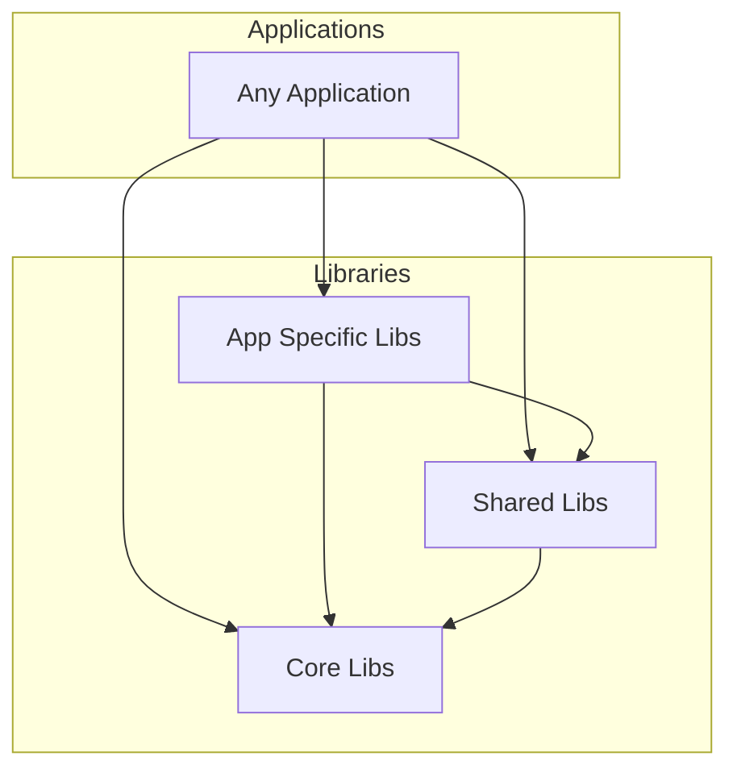

# Plastikspace

<div align="center">
  
</div>

## Modern Angular Experimentation Lab

### A personal multi-repository to explore Nx, Angular 21, and cutting-edge web technologies

<div align="center">

[](https://github.com/plastikaweb/plastikspace/actions/workflows/ci.yml)

[](https://deepwiki.com/plastikaweb/plastikspace)


[](http://commitizen.github.io/cz-cli/)
[](https://github.com/facebook/jest)


</div>

---

## 🚀 Tech Stack Highlights

- **Framework:** [Angular 21](https://angular.io/) (Standalone Components, Signals, Hydration)
- **Monorepo Tooling:** [Nx](https://nx.dev/) (Project Graph, Distributed Task Execution)
- **Styling:** [Tailwind CSS 4](https://tailwindcss.com/)
- **State Management:** [NgRx Signal Store](https://ngrx.io/guide/signals/signal-store)
- **Backend Integrations:**
  - **Firebase:** Real-time DB, Auth, and Cloud Functions (llecoop)
  - **PocketBase:** Lightweight Go backend (eco-store)
  - **GraphQL:** Apollo Client integration (plastikaweb)
- **Quality Assurance:** Jest, Cypress, Pa11y (Accessibility), ESLint

---

## 🏗️ Architecture

This project follows a **Domain-Driven Design (DDD)** approach within an Nx workspace.


```mermaid
graph TD
    subgraph Applications
        Apps[Any Application]
    end

    subgraph Libraries
        direction TB
        AppSpecific[App Specific Libs]
        Shared[Shared Libs]
        Core[Core Libs]
    end

    Apps --> AppSpecific
    Apps --> Shared
    Apps --> Core

    AppSpecific --> Shared
    AppSpecific --> Core
    Shared --> Core
```

For more details, see the [🏛️ NX Architecture Guide](documentation/nx-architecture.md).

---

## 📥 Getting Started

### Prerequisites

- **Node.js**: v22 (see `.nvmrc`)
- **Yarn**: v4+
- **rimraf**: `npm install -g rimraf` (required for clean scripts)

### Installation

1. **Clone the repo**

   ```bash
   git clone git@github.com:plastikaweb/plastikspace.git
   cd plastikspace
   ```

2. **Full Environment Setup**

   ```bash
   yarn install:local
   ```

```bash

---

## 🔧 Development Commands

### Running Applications (Full Local Environment)

Some apps require a backend to be running. These commands start both:

| Command                  | Description                                          |
| :----------------------- | :--------------------------------------------------- |
| `yarn eco-store:local`   | Starts **PocketBase** + **eco-store** frontend       |
| `yarn llecoop:local`     | Starts **Firebase Emulators** + **llecoop** frontend |
| `yarn nasa-images:serve` | Starts the NASA image gallery                        |
| `yarn plastikaweb:serve` | Starts the personal website                          |

### Common Nx Tasks

- **Test Everything**: `yarn test:all`
- **Lint Everything**: `yarn lint:all`
- **Visualize Workspace**: `yarn dep-graph`
- **Affected Changes**: `nx affected:test`

---

## 📘 Documentation & Standards

| Resource                                               | Description                                  |
| :----------------------------------------------------- | :------------------------------------------- |
| [🎨 Code Style](documentation/code-style.md)           | ESLint, Prettier, and Angular best practices |
| [📝 Commit Guide](documentation/commit-conventions.md) | Conventional Commits & Commitizen usage      |
| [♿ Accessibility](documentation/accessibility.md)     | WCAG compliance and Pa11y testing            |
| [🌐 I18n Guide](documentation/i18n.md)                 | ngx-translate and multi-language support     |
| [💅 CSS Styling](documentation/css-styles.md)          | Tailwind 4 configuration and presets         |

---

## 📱 Applications Overview

| Application                                   | Stack                | Description                         |
| :-------------------------------------------- | :------------------- | :---------------------------------- |
| [**eco-store**](apps/eco-store/README.md)     | PocketBase, Signals  | Modern e-commerce showcase.         |
| [**llecoop**](apps/llecoop/README.md)         | Firebase, NgRx       | Collaborative shopping application. |
| [**nasa-images**](apps/nasa-images/README.md) | Public API, Material | NASA imagery explorer.              |
| [**plastikaweb**](apps/plastikaweb/README.md) | GraphQL, Apollo      | Personal portfolio & blog.          |

---

## 📚 Libraries

### 🧩 Core

Foundation libraries used across applications.

#### API and Data Access

- [**api-base**](libs/core/util/api-base/README.md): Base interfaces and types for API services.
- [**api-http**](libs/core/util/api-http/README.md): Generic HTTP CRUD services.
- [**api-firebase**](libs/core/util/api-firebase/README.md): Generic Firebase CRUD services.
- [**api-pocketbase**](libs/core/util/api-pocketbase/README.md): Generic PocketBase CRUD services.

#### Utilities

- [**environments**](libs/core/util/environments/README.md): Environment configuration helpers.
- [**assets**](libs/core/util/assets/README.md): Asset management.
- [**cypress-commands**](libs/core/util/cypress-commands/README.md): Custom Cypress commands.
- [**paginator**](libs/core/paginator/README.md): Material Paginator internationalization service.

#### UI and Layout

- [**cms-layout**](libs/core/cms-layout/feature/README.md): CMS layout features.
- [**ng-entry-html**](libs/core/ng-entry-html/util/README.md): HTML entry utilities.
- [**styles**](libs/core/styles/util/tailwind-preset/README.md): Core styles and presets.

### 🔄 Shared

Reusable features and UI components.

#### Signal State (NgRx Signal Store)

- [**data-access-http**](libs/shared/signal-state/data-access-http/README.md): Signal Store features for HTTP.
- [**data-access-firebase**](libs/shared/signal-state/data-access-firebase/README.md): Signal Store features for Firebase.
- [**data-access-pocketbase**](libs/shared/signal-state/data-access-pocketbase/README.md): Signal Store features for PocketBase.

#### Auth

- [**auth-feature**](libs/shared/auth/feature/README.md)
- [**auth-entities**](libs/shared/auth/entities/README.md)
- [**auth-firebase**](libs/shared/auth/firebase/data-access/README.md)
- [**auth-pocketbase**](libs/shared/auth/pocketbase/data-access/README.md)
- [**login**](libs/shared/auth/login/feature/README.md)
- [**register**](libs/shared/auth/register/feature/README.md)
- [**request-password**](libs/shared/auth/request-password/feature/README.md)

#### UI Components

- [**button**](libs/shared/button/ui/README.md)
- [**table**](libs/shared/table/ui/README.md)
- [**form**](libs/shared/form/feature/README.md)
- [**notification**](libs/shared/notification/data-access/README.md)
- [**activity**](libs/shared/activity/ui/README.md)
- [**img-container**](libs/shared/img-container/ui/README.md)
- [**mat-theme-toggle**](libs/shared/mat-theme-toggle/README.md)
- [**pagination-ui**](libs/shared/pagination/ui/README.md)
- [**pagination-util**](libs/shared/pagination/util/README.md)
- [**sort-selector**](libs/shared/sort-selector/README.md)

#### Utilities

- [**storage**](libs/shared/storage/data-access/README.md)
- [**testing**](libs/shared/testing/README.md)
- [**util**](libs/shared/util/objects/README.md)
- [**countdown**](libs/shared/countdown/util/README.md)

---

## 📬 Contact

### Carlos Matheu Armengol

[](https://www.linkedin.com/in/plastikaweb)

> 📧 [info@plastikaweb.com](mailto:info@plastikaweb.com)
> 🌐 [www.plastikaweb.com](https://www.plastikaweb.com)
```
