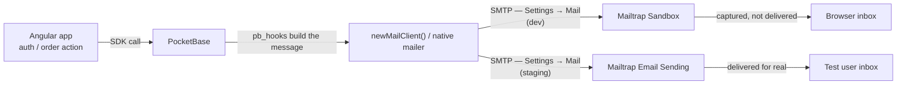

# Mailtrap (SMTP) — Eco-Store

How transactional email works in eco-store, and how [Mailtrap](https://mailtrap.io) is wired in as the SMTP transport for PocketBase in **development** and **staging**.

> [!IMPORTANT]
> There is **no Mailtrap reference anywhere in the committed code**, and that is by design.
> PocketBase is the email sender; Mailtrap is just the SMTP server its mail goes through.
> That SMTP configuration lives in PocketBase's own settings (stored in `pb_data/`, which is **gitignored**) — it is never in `.env`, `pb_schema.json`, or any Angular file.
> This document describes a configuration you apply in the PocketBase Admin UI, not code you edit.

## 📋 Table of Contents

- [Mailtrap (SMTP) — Eco-Store](#mailtrap-smtp--eco-store)
  - [📋 Table of Contents](#-table-of-contents)
  - [Why Mailtrap](#why-mailtrap)
    - [Sandbox vs Email Sending — don't confuse them](#sandbox-vs-email-sending--dont-confuse-them)
  - [How email flows through PocketBase](#how-email-flows-through-pocketbase)
  - [Which emails eco-store sends](#which-emails-eco-store-sends)
  - [Configuration](#configuration)
    - [Development — Email Sandbox](#development--email-sandbox)
    - [Staging (PocketHost) — Email Sending (real delivery)](#staging-pockethost--email-sending-real-delivery)
  - [Verifying it works](#verifying-it-works)
  - [Production note](#production-note)
  - [Troubleshooting](#troubleshooting)
  - [Quick reference](#quick-reference)

---

## Why Mailtrap

Eco-store's auth and order flows trigger real transactional emails (password reset, email-change confirmation, order confirmation).
Mailtrap covers both the **catch-everything** need in local development and the **real-delivery-to-test-users** need in staging — with two different products.

| Environment                        | Mailtrap product                               | Behaviour                                             | Why                                                      |
| ---------------------------------- | ---------------------------------------------- | ----------------------------------------------------- | -------------------------------------------------------- |
| **Development** (local PocketBase) | **Email Sandbox**                              | Mail is **captured** in a fake inbox, never delivered | Inspect HTML/links without spamming anyone; no DNS setup |
| **Staging** (PocketHost)           | **Email Sending** (verified `plastikaweb.com`) | Mail is **delivered for real** to the recipient       | Test users must actually receive the emails              |
| **Production**                     | See [Production note](#production-note)        | —                                                     | —                                                        |

> [!CAUTION]
> Staging delivers **real email**. Because `yarn eco-store:pb:seed` clones real records from staging, you must ensure **every recipient address in staging belongs to a test account** —
> never a real cooperative member — or a test password-reset/order email will reach a real person. Treat this as a precondition before sending anything from staging.

[**Mailtrap Email Sandbox**](https://mailtrap.io/email-sandbox/) (development) exposes a normal SMTP server but, instead of delivering anything, **captures every message in a fake inbox**
you can open in the browser — rendered HTML, headers, spam score, verification/reset links — without a single email reaching a real recipient.

[**Mailtrap Email Sending**](https://mailtrap.io/transactional-emails/) (staging) does real delivery through a **verified sending domain** (`plastikaweb.com`, already verified).

### Sandbox vs Email Sending — don't confuse them

Mailtrap ships **two separate products**. Eco-store uses Sandbox for dev and Sending for staging; mixing them up is a common trap.

|                       | **Email Sandbox** ✅ (use this)                                 | **Email Sending** ⚠️                                                                |
| --------------------- | --------------------------------------------------------------- | ----------------------------------------------------------------------------------- |
| What it does          | Captures mail in a fake inbox — **never delivers**              | **Delivers for real**                                                               |
| SMTP host             | `sandbox.smtp.mailtrap.io`                                      | `live.smtp.mailtrap.io`                                                             |
| Needs a domain?       | No                                                              | Yes — verified sending domain (or a throwaway _demo domain_)                        |
| Free-tier limit       | **~50 captured emails / month** (no per-message cap, no domain) | **Demo domain capped at ~20 emails**, then blocked until you verify your own domain |
| `from` address        | Any address works                                               | **Must be on the verified domain** (e.g. `no-reply@plastikaweb.com`)                |
| Eco-store uses it for | **Development** (local)                                         | **Staging** (and later production)                                                  |

> [!WARNING]
> The Mailtrap **demo domain** belongs to **Email Sending**, not Sandbox. It is a one-time taste of real delivery, hard-capped at ~20 emails — after that Mailtrap sends:
> _"Your demo domain has reached its email limit… sending from a demo domain is no longer possible… please switch sending to your own domain."_
>
> If you hit this, you were on **Email Sending** with the **demo domain**. The fix is **not** to keep using the demo domain —
> it's to send through the **verified `plastikaweb.com`** domain (already verified for this account).
> For **development**, where you don't want real delivery at all, use **Email Sandbox** instead (no domain needed).

---

## How email flows through PocketBase

The key point: **the SMTP transport is configured once**, in PocketBase `Settings → Mail`.
Every email — whether sent by the built-in mailer or by a custom `pb_hooks` script — uses that same transport.
The hooks only shape the **content** (`subject`, `html`, `from`); they never define where mail is sent.
So pointing eco-store's email at Mailtrap is a single configuration change per environment, not a per-feature one.

---

## Which emails eco-store sends

All live email originates from PocketBase. Three flows exist today (see [`POCKETBASE.md`](./POCKETBASE.md) for the full hook list):

| Email                                   | Trigger                               | Where it's built                                                                    | SMTP transport  |
| --------------------------------------- | ------------------------------------- | ----------------------------------------------------------------------------------- | --------------- |
| **Password reset** (PRV-03)             | User requests password recovery       | [`on_password_reset.pb.js`](./pocketbase/pb_hooks/on_password_reset.pb.js) override | Settings → Mail |
| **Email-change confirmation** (PRV-02b) | User changes their email in `/perfil` | [`on_email_change.pb.js`](./pocketbase/pb_hooks/on_email_change.pb.js) override     | Settings → Mail |
| **Order confirmation** (NOT-01)         | New order created                     | [`on_create_order.pb.js`](./pocketbase/pb_hooks/on_create_order.pb.js) hook         | Settings → Mail |

> [!NOTE]
> Both custom hooks read the sender and app URL from `e.app.settings().meta` — specifically `meta.senderAddress`, `meta.senderName`, and `meta.appURL`.
> Those are **not** Mailtrap settings; they live in `Settings → Application` (the same Sender name / Sender address fields shown in Mail settings)
> and must be filled in too (see [step 3](#3-configure-the-sender--app-url-settings--application)), or the hooks send with an empty `from` / build broken links.

---

## Configuration

Two tracks: **[Development → Sandbox](#development--email-sandbox)** and **[Staging → Email Sending](#staging-pockethost--email-sending-real-delivery)**.
Both are configured in PocketBase `Settings → Mail` + `Settings → Application`, just with different credentials and host.

### Development — Email Sandbox

#### 1. Get the Mailtrap Sandbox credentials

1. Sign in to [mailtrap.io](https://mailtrap.io) → **Email Testing** → **Inboxes** (the **Sandbox** card, _not_ the "Email API/SMTP — Live sending" one).
2. Open (or create) an inbox for eco-store (e.g. "My Sandbox").
3. In the inbox, open the **SMTP Settings** tab and pick **integration: "SMTP"** (not API). You'll get values like:

   | Field    | Example                          |
   | -------- | -------------------------------- |
   | Host     | `sandbox.smtp.mailtrap.io`       |
   | Port     | `2525` (also `25`, `465`, `587`) |
   | Username | per-inbox, e.g. `77465d8bbd6f0a` |
   | Password | per-inbox secret                 |

   > The username/password are **per-inbox** and are the only secrets. Treat them like any credential — do not commit them. They are entered directly into PocketBase, never into the repo.

#### 2. Configure SMTP in PocketBase (Settings → Mail)

Open the local Admin UI (`http://localhost:8090/_/`) → **Settings → Mail settings**:

1. Toggle **Use SMTP mail server** → ON.
2. Fill in:
   - **SMTP server host**: `sandbox.smtp.mailtrap.io`
   - **Port**: `2525`
   - **Username** / **Password**: the per-inbox values from step 1
   - **TLS encryption**: **`Auto (StartTLS)`** — correct for port `2525` (Mailtrap Sandbox uses STARTTLS, negotiated on the plain port, not implicit TLS). Pick implicit TLS only if you switch to port `465`.
   - **AUTH method**: `PLAIN (default)` is fine.
3. Click **Send test email** — it should appear in your Mailtrap inbox within seconds.
4. **Save**.

A correct local config looks like this:

| Field                | Value                                                                              |
| -------------------- | ---------------------------------------------------------------------------------- |
| Sender name          | `Botiga Eco`                                                                       |
| Sender address       | `no-reply@plastikaweb.com` _(any address works in Sandbox — nothing is delivered)_ |
| Use SMTP mail server | ON                                                                                 |
| SMTP server host     | `sandbox.smtp.mailtrap.io`                                                         |
| Port                 | `2525`                                                                             |
| TLS encryption       | `Auto (StartTLS)`                                                                  |
| AUTH method          | `PLAIN (default)`                                                                  |

> [!WARNING]
> These values are written into `pb_data/` (gitignored). They do **not** sync to staging via `yarn eco-store:pb:export` / the schema GitHub workflow —
> that pipeline only carries `pb_schema.json` (collections), not settings. Each environment is configured independently in its own Admin UI.

#### 3. Configure the sender + app URL (Settings → Application)

The custom hooks (`on_password_reset`, `on_email_change`, `on_create_order`) read these. In **Settings → Application**:

- **Application name** (`meta.appName`) — set to `Botiga Eco`. Any residual default email (before a hook covers it) says "Acme" otherwise.
- **Application URL** (`meta.appURL`) — the public app origin (e.g. `http://localhost:4200` locally). Used to build links inside emails.
- **Sender name** (`meta.senderName`) — e.g. `Botiga Eco`. The auth mail hooks override the `from:` name with the **tenant name** when they can resolve it.
- **Sender address** (`meta.senderAddress`) — the `from:` address on hook-built emails (e.g. `no-reply@plastikaweb.com`). With Sandbox this can be any address since nothing is actually delivered.

#### 4. Run it

1. Start the backend: `yarn eco-store:pocketbase:run` (or the full env with `yarn eco-store:local`).
2. Trigger a flow (request a password reset, change your email in `/perfil`, place an order) and watch the Mailtrap Sandbox inbox.

### Staging (PocketHost) — Email Sending (real delivery)

Staging delivers **real email to test users** through the verified `plastikaweb.com` domain.
Configure it in the **PocketHost** instance's own Admin UI (not local) — SMTP settings are per-instance and are **not** carried by the schema sync workflow.

> [!CAUTION]
> Before sending anything from staging: confirm **every recipient in the staging DB is a test account**. `yarn eco-store:pb:seed` clones real records — a stray real address means a real person receives a test email.

#### 1. Get the Email Sending SMTP credentials

In Mailtrap → **Email Sending** → **Sending Domains** → `plastikaweb.com` (must show **Verified**) → **Integration / SMTP**. These credentials are **different** from the Sandbox ones:

| Field    | Value                              |
| -------- | ---------------------------------- |
| Host     | `live.smtp.mailtrap.io`            |
| Port     | `587` (also `2525`, `465`)         |
| Username | per-domain (e.g. `api` / `smtp@…`) |
| Password | per-domain secret (the API token)  |

#### 2. Configure SMTP in PocketBase (PocketHost → Settings → Mail)

1. **Use SMTP mail server** → ON.
2. Fill in:
   - **SMTP server host**: `live.smtp.mailtrap.io`
   - **Port**: `587`
   - **Username** / **Password**: the Email Sending values above
   - **TLS encryption**: `Auto (StartTLS)` for `587`/`2525` (or implicit TLS for `465`)
   - **AUTH method**: `PLAIN (default)`
3. **Sender address** (Settings → Mail / Application) **must be on the verified domain** → `no-reply@plastikaweb.com`. A `from` outside `plastikaweb.com` is rejected by Email Sending.
4. **Sender name**: `Botiga Eco`. **Application name**: `Botiga Eco`. **Application URL** (`meta.appURL`): the staging domain.
5. **Send test email** to a **test address you control** → it should arrive in that real inbox. **Save**.

#### Quota

Free Email Sending = **4,000 emails / month**, 1 domain, **3 days** of email logs. Plenty for staging test traffic.

---

## Verifying it works

Trigger any of the three flows, then check the right place per environment:

- **Development (Sandbox):** open the Mailtrap **Email Testing** inbox → the message appears (captured, never delivered). The **Monthly emails** counter (e.g. `2 / 50`) ticks up.
- **Staging (Email Sending):** the email arrives in the **real test inbox**; Mailtrap **Email Sending → Logs** records the send (free tier keeps 3 days of logs).

Per email, verify:

- **HTML preview** renders correctly (localized — `ca` / `es` / `en`).
- **Links** point at the right `appURL` (reset / confirm-email-change tokens resolve to the app routes).
- **From** shows the configured `senderName <senderAddress>` (on staging it must be `…@plastikaweb.com`).

PocketBase logs (`pb_data` logs, or the Admin UI **Logs** view) record send attempts and SMTP errors.

---

## Production note

Production will use the **same Email Sending product as staging** (verified `plastikaweb.com`),
just configured in the production PocketBase instance with its own credentials, real `meta.appURL`, and `no-reply@plastikaweb.com` sender.
The main differences to plan for: the free tier's **4,000 emails/month** and **3-day log retention** may be too small at production volume (upgrade the Sending plan if so),
and a dedicated IP / stricter DMARC may be warranted. Update this section (and the TASKS/BACKLOG entry that introduces prod email) when production goes live.

---

## Troubleshooting

| Symptom                                            | Likely cause                                                           | Fix                                                                       |
| -------------------------------------------------- | ---------------------------------------------------------------------- | ------------------------------------------------------------------------- |
| "Send test email" fails in Admin UI                | Wrong host/port/credentials, or TLS mode mismatched to the port        | Re-copy creds; `Auto (StartTLS)` for `2525`/`587`, implicit TLS for `465` |
| Email sends but `from` is empty / links are broken | `meta.senderAddress` / `meta.appURL` not set in Settings → Application | See [step 3](#3-configure-the-sender--app-url-settings--application)      |
| Staging: send rejected / 5xx on `from`             | `from` is not on the verified domain                                   | Set sender to `no-reply@plastikaweb.com` (verified domain only)           |
| `…demo domain has reached its email limit…`        | You're sending from the **demo domain**                                | Staging → verified `plastikaweb.com` creds; dev → Sandbox                 |
| Nothing arrives, no error                          | Wrong PocketBase instance (you configured a different one)             | Confirm the URL and that SMTP is configured **there**                     |
| Dev: Mailtrap stops capturing mid-month            | Sandbox free quota (~50/month) reached                                 | Wait for reset, use a second inbox, or upgrade the plan                   |
| Staging: sends stop mid-month                      | Email Sending free quota (4,000/month) reached                         | Wait for reset or upgrade the Sending plan                                |
| Staging stopped sending after a schema sync        | Expected — schema sync never carries SMTP settings                     | Re-apply SMTP settings in the PocketHost Admin UI                         |
| A real person got a test email                     | Real address present in staging data                                   | Sanitize staging recipients to test-only accounts (see CAUTION above)     |
| Wrong language in email                            | Hook localization keys off the user/tenant                             | See `on_password_reset.pb.js` / `on_create_order.pb.js`                   |

---

## Quick reference

| What                           | Where                                                                                                        |
| ------------------------------ | ------------------------------------------------------------------------------------------------------------ |
| **Dev** SMTP host              | `sandbox.smtp.mailtrap.io` (port `2525`, Sandbox inbox creds) — captured                                     |
| **Staging** SMTP host          | `live.smtp.mailtrap.io` (port `587`, `plastikaweb.com` Sending creds) — real delivery                        |
| Sender (`from`)                | `no-reply@plastikaweb.com` — **required** on the verified domain for staging                                 |
| SMTP transport config          | PocketBase **Settings → Mail** (per environment, in `pb_data`, gitignored)                                   |
| Sender + app URL (`meta.*`)    | PocketBase **Settings → Application**                                                                        |
| Mailtrap Sandbox inbox         | [mailtrap.io](https://mailtrap.io) → Email Testing → Inboxes                                                 |
| Mailtrap Sending domain        | [mailtrap.io](https://mailtrap.io) → Email Sending → Sending Domains                                         |
| Local Admin UI                 | `http://localhost:8090/_/`                                                                                   |
| Email-building hooks           | [`pocketbase/pb_hooks/`](./pocketbase/pb_hooks/) (`on_password_reset`, `on_email_change`, `on_create_order`) |
| Email-change confirmation page | `libs/eco-store/auth/feature/confirm-email-change`                                                           |
| Backend / schema workflow      | [`POCKETBASE.md`](./POCKETBASE.md)                                                                           |

---

**Last Updated**: 2026-06-28
**Maintainer**: Carlos Matheu (Plastikaweb)
