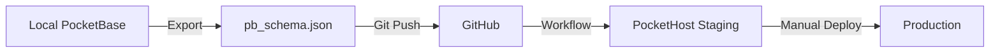

# PocketBase Management - Eco-Store

This document covers best practices for managing PocketBase schema changes, JavaScript hooks, and cron jobs in the eco-store application.

## 📋 Table of Contents

- [Overview](#overview)
- [Schema Synchronization Workflow](#schema-synchronization-workflow)
- [PocketBase Hooks & Cron Jobs](#pocketbase-hooks--cron-jobs)
- [Safety Guidelines](#safety-guidelines)
- [Common Scenarios](#common-scenarios)
- [Troubleshooting](#troubleshooting)
- [Quick Reference](#quick-reference)

---

## Overview

PocketBase serves as the backend for the eco-store application. The schema and server-side logic (hooks/cron) are managed within this repository to ensure consistency across environments.

### Key Components

1. **Schema**: Defined in `apps/eco-store/pocketbase/pb_schema.json`.
2. **Hooks & Cron**: JavaScript logic located in `apps/eco-store/pocketbase/pb_hooks/`.
3. **Sync Scripts**: Utilities in `apps/eco-store/scripts/` for environment synchronization.

---

## Schema Synchronization Workflow

Local schema changes are automatically synchronized to staging (PocketHost) via GitHub Actions when pushing to the `develop` branch.

### Automated Process



### GitHub Workflow Triggers

The workflow at `.github/workflows/pocketbase-schema.yml` runs when:

- **Automatic**: Push to `develop` branch with changes in `apps/eco-store/pocketbase/**`.
- **Manual**: Workflow dispatch for `sync` (repo to staging) or `export` (staging to repo).

---

## PocketBase Hooks & Cron Jobs

Server-side logic is implemented as standard PocketBase JavaScript hooks.

### Hooks

#### [on_create_order.pb.js](./pocketbase/pb_hooks/on_create_order.pb.js)

Automatically identifies the `open` order cycle for a tenant and links new orders to it. It also prevents duplicate orders if the order window is configured, deletes the user's cart upon order confirmation,
and sends an order confirmation email to the user in their preferred language.

#### [single_default_address.js](./pocketbase/pb_hooks/single_default_address.js)

Ensures each user has only one default address by unsetting previous defaults when a new one is selected.

### Cron Jobs

#### [cycle_cron.pb.js](./pocketbase/pb_hooks/cycle_cron.pb.js)

- **`order_cycle_init`** (Sundays 23:59): Generates order cycles for the following week based on tenant `logisticsConfig`.
- **`order_cycle_status_watcher`** (Every 15 mins): Closes expired cycles and moves them to `processing` status.

---

## Safety Guidelines

### 🔴 HIGH RISK

- **Changing Field Types**: Can cause data loss. Create a new field, migrate, then delete the old one.
- **Adding Required Fields**: Will fail on existing records. Add as optional first, populate data, then make required.

### 🟡 MEDIUM RISK

- **Unique Indexes**: Can fail if duplicates exist in production.
- **Stricter Validation**: Existing data might not meet new requirements.

---

## Common Scenarios

### Scenario 1: Adding a New Optional Field

**Goal**: Add `ecoLabel` field to `products` collection.

1. Make changes in local PocketBase UI.
2. Export schema: `yarn pb:export`.
3. Review changes: `git diff apps/eco-store/pocketbase/pb_schema.json`.
4. Commit and push: `git commit -m "feat(schema): add ecoLabel field"`.

### Scenario 2: Making an Optional Field Required

**Goal**: Make `ecoLabel` required after data is populated.

1. Ensure all existing records have the field populated.
2. Update local schema: `required=true`.
3. Export and verify: `yarn pb:export`.
4. Commit and push.

### Scenario 3: Adding a New Collection

**Goal**: Create `suppliers` collection.

1. Create collection in local PocketBase UI.
2. Export schema: `yarn pb:export`.
3. Commit and push.

### Scenario 4: Changing Field Type (Migration Required)

**Goal**: Change `price` from text to number.

1. Add new field `priceNew` as number.
2. Migrate data from `price` to `priceNew`.
3. Delete `price` and rename `priceNew` to `price`.
4. Export and commit.

---

## Troubleshooting

### Error: "Field validation failed for required field"

**Cause**: Trying to add a required field to a collection with existing records.

**Solution**: Add as optional first, populate data, then make required.

---

## Quick Reference

### Essential Commands

```bash
# Export schema from local PocketBase
yarn pb:export

# Run local PocketBase (development)
yarn pb:dev

# View diff of schema changes
git diff apps/eco-store/pocketbase/pb_schema.json
```

---

**Last Updated**: 2026-02-26
**Maintainer**: Eco-Store Development Team
