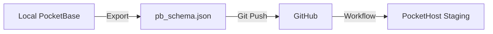

# PocketBase Management - Eco-Store

This document covers best practices for managing PocketBase schema changes, JavaScript hooks, and cron jobs in the eco-store application.

## 📋 Table of Contents

- [PocketBase Management - Eco-Store](#pocketbase-management---eco-store)
  - [📋 Table of Contents](#-table-of-contents)
  - [Overview](#overview)
    - [Key Components](#key-components)
  - [Installation \& Setup](#installation--setup)
  - [Schema Synchronization with Pocketbase Staging Workflow](#schema-synchronization-with-pocketbase-staging-workflow)
    - [Automated Process](#automated-process)
    - [GitHub Workflow Triggers](#github-workflow-triggers)
    - [Local sync with pb_schema.json](#local-sync-with-pb_schemajson)
  - [Script Reference](#script-reference)
    - [Core Scripts](#core-scripts)
    - [Data Workflows](#data-workflows)
  - [PocketBase Hooks \& Cron Jobs](#pocketbase-hooks--cron-jobs)
    - [Hooks](#hooks)
    - [Cron Jobs](#cron-jobs)
  - [Safety Guidelines](#safety-guidelines)
  - [Common Scenarios](#common-scenarios)
    - [Adding a New Optional Field](#adding-a-new-optional-field)
    - [Populating Local Data from Staging](#populating-local-data-from-staging)
  - [Quick Reference](#quick-reference)
    - [Essential Commands](#essential-commands)

---

## Overview

PocketBase serves as the backend for the eco-store application. The schema and server-side logic (hooks/cron) are managed within this repository to ensure consistency across environments.

### Key Components

1. **Binary**: Managed via `yarn eco-store:pb:download`.
2. **Schema**: Defined in `apps/eco-store/pocketbase/pb_schema.json`.
3. **Hooks & Cron**: Located in `apps/eco-store/pocketbase/pb_hooks/`.
4. **Automation**: Utilities in `apps/eco-store/scripts/` for data seeding and environment sync.

---

## Installation & Setup

The recommended way to set up the local environment is using the intelligent orchestrator:

```bash
yarn install:local
```

This command automatically:

1. Downloads the correct PocketBase binary for your OS.
2. Initializes the local database.
3. Prompts to populate the schema and seed data from staging if no local data is found.

---

## Schema Synchronization with Pocketbase Staging Workflow

Local schema changes are automatically synchronized to staging (PocketHost) via GitHub Actions when pushing to the `develop` branch.

### Automated Process


```mermaid
graph LR
    A[Local PocketBase] -->|Export| B[pb_schema.json]
    B -->|Git Push| C[GitHub]
    C -->|Workflow| D[PocketHost Staging]
```

### GitHub Workflow Triggers

The workflow at `.github/workflows/pocketbase-schema.yml` runs automatically on pushes to `develop` with changes in `apps/eco-store/pocketbase/**`.

---

### Local sync with pb_schema.json

If you have modified the schema in the pb_schema.json file, you can sync it with the local PocketBase instance using the following command:

```bash
POCKETBASE_ENV=development yarn eco-store:pb:sync
```

---

## Script Reference

The automation logic is located in `apps/eco-store/scripts/`.

### Core Scripts

| Script                        | Command                      | Description                                                           |
| :---------------------------- | :--------------------------- | :-------------------------------------------------------------------- |
| `download-pocketbase.js`      | `yarn eco-store:pb:download` | Downloads the PocketBase binary for your OS.                          |
| `sync-pocketbase-schema.js`   | `yarn eco-store:pb:sync`     | Pushes local `pb_schema.json` to a PB instance (defaults to staging). |
| `export-pocketbase-schema.js` | `yarn eco-store:pb:export`   | Pulls schema, data (JSON), and files from local instance to the repo. |
| `populate-pocketbase.js`      | `yarn eco-store:pb:populate` | Orchestrator for full local DB initialization.                        |
| `import-pocketbase-data.js`   | `yarn eco-store:pb:import`   | Imports JSON data files from `pocketbase/data/` into local instance.  |
| `load-environment.js`         | N/A                          | Shared helper for loading `.env` and Angular environments.            |

### Data Workflows

| Script               | Command                      | Description                                                                   |
| :------------------- | :--------------------------- | :---------------------------------------------------------------------------- |
| `seed-local.js`      | `yarn eco-store:pb:seed`     | **Clone Staging**: Pulls real records and files from Staging to Local.        |
| `seed.ts`            | `yarn eco-store:pb:seed-gen` | **Generate Dummy**: Generates fake history (cycles/orders) for local testing. |
| `push-to-staging.ts` | `yarn eco-store:pb:push-gen` | Pushes local data and files to the Staging environment.                       |

> [!NOTE]
> Scripts using `.ts` extensions (like `seed-gen` and `push-gen`) are executed using the native
> `node --experimental-strip-types` flag (available in Node 22+). This provides better
> performance and compatibility than the previous `ts-node/esm` loader.

---

## PocketBase Hooks & Cron Jobs

Server-side logic is implemented as standard PocketBase JavaScript hooks.

### Hooks

- **[on_create_order.pb.js](./pocketbase/pb_hooks/on_create_order.pb.js)**: Handles order cycle linking, duplicate prevention, cart cleanup, and confirmation emails.
- **[single_default_address.js](./pocketbase/pb_hooks/single_default_address.js)**: Ensures unique default user addresses.

### Cron Jobs

- **[cycle_cron.pb.js](./pocketbase/pb_hooks/cycle_cron.pb.js)**: Initializes weekly order cycles and manages status transitions.

---

## Safety Guidelines

- **🔴 HIGH RISK**: Changing field types or adding `required` fields to existing collections. Always add as optional first, populate data, then enforce.
- **🟡 MEDIUM RISK**: Adding unique indexes or stricter validation to collections with existing data.

---

## Common Scenarios

### Adding a New Optional Field

1. Modify in local UI.
2. Export schema: `yarn eco-store:pb:export`.
3. Verify diff: `yarn eco-store:pb:diff`.
4. Commit and push.

### Populating Local Data from Staging

Run `yarn eco-store:pb:seed` to pull records and images from the staging environment to your local instance.

---

## Quick Reference

### Essential Commands

| Task                     | Command                         | Description                                          |
| :----------------------- | :------------------------------ | :--------------------------------------------------- |
| **Start Backend**        | `yarn eco-store:pocketbase:run` | Runs local PocketBase on port 8090.                  |
| **Export Schema & Data** | `yarn eco-store:pb:export`      | Exports local schema, data, and files to the repo.   |
| **Sync Schema**          | `yarn eco-store:pb:sync`        | Pushes `pb_schema.json` to a PB instance.            |
| **Clone Staging Data**   | `yarn eco-store:pb:seed`        | Pulls real records and images from staging to local. |
| **Generate Fake Data**   | `yarn eco-store:pb:seed-gen`    | Generates dummy history for local testing.           |
| **Push to Staging**      | `yarn eco-store:pb:push-gen`    | Pushes local records and files to staging.           |
| **Download Binary**      | `yarn eco-store:pb:download`    | Downloads PocketBase for your OS.                    |
| **Initial Populate**     | `yarn eco-store:pb:populate`    | Sets up superuser, schema, and initial data.         |
| **View Diff**            | `yarn eco-store:pb:diff`        | Shows git diff for the schema file.                  |
| **Full Local Env**       | `yarn eco-store:local`          | Starts PB + App + SCSS watcher.                      |

---

**Last Updated**: 2026-03-26
**Maintainer**: Carlos Matheu (Plastikaweb)
