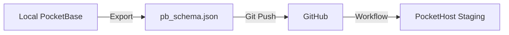

# PocketBase Management - Eco-Store

This document covers best practices for managing PocketBase schema changes, JavaScript hooks, and cron jobs in the eco-store application.

## 📋 Table of Contents

- [Overview](#overview)
- [Installation & Setup](#installation--setup)
- [Schema Synchronization Workflow](#schema-synchronization-workflow)
- [PocketBase Hooks & Cron Jobs](#pocketbase-hooks--cron-jobs)
- [Safety Guidelines](#safety-guidelines)
- [Common Scenarios](#common-scenarios)
- [Quick Reference](#quick-reference)

---

## Overview

PocketBase serves as the backend for the eco-store application. The schema and server-side logic (hooks/cron) are managed within this repository to ensure consistency across environments.

### Key Components

1. **Binary**: Managed via `yarn eco-store:pb:download`.
2. **Schema**: Defined in `apps/eco-store/pocketbase/pb_schema.json`.
3. **Hooks & Cron**: Located in `apps/eco-store/pocketbase/pb_hooks/`.
4. **Automation**: Utilities in `apps/eco-store/scripts/` for data seeding and environment sync.

---

## Installation & Setup

The recommended way to set up the local environment is using the intelligent orchestrator:

```bash
yarn install:local
```

This command automatically:

1. Downloads the correct PocketBase binary for your OS.
2. Initializes the local database.
3. Prompts to populate the schema and seed data from staging if no local data is found.

---

## Schema Synchronization Workflow

Local schema changes are automatically synchronized to staging (PocketHost) via GitHub Actions when pushing to the `develop` branch.

### Automated Process


```mermaid
graph LR
    A[Local PocketBase] -->|Export| B[pb_schema.json]
    B -->|Git Push| C[GitHub]
    C -->|Workflow| D[PocketHost Staging]
```

### GitHub Workflow Triggers

The workflow at `.github/workflows/pocketbase-schema.yml` runs automatically on pushes to `develop` with changes in `apps/eco-store/pocketbase/**`.

---

## PocketBase Hooks & Cron Jobs

Server-side logic is implemented as standard PocketBase JavaScript hooks.

### Hooks

- **[on_create_order.pb.js](./pocketbase/pb_hooks/on_create_order.pb.js)**: Handles order cycle linking, duplicate prevention, cart cleanup, and confirmation emails.
- **[single_default_address.js](./pocketbase/pb_hooks/single_default_address.js)**: Ensures unique default user addresses.

### Cron Jobs

- **[cycle_cron.pb.js](./pocketbase/pb_hooks/cycle_cron.pb.js)**: Initializes weekly order cycles and manages status transitions.

---

## Safety Guidelines

- **🔴 HIGH RISK**: Changing field types or adding `required` fields to existing collections. Always add as optional first, populate data, then enforce.
- **🟡 MEDIUM RISK**: Adding unique indexes or stricter validation to collections with existing data.

---

## Common Scenarios

### Adding a New Optional Field

1. Modify in local UI.
2. Export schema: `yarn eco-store:pb:export`.
3. Verify diff: `yarn eco-store:pb:diff`.
4. Commit and push.

### Populating Local Data from Staging

Run `yarn eco-store:pb:seed` to pull records and images from the staging environment to your local instance.

---

## Quick Reference

### Essential Commands

| Task                 | Command                         | Description                                  |
| :------------------- | :------------------------------ | :------------------------------------------- |
| **Start Backend**    | `yarn eco-store:pocketbase:run` | Runs local PocketBase on port 8090.          |
| **Export Schema**    | `yarn eco-store:pb:export`      | Exports local schema to `pb_schema.json`.    |
| **Sync Schema**      | `yarn eco-store:pb:sync`        | Pushes `pb_schema.json` to staging.          |
| **Seed Local Data**  | `yarn eco-store:pb:seed`        | Pulls data and images from staging to local. |
| **Download Binary**  | `yarn eco-store:pb:download`    | Downloads PocketBase for your OS.            |
| **Initial Populate** | `yarn eco-store:pb:populate`    | Sets up superuser and schema.                |
| **View Diff**        | `yarn eco-store:pb:diff`        | Shows changes in schema file.                |
| **Full Local Env**   | `yarn eco-store:local`          | Starts PB + App + SCSS watcher.              |

---

**Last Updated**: 2026-03-18
**Maintainer**: Eco-Store Development Team
