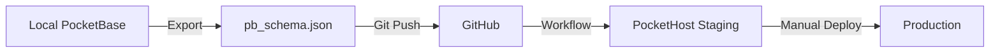

# PocketBase Schema Management - Best Practices

## 📋 Table of Contents

- [Overview](#overview)
- [Schema Synchronization Workflow](#schema-synchronization-workflow)
- [Safety Guidelines](#safety-guidelines)
- [Field Types & Changes](#field-types--changes)
- [Common Scenarios](#common-scenarios)
- [Troubleshooting](#troubleshooting)
- [Quick Reference](#quick-reference)

---

## Overview

This document provides best practices for managing PocketBase schema changes in the eco-store application.
The schema is automatically synchronized between local development, PocketHost staging, and production
environments via GitHub Actions.

### How It Works

1. **Local Changes**: Make schema changes in your local PocketBase instance
2. **Export**: Export the schema to `apps/eco-store/pocketbase/pb_schema.json`
3. **Sync**: Push to `develop` branch triggers automatic sync to PocketHost staging
4. **Safe Updates**: The workflow updates only the structure (schema), never the data

### Current Collections

| Collection           | Type | Required Fields                                  | Notes             |
| -------------------- | ---- | ------------------------------------------------ | ----------------- |
| `users`              | auth | email, password, clientId                        | Auth collection   |
| `products`           | base | name, normalizedName, unitType, category         | Main products     |
| `product_categories` | base | normalizedName, name, description, client, group | Categories        |
| `clients`            | base | name, email                                      | Client management |
| `languages`          | base | code                                             | i18n support      |
| `category_groups`    | base | name                                             | Category grouping |

---

## Schema Synchronization Workflow

### Automated Process



### GitHub Workflow Triggers

The workflow at `.github/workflows/pocketbase-schema.yml` runs when:

- **Automatic**: Push to `develop` branch with changes in:
  - `apps/eco-store/pocketbase/**`
  - `apps/eco-store/scripts/**`

- **Manual**: Workflow dispatch for:
  - `sync`: Sync schema from repo to PocketHost
  - `export`: Export schema from PocketHost to repo

### Two-Phase Sync Process

The sync script uses a two-phase approach to handle complex schemas:

**Phase 1**: Create missing collections (without relations)

- Avoids "missing collection" errors for relation fields
- Creates minimal schema structure

**Phase 2**: Update all collections with full schema

- Adds relation fields
- Updates indexes, rules, and options
- Ensures complete schema synchronization

---

## Safety Guidelines

### 🔴 **HIGH RISK - Avoid These Changes**

#### 1. Changing Field Types

```json
// ❌ DANGEROUS - Can cause data loss or migration errors
{
  "name": "price",
  "type": "text" // was "number"
}
```

**Impact**: Existing data may become invalid or inaccessible.

**Solution**: Create a new field instead:

```json
// ✅ SAFE - Add new field, migrate data, then remove old field
{
  "name": "priceNew",
  "type": "number",
  "required": false
}
```

#### 2. Adding Required Fields to Populated Collections

```json
// ❌ DANGEROUS - Will fail if collection has existing records
{
  "name": "ecoLabel",
  "type": "text",
  "required": true // ⚠️ Problem!
}
```

**Impact**: Sync will fail due to validation errors on existing records.

**Solution**: Always add as optional first:

```json
// ✅ SAFE - Add as optional, populate data, then make required
{
  "name": "ecoLabel",
  "type": "text",
  "required": false // ← Start here
}
```

#### 3. Modifying Cascade Delete on Relations

```json
// ⚠️ RISKY - Can cause unexpected data deletion
{
  "name": "category",
  "type": "relation",
  "cascadeDelete": true // was false
}
```

**Impact**: Deleting a parent record will now delete all related records.

**Solution**: Test thoroughly in local environment first.

---

### 🟡 **MEDIUM RISK - Proceed with Caution**

#### 1. Adding Unique Indexes

```json
// ⚠️ Can fail if duplicate values exist
"indexes": [
  "CREATE UNIQUE INDEX `idx_new` ON `products` (`sku`)"
]
```

**Mitigation**:

1. Check for duplicates in production first
2. Clean data before adding unique constraint
3. Test in local environment

#### 2. Stricter Validation Rules

```json
// ⚠️ Existing data might not meet new requirements
{
  "name": "email",
  "type": "email",
  "pattern": "^[a-z0-9._%+-]+@company\\.com$" // New strict pattern
}
```

**Mitigation**:

1. Verify existing data matches new rules
2. Clean/update data if needed
3. Consider grace period for validation

---

### 🟢 **LOW RISK - Generally Safe**

#### 1. Adding Optional Fields

```json
// ✅ SAFE
{
  "name": "description",
  "type": "text",
  "required": false
}
```

#### 2. Adding Non-Unique Indexes

```json
// ✅ SAFE - Improves query performance
"indexes": [
  "CREATE INDEX `idx_products_category` ON `products` (`category`)"
]
```

#### 3. Modifying API Rules

```json
// ✅ SAFE - Only affects permissions, not data
"listRule": "@request.auth.id != ''",
"viewRule": "@request.auth.id != ''"
```

#### 4. Adding Values to Select Fields

```json
// ✅ SAFE - Extends available options
{
  "name": "status",
  "type": "select",
  "values": ["active", "inactive", "pending", "archived"] // Added "archived"
}
```

---

## Field Types & Changes

### Common Field Types

| Type       | Use Case             | Required Attributes                 | Example            |
| ---------- | -------------------- | ----------------------------------- | ------------------ |
| `text`     | Short strings        | `max`, `min`, `pattern`             | Product names      |
| `json`     | Multilingual content | `maxSize`                           | Translations       |
| `number`   | Numeric values       | `min`, `max`, `onlyInt`             | Prices, quantities |
| `bool`     | True/false           | -                                   | In stock flag      |
| `email`    | Email addresses      | `onlyDomains`, `exceptDomains`      | User emails        |
| `select`   | Fixed options        | `values`, `maxSelect`               | Unit types         |
| `file`     | File uploads         | `maxSize`, `mimeTypes`, `maxSelect` | Product images     |
| `relation` | Foreign keys         | `collectionId`, `cascadeDelete`     | Category links     |
| `autodate` | Timestamps           | `onCreate`, `onUpdate`              | created, updated   |

### Safe Field Modifications

```json
// ✅ Safe to modify on optional fields
{
  "name": "description",
  "type": "text",
  "required": false,
  "max": 1000,  // Can increase
  "min": 0      // Can decrease
}

// ✅ Safe to add new select values
{
  "name": "unitType",
  "type": "select",
  "values": [
    "unit",
    "weight",
    "volume",
    "newType"  // ✅ Add new options
  ]
}

// ❌ Cannot remove select values if used
{
  "name": "unitType",
  "type": "select",
  "values": [
    "unit"
    // ❌ Removed "weight" - will break existing records
  ]
}
```

---

## Common Scenarios

### Scenario 1: Adding a New Optional Field

**Goal**: Add `ecoLabel` field to `products` collection

```bash
# 1. Make changes in local PocketBase UI
# Add field: name="ecoLabel", type="text", required=false

# 2. Export schema
yarn pb:export

# 3. Review changes
git diff apps/eco-store/pocketbase/pb_schema.json

# 4. Commit and push
git add apps/eco-store/pocketbase/pb_schema.json
git commit -m "feat(schema): add ecoLabel field to products"
git push origin develop

# 5. GitHub Actions will sync to staging automatically
```

### Scenario 2: Making an Optional Field Required

**Goal**: Make `ecoLabel` required after data is populated

```bash
# 1. First, ensure all existing records have the field populated
# (Do this manually in PocketHost or via migration script)

# 2. Update local PocketBase schema
# Change: required=false → required=true

# 3. Export and verify
yarn pb:export
git diff apps/eco-store/pocketbase/pb_schema.json

# 4. Look for the field change
# "required": false → "required": true

# 5. Commit and push
git add apps/eco-store/pocketbase/pb_schema.json
git commit -m "feat(schema): make ecoLabel required in products"
git push origin develop
```

### Scenario 3: Adding a New Collection

**Goal**: Create `suppliers` collection

```bash
# 1. Create collection in local PocketBase UI
# Add all fields, relations, indexes, and rules

# 2. Export schema
yarn pb:export

# 3. Review - check that the new collection is in the array
git diff apps/eco-store/pocketbase/pb_schema.json

# 4. Commit and push
git add apps/eco-store/pocketbase/pb_schema.json
git commit -m "feat(schema): add suppliers collection"
git push origin develop

# Note: The two-phase sync ensures relations to/from new collection work correctly
```

### Scenario 4: Changing Field Type (Migration Required)

**Goal**: Change `price` from text to number

```bash
# ⚠️ This requires a multi-step process

# Step 1: Add new field
# 1. Add "priceNew" as number field (required=false)
# 2. Export, commit, push
yarn pb:export
git add apps/eco-store/pocketbase/pb_schema.json
git commit -m "feat(schema): add priceNew field for migration"
git push origin develop

# Step 2: Migrate data (manual or script)
# - Copy data from "price" to "priceNew" for all records
# - Verify all data migrated correctly

# Step 3: Remove old field, rename new field
# 1. Delete "price" field in PocketBase UI
# 2. Rename "priceNew" to "price"
# 3. If needed, mark as required
# 4. Export, commit, push
yarn pb:export
git add apps/eco-store/pocketbase/pb_schema.json
git commit -m "feat(schema): complete price field migration to number"
git push origin develop
```

### Scenario 5: Synchronization Conflicts

**Problem**: Changes made directly in PocketHost that conflict with local schema

```bash
# Option 1: Pull from PocketHost (preserve remote changes)
# Use workflow dispatch "export" action in GitHub

# Option 2: Force local schema (overwrite remote changes)
# Just push your local changes - sync will update remote

# Option 3: Manual merge
# 1. Export from PocketHost
# 2. Manually merge with local changes
# 3. Push merged schema
```

---

## Troubleshooting

### Error: "Field validation failed for required field"

**Cause**: Trying to add/sync a required field to a collection with existing records

**Solution**:

1. Change field to `required: false` in `pb_schema.json`
2. Push changes
3. Populate data for all existing records
4. Change back to `required: true`
5. Push again

### Error: "Unique constraint violation"

**Cause**: Trying to add a unique index when duplicate values exist

**Solution**:

1. Check for duplicates in the target field
2. Clean/deduplicate data
3. Re-run sync

### Error: "Collection not found" for relation field

**Cause**: Trying to create a relation to a collection that doesn't exist yet

**Solution**:

- This should be handled automatically by the two-phase sync
- If it persists, ensure both collections exist in `pb_schema.json`
- Check that collection IDs match

### Workflow Fails with Authentication Error

**Cause**: Missing or incorrect PocketBase credentials in GitHub Secrets

**Solution**:

1. Verify secrets in GitHub:
   - `POCKETBASE_STAGING_ADMIN_EMAIL`
   - `POCKETBASE_STAGING_ADMIN_PASSWORD`
2. Ensure credentials match PocketHost admin account
3. Re-run workflow

---

## Quick Reference

### Essential Commands

```bash
# Export schema from local PocketBase
yarn pb:export

# Run local PocketBase (development)
yarn pb:dev

# View diff of schema changes
git diff apps/eco-store/pocketbase/pb_schema.json

# Manually trigger sync to staging
# Go to: GitHub Actions > PocketBase Staging Schema Management > Run workflow > Select "sync"

# Manually export from staging
# Go to: GitHub Actions > PocketBase Staging Schema Management > Run workflow > Select "export"
```

### Pre-Flight Checklist

Before pushing schema changes:

- [ ] Changes tested in local PocketBase
- [ ] Schema exported successfully
- [ ] Diff reviewed for unintended changes
- [ ] New required fields are optional OR data is pre-populated
- [ ] No field type changes (or migration plan ready)
- [ ] Unique indexes verified for no duplicates
- [ ] Commit message is clear and descriptive

### Schema File Location

```text
apps/eco-store/pocketbase/pb_schema.json
```

### Workflow File Location

```text
.github/workflows/pocketbase-schema.yml
```

### Scripts Location

```text
apps/eco-store/scripts/
  ├── sync-pocketbase-schema.js    # Syncs schema to PocketHost
  ├── export-pocketbase-schema.js  # Exports schema from PocketHost
  └── load-environment.js          # Loads environment config
```

---

## Additional Resources

- [PocketBase Documentation](https://pocketbase.io/docs/)
- [PocketBase Schema Reference](https://pocketbase.io/docs/api-collections/)
- [GitHub Actions Workflow](../.github/workflows/pocketbase-schema.yml)
- [Eco-Store README](../apps/eco-store/README.md)

---

**Last Updated**: 2025-12-03
**Maintainer**: Eco-Store Development Team
