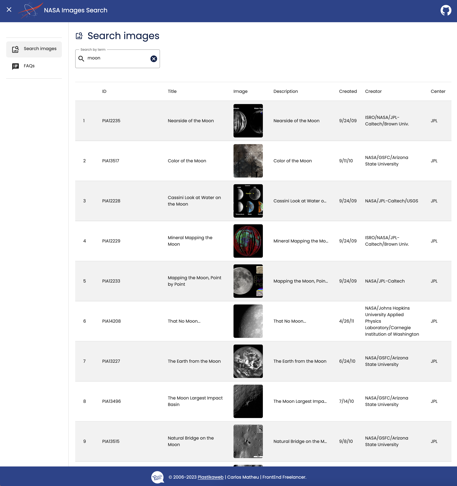
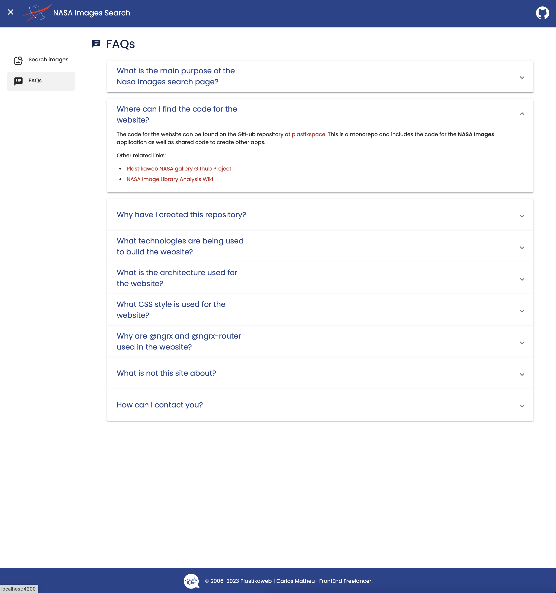

# Nasa Images

- [Nasa Images](#nasa-images)
  - [Description](#description)
  - [Running commands](#running-commands)
  - [Deploys](#deploys)
  - [Available libraries](#available-libraries)
    - [Shared](#shared)
    - [Search view](#search-view)
    - [FAQs view](#faqs-view)
  - [Useful links](#useful-links)

## Description

Main application entry point for Nasa Images, an application to search NASA images using `images-api.nasa.gov` API.

See the [NASA Image library analysis wiki](https://github.com/plastikaweb/plastikspace/wiki/nasa-image-library-project) for documentation on analysis and requirements.

It has 2 main views:

> 
> Search page
>
> 
> FAQs page

## Running commands

- Serve: Run `yarn nasa-images:serve`.
- LInt: Run `yarn nasa-images:lint`.
- Test: Run `yarn nasa-images:test`.
- E2E: Run `yarn nasa-images:e2e`.
- Build: Run `yarn nasa-images:build`.

## Deploys

A `staging` deployment can be found at [Nasa Images staging](https://nasa-images-staging.plastikaweb.com).

## Available libraries

This is a list of all the related only to nasa-images app.

### Shared

- [nasa-images-data-access](../../libs/nasa-images/data-access/README.md)

### Search view

- [nasa-images-search-entities](../../libs/nasa-images/search/entities/README.md)
- [nasa-images-search-data-access](../../libs/nasa-images/search/data-access/README.md)
- [nasa-images-search-feature](../../libs/nasa-images/search/feature/README.md)
- [nasa-images-search-ui-no-results](../../libs/nasa-images/search/ui/no-results/README.md)

### FAQs view

- [nasa-images-faqs-feature](../../libs/nasa-images/faqs/feature/README.md)

## Useful links

- [NASA Images library analysis](https://github.com/plastikaweb/plastikspace/wiki/nasa-image-library-project)
- [NASA Images repository folder](https://github.com/plastikaweb/plastikspace/tree/develop/apps/nasa-images)
- [Nasa Images staging](https://nasa-images-staging.plastikaweb.com)
- [NASA Images API](https://images.nasa.gov/docs/images.nasa.gov_api_docs.pdf)
