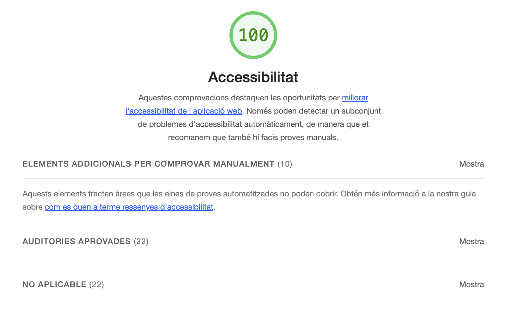

# Accessibility

- [Accessibility](#accessibility)
  - [Analysis](#analysis)
  - [Review list](#review-list)
    - [Semantic HTML](#semantic-html)
    - [Headings](#headings)
    - [Images](#images)
    - [Interactive](#interactive)
    - [Forms](#forms)
    - [Tables](#tables)
    - [Text](#text)
    - [Tabulation](#tabulation)
    - [ARIA](#aria)
    - [Reduced motion](#reduced-motion)
    - [Angular Material / CDK](#angular-material--cdk)
  - [Testing tools](#testing-tools)
    - [Lighthouse](#lighthouse)
    - [Angular ESLint](#angular-eslint)
    - [Pa11y CI Accessibility Test Runner](#pa11y-ci-accessibility-test-runner)
    - [jest axe](#jest-axe)
  - [Useful links](#useful-links)

## Analysis

A todo list of accessibility actions and related information can be found [here](https://github.com/plastikaweb/plastikspace/wiki/Accessibility).

## Review list

### Semantic HTML

- Use semantic HTML.
- Use landmarks: `<header>`, `<footer>`, `<main>`, `<aside>`.
  While using material components, you can mark elements like `mat-toolbar` or `mat-sidenav-content` with the correct `role`:
   > `<mat-toolbar role="banner"></mat-toolbar>`
   >
   > `<mat-sidenav-content role="main"></mat-sidenav-content>`
- Use angular dynamic title strategy.

### Headings

- Use headings with the correct order. Just one `h1` per page.

### Images

- Use `alt` attributes for images.
- If the image is decorative, use an empty alt attribute. You can also hide it form the Accessibility Tree using `aria-hidden=true`.
- Add hidden description inside the tag that uses a bg image.
- Use `role="img"` and a title to describe `<svg>` images.

```html
<svg role="img" aria-labelledby="twitter-title">
    <title id="twitter-title">Follow on Twitter</title>
    <path ....>
</svg>
```

### Interactive

- Use buttons for interactive elements.
- Use links for navigation and external linking.
- Links must have context and be descriptive.

### Forms

- Use `label` with form controls.
- Add `role` to form: 'search' for a search form.
- Add `novalidate` to each form.
- Add input `type` attributes.
- Use `fieldset` and `legend` for describing complex forms parts.

### Tables

- Use `caption` to describe the table contents.
- Use `scope` attr (col | row).

### Text

- Use `em` or `rem` as text size units.

### Tabulation

- Don't use positive `tabindex`. Visual order should match DOM order.

### ARIA

- Use `aria-label`, `aria-labelledby` when needed to add meaning to links, svg images, tables and buttons.

### Reduced motion

- Apply `Tailwind Reduced Motion Variants` for elements with animations or transitions to disable them for users with reduced motion.

```css
<mat-loading-bar class="animate-radar motion-reduce:animate-none"></mat-loading-bar>
```

### Angular Material / CDK

- Please review Accessibility guides for each component at the end of the Overview tab: [Angular Material Components](https://material.angular.io/components/categories).
- Please review `A11y` guidelines from [CDK documentation](https://material.angular.io/cdk/a11y/overview).
- Use [`LiveAnnouncer`](https://material.angular.io/cdk/a11y/overview) to announce messages for screen-reader users using `aria-live` region. Specially to inform of the state of API requests.

## Testing tools

### Lighthouse

Using [lighthouse plugin](https://developer.chrome.com/docs/lighthouse), passes the automatic accessibility test with a value of 100.



Other tools:

- [WAVE](https://wave.webaim.org/extension/)
- [axe DevTools](https://www.deque.com/axe/)
- [Accessibility Insights](https://accessibilityinsights.io/)
- [Firefox Accessibility Inspector](https://firefox-source-docs.mozilla.org/devtools-user/accessibility_inspector/)
- [NoCoffee – Vision Simulator for Chrome](https://accessgarage.wordpress.com/2013/02/09/458/)

### Angular ESLint

Some lint patterns are used to review accessibility.

See [@angular-eslint/schematics](https://github.com/angular-eslint/angular-eslint#readme) for further information.

```json
// .eslintrc.json
// to see the current configuration please take a look at the root eslint file.
{
      "files": ["*.html"],
      "extends": ["plugin:@angular-eslint/template/recommended"],
      "rules": {
        "@angular-eslint/template/no-positive-tabindex": 2,
        "@angular-eslint/template/no-autofocus": 2,
        "@angular-eslint/template/mouse-events-have-key-events": 2,
        "@angular-eslint/template/click-events-have-key-events": 2,
        "@angular-eslint/template/accessibility-interactive-supports-focus": 2,
        "@angular-eslint/template/accessibility-valid-aria": 2,
        "@angular-eslint/template/accessibility-role-has-required-aria": 2,
        "@angular-eslint/template/accessibility-label-for": 2,
        "@angular-eslint/template/accessibility-label-has-associated-control": 2,
        "@angular-eslint/template/accessibility-alt-text": 2,
        "@angular-eslint/template/accessibility-elements-content": 2,
        "@angular-eslint/template/accessibility-table-scope": 2,
        "@angular-eslint/template/no-any": 2,
        "@angular-eslint/no-input-prefix": 2,
        "@angular-eslint/use-lifecycle-interface": 2,
        "@angular-eslint/prefer-output-readonly": 2,
        "@angular-eslint/component-max-inline-declarations": 2,
        "@angular-eslint/template/no-call-expression": 2,
        "@angular-eslint/template/use-track-by-function": 2,
        "@angular-eslint/use-pipe-transform-interface": 2,
        "@angular-eslint/no-conflicting-lifecycle": 2,
        "@angular-eslint/relative-url-prefix": 2,
        "@angular-eslint/use-component-selector": 2,
        "@angular-eslint/template/conditional-complexity": 2,
        "@angular-eslint/use-injectable-provided-in": 2,
        "@angular-eslint/no-host-metadata-property": 2,
        "@angular-eslint/no-inputs-metadata-property": 2,
        "@angular-eslint/no-outputs-metadata-property": 2,
        "@angular-eslint/no-queries-metadata-property": 2,
        "@angular-eslint/template/no-distracting-elements": 2,
        "@angular-eslint/component-class-suffix": 2
      }
    }

```

### Pa11y CI Accessibility Test Runner

We use [pa11cy-ci](https://github.com/pa11y/pa11y-ci) accessibility test runner.

It runs against the different app pages, so each app should have a configuration file named `.pa11yci.json`:

```json
{
  "defaults": {
    "timeout": 5000
  },
  "urls": [
    "http://localhost:4200/page1",
    "http://localhost:4200/page2",
  ]
}
```

In `package.json` you must add a script to run the test runner:

```json
"my-app:http-server": "angular-http-server --path dist/apps/my-app --port 8080 --silent",
"my-app:a11y": "nx run my-app:build",
"my-app:a11y": "npm-run-all --parallel --race my-app:http-server my-app:a11y:run",
"my-app:a11y:run": "pa11y-ci --config ./apps/my-app/.pa11yci.json",
```

This script (`my-app:a11y`) can be used with `husky hooks` and `github actions CI`. You can see an example [here](./git-flow.md#pull-request-github-actions).

### jest axe

We should also add unit testing for any UI type component using the [jest-axe](https://github.com/nickcolley/jest-axe#readme) library.

```typescript
import { axe, toHaveNoViolations } from 'jest-axe';
// other imports...

describe('MyComponent', () => {
  let component: MyComponent;
  let fixture: ComponentFixture<MyComponent>;

  beforeEach(async () => {
    await TestBed.configureTestingModule({
      imports: [MyComponent],
    }).compileComponents();

    fixture = TestBed.createComponent(MyComponent);
    component = fixture.componentInstance;
  });

  it('should have no accessibility violations', async () => {
    expect.extend(toHaveNoViolations);
    const results = await axe(fixture.nativeElement);
    expect(results).toHaveNoViolations();
  });
});
```

## Useful links

- [lighthouse for chrome](https://chrome.google.com/webstore/detail/lighthouse/blipmdconlkpinefehnmjammfjpmpbjk/related?hl=es)
- [@angular-eslint/schematics](https://github.com/angular-eslint/angular-eslint#readme)
- [Build more accessible apps in Angular](https://www.youtube.com/watch?v=Gm_bD1abFXI)
- [Angular a11y: 11 tips on how to make your apps more accessible](https://indepth.dev/posts/1152/angular-a11y-11-tips-on-how-to-make-your-apps-more-accessible)
- [Accessibility in Angular](https://angular.io/guide/accessibility)
- [Angular ESLint Rules for Accessibility Series' Articles](https://dev.to/sandikbarr/series/20450)
- [Learnings from Accessibility Workshop from Enterprise NG 2020](https://dev.to/alfredoperez/learnings-from-accessibility-workshop-from-enterprise-ng-2020-2k57)
- [Angular, Accessibility, and You](https://dev.to/mattnmoore/angular-accessibility-and-you-12g9)
- [Pa11y CI](https://github.com/pa11y/pa11y-ci)
- [Test for accessibility and help millions of people by Tim Deschryver](https://timdeschryver.dev/blog/test-for-accessibility-and-help-millions-of-people#pa11y)
- [jest-axe](https://github.com/nickcolley/jest-axe#readme)
