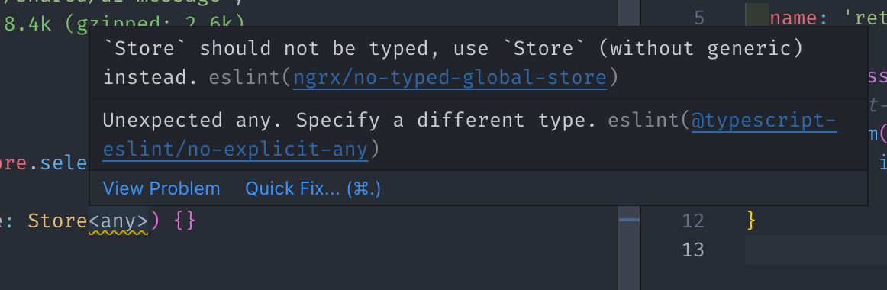

# Code Style

- [Code Style](#code-style)
  - [Angular Style Guide](#angular-style-guide)
  - [Visual Studio Code](#visual-studio-code)
    - [Needed extensions](#needed-extensions)
    - [Minimal configuration settings](#minimal-configuration-settings)
  - [Prettier auto formatter](#prettier-auto-formatter)
  - [Lint rules](#lint-rules)
  - [Links](#links)

## Angular Style Guide

All Angular code must follow the styles dictated by the official [Angular Style Guide](https://angular.io/styleguide).  
As long as you use Angular CLI and don't skip the git hooks, we shouldn't need to worry about missing something.

## Visual Studio Code

### Needed extensions

- **Angular Language Service** ([angular.ng-template](https://marketplace.visualstudio.com/items?itemName=Angular.ng-template)):
rich editing experience for Angular templates, both inline and external templates.
- **Nx Console** ([nrwl.angular-console](https://marketplace.visualstudio.com/items?itemName=nrwl.angular-console)):
UI for Nx commands in an easy way.
- **Prettier - Code formatter** ([esbenp.prettier-vscode](https://marketplace.visualstudio.com/items?itemName=esbenp.prettier-vscode)):
VSCode plugin for prettier.
- **Jest Runner** ([firsttris.vscode-jest-runner](https://marketplace.visualstudio.com/items?itemName=firsttris.vscode-jest-runner)):
A simple way to run or debug tests.
- **ESLint** ([dbaeumer.vscode-eslint](https://marketplace.visualstudio.com/items?itemName=dbaeumer.vscode-eslint)):
integrates ESLint JavaScript into VS Code.
- **markdownlint** ([davidanson.vscode-markdownlint](https://marketplace.visualstudio.com/items?itemName=DavidAnson.vscode-markdownlint)):
markdown linting and style checking for Visual Studio Code.
- **axe Accessibility Linter** ([deque-systems.vscode-axe-linter](https://marketplace.visualstudio.com/items?itemName=deque-systems.vscode-axe-linter))

> These extensions will appear in your extension VSCODE manager, under "recommended". For a real view of recommended extensions, please take a look at it.

### Minimal configuration settings

Under .vscode/settings.json there are some configurations needed for this project repository.

## Prettier auto formatter

We use prettier for automatic code formatting on save. The minimal configuration lives in .prettierrc and .prettierignore project root files.

## Lint rules

These are the manually added rules to the `.eslintrc.json` base file:

- [eslint-plugin-ngrx](https://github.com/timdeschryver/eslint-plugin-ngrx): with its default configuration to automatically lint all code while running nx lint.
  >
- [no-console](https://eslint.org/docs/latest/rules/no-console): warns about any console related methods in the code.
- [@typescript-eslint/prefer-readonly](https://github.com/typescript-eslint/typescript-eslint/blob/main/packages/eslint-plugin/docs/rules/prefer-readonly.md):
  require private members to be marked as `readonly` if they're never modified outside of the constructor.
- [eslint-plugin-jsdoc](https://github.com/gajus/eslint-plugin-jsdoc):
  - adds the recommended linting rules for `JSDoc`.
  - adds a regex match for description text in order to begin it in Uppercase and always end with a ".".
- [@angular-eslint/schematics](https://github.com/angular-eslint/angular-eslint#readme): enables ESLint to lint Angular projects. Added accessibility related rules. For more information visit [accessibility.md](accessibility).

## Links

- [Angular Style Guide](https://angular.io/guide/styleguide/)
- [Angular lint](https://angular.io/cli/lint)
- [prettier](https://prettier.io/)
- [ESLint](https://eslint.org/)
