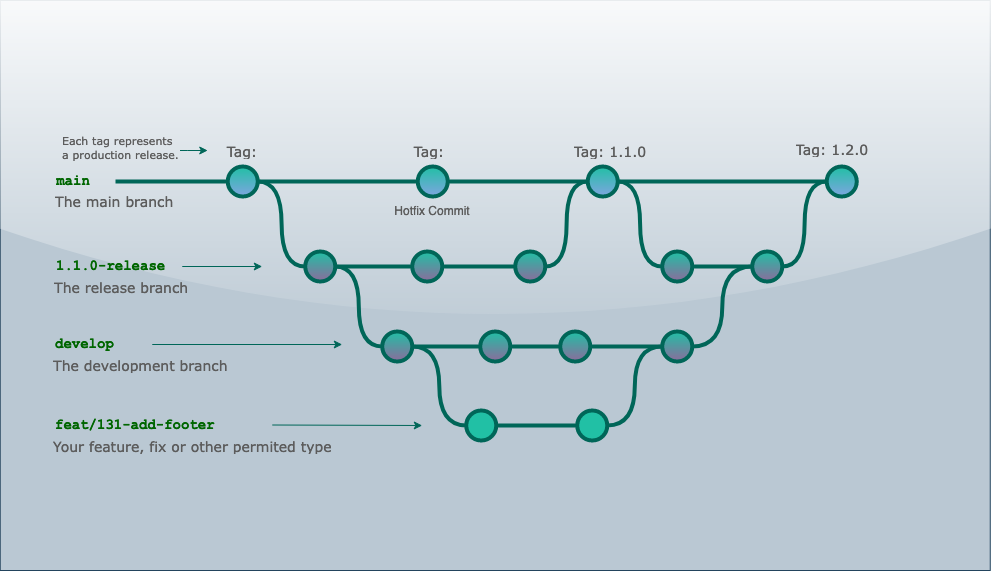

# Git Flow and CI/CD

- [Git Flow and CI/CD](#git-flow-and-cicd)
  - [Description](#description)
  - [Branch strategy](#branch-strategy)
  - [Issues creation](#issues-creation)
  - [Local development](#local-development)
  - [Pull request](#pull-request)
    - [Pull request Github actions](#pull-request-github-actions)
  - [Merge](#merge)
    - [Merge Github actions](#merge-github-actions)
    - [Staging deploy](#staging-deploy)
  - [Useful links](#useful-links)

## Description

A guide to show the right implementation of issues and `git branching model`, and the `CI` and `CD` of included applications.

## Branch strategy



- **Develop (develop branch)**.
  - It exists at all times.
  - Features are developed from it.
  - It must be synchronized with production every time a new release is created.
- **Feature (${issue-type}/${issue-number}-short-description)**.
  - The feature refers to any change in code, and should be named using the `commitizen` types.
  - Created to add new functionality.
  - Limited life, between start of issue and merge into development.
  - They will always be created from the historical point of development and based on an issue with a defined nomenclature.
  - They will end up merged always in `develop`.
- **Bugfix (fix/${issue-number}-short-description)**.
  - Bug resolution branch.
  - They can be generated from develop or from release.
  - If it is about this second situation, the fix must also be merged into `develop`.
- **Release (release/xx.xx.xx)**.
  - Preparation branch for a new release.
  - Limited use, it is created at a specific point of development with all the new features that we decided to introduce in a specific release.
  - We decided to never delete release branches. Whenever we needed to go through history, check code at a specific time, or review updates, branches were all available and easy to find.
  - `Hotfix commits` can be added directly to this branch before it is merged into production. `Develop` should be updated also with these changes.
- **Production (main)**.
  - Each merge since release must be tagged according to Semantic Versioning 2.0.0.
  - You can receive fixes directly in case you find bugs directly in production by the same usual procedure of creating a hotfix branch directly.
  - Remember that in this case this branch must also be merged with `develop`.

## Issues creation

Each new feature should be based on an existing `github issue`.  
By default we are using `github projects` to manage the whole repository work.

>[plastikspace project](https://github.com/users/plastikaweb/projects/2)

Each issue should have:

- A concise and clear title written in imperative (Imperative mood in English).
  > "Add a dynamic title to header"  
  > "Fix h2 sizes for mobile in Contact view"
- A description when needed, with any help, screen image, external useful links, steps to reproduce a bug, etc.
- Assignees: the person who is responsible for the development of the issue. This assignment is normally produced when the status of the issue changes to `Todo`.
- Labels: the type of issue. It matches with the [`commitizen` available types](commit-conventions.md#1-type).

By default the issues will be marked to wait in the `Backlog` of the project.

## Local development

- After picking an issue, it should be marked as a `In Progress`.
- The developer should work on a `feature branch` from the `develop branch`.
- The branch should have a naming convention: ```${issue-type}/${issue-number}-${issue brief description}```
  > For a github issue like: `Issue #33 "Add footer to main page"`
  >
  > Possible branch naming: `feat/33-footer-main`
  >
  > **There is a linting process that uses [branch-name-lint](https://github.com/barzik/branch-name-lint) package to check the validity of the branch naming. It runs at commit creation time.**

- When the issue is resolved, we have to commit it. See [commit-conventions](commit-conventions.md) for more information.
- Later we have to push the new feature branch to `github`.

## Pull request

The assigned developer creates a new PR based on the pushed branch and:

- Adds any extra information necessary for reviewer(s) in order to understand the goal of the PR and to test it.
- Select one or more reviewers. An opened dialog between actors could be established.
- The reviewers can approve it, can suggest changes, ask questions or reject it.

### Pull request Github actions

On any PR creation:

- **CI**:  this action is fired to pass different steps for markdownlint, code lint, unit testing and build in this branch.
  > You can see the `CI` actions status [here](https://github.com/plastikaweb/plastikspace/actions/workflows/ci.yml).

- **`a11y {app-name}`**: this action is fired to execute accessibility test using `pa11y-cy` runner.
  > You can see the `a11y nasa-images` actions status [here](https://github.com/plastikaweb/plastikspace/actions/workflows/pa11y.yml).  
  > You can see a local app a11y configuration [here](./accessibility.md#pa11y-ci-accessibility-test-runner)

## Merge

Once the PR is approved, it can be merged into `develop branch` by its author.  `github` automatically deletes the feature branch.

### Merge Github actions

On any merge to `develop branch`:

- **CI**:  this action is fired to pass different steps for markdownlint, code lint, unit testing and build in this branch.
  > You can see the `CI` actions status [here](https://github.com/plastikaweb/plastikspace/actions/workflows/ci.yml).

- **`a11y {app-name}`**: this action is fired to execute accessibility test using `pa11y-cy` runner.
  > You can see the `a11y for nasa-images app` action status [here](https://github.com/plastikaweb/plastikspace/actions/workflows/pa11y.yml).  
  > You can see a local app a11y configuration [here](./accessibility.md#pa11y-ci-accessibility-test-runner)

- **Deploy**: Once all `CI` and `a11y` related actions are passed successfully, a `Deploy Staging` workflow is fired, to build and deploy to github pages the app(s).

  > You can see the `Deploy Staging` actions status [here](https://github.com/plastikaweb/plastikspace/actions/workflows/cd-dev.yml).

### Staging deploy

The deploy used by `github pages` will vary depending of each included app configuration.  
Please, take a look inside each app README for further information:

- [nasa-images](../apps/nasa-images/README.md);

## Useful links

- [Github actions](https://docs.github.com/en/actions)
- [Github pages](https://docs.github.com/en/pages)
- [Atlassian: Git Feature Branch Workflow](https://www.atlassian.com/git/tutorials/comparing-workflows/feature-branch-workflow)
- [Gitflow Workflow](https://www.atlassian.com/git/tutorials/comparing-workflows/gitflow-workflow)
- [GitHub flow as a simpler alternative](https://gitlab.com/help/workflow/gitlab_flow.md)
- [Professional Guides: Workflow Strategies](https://www.youtube.com/watch?v=aJnFGMclhU8&list=PL7xAwalD2Tvz09hEyAY572DM-8yhkSZuf&index=14&t=0s)
- [Better Git branching strategy — Multi-apps, monorepos and multiple teams in focus — SimGit Flow](https://levelup.gitconnected.com/better-git-branching-strategy-multi-apps-monorepos-and-multiple-teams-in-focus-cd17b56962f2)
- [pa11y](https://github.com/pa11y/pa11y-ci)
