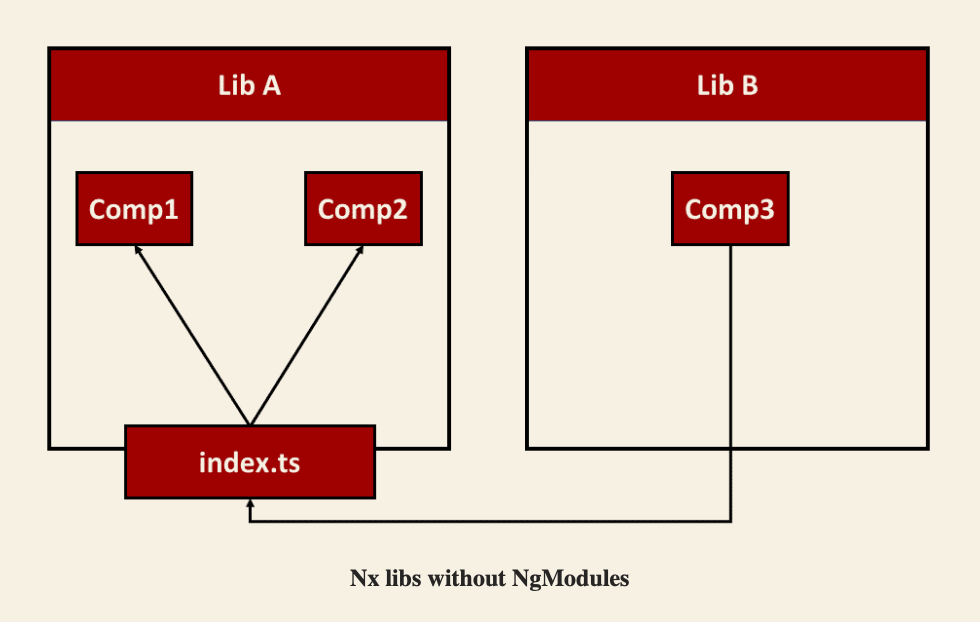
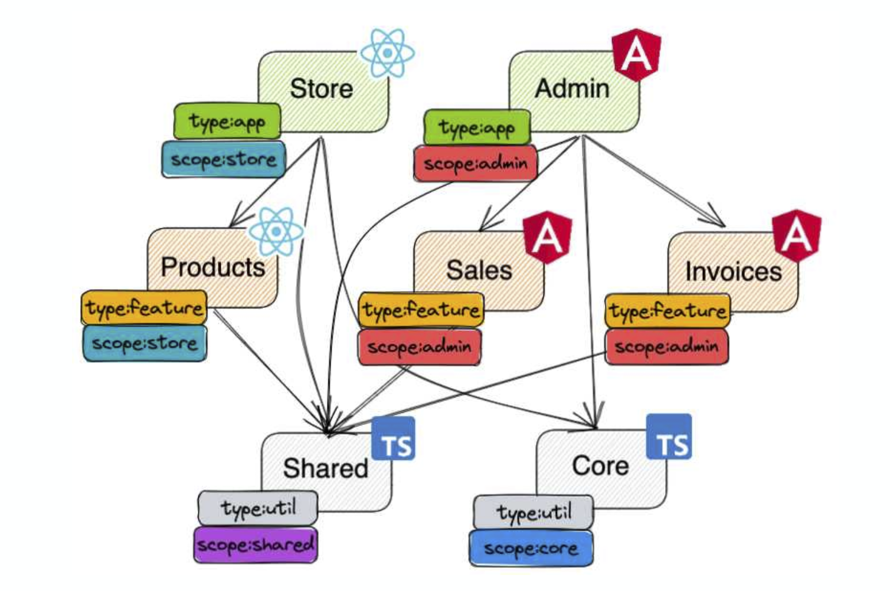
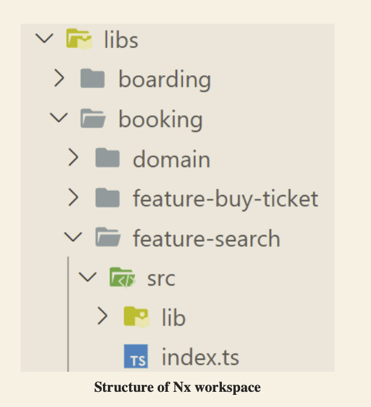

# NX architecture

- [NX architecture](#nx-architecture)
  - [Standalone components](#standalone-components)
  - [Lazy loading routing](#lazy-loading-routing)
  - [Domains and naming](#domains-and-naming)
    - [Scopes](#scopes)
      - [Grouping folders](#grouping-folders)
    - [Types](#types)
      - [app](#app)
      - [feature](#feature)
      - [data-access](#data-access)
      - [ui](#ui)
      - [util](#util)
    - [Linting Rules and built-in constraints Based Upon Tags](#linting-rules-and-built-in-constraints-based-upon-tags)
    - [Module Names](#module-names)
  - [Useful links](#useful-links)

## Standalone components

- use when possible standalone components over NG Modules.
- use barrels to get modularization.
- use whole barrels when possible to export always related classes and import as an array.
- define paths in tsconfig file to import elements with short, pretty, and descriptive naming.



## Lazy loading routing

- use lazy loading of components.
- set ngrx as provider for bootstrapping apps.
- set ngrx as provider for lazy loaded slices.
- there should be a dedicated *.routes.ts file for each feature / scope as the entrypoint.
- services that can be used globally should use `providedIn: ‘root’ while component-specific services should be provided directly in that component’s decorator metadata.

> The Angular team recommends using this providers array with caution and favoring providedIn: 'root' instead. As already mentioned in a previous chapter, also providedIn: 'root' allows for lazy loading.
> If you just use a service provided with providedIn: 'root' in lazy parts of your application, they will only be loaded together with them.

## Domains and naming

- NX puts all apps into an apps folder and the libraries into libs.
- each domain is represented by a subfolder.
- everything that is shared across different folders goes into a /shared folder.
- we use prefixes (feature, util, etc) to denote the layer a specific library is a part of.



### Scopes

Scope relates to a logical grouping, business use-case, or scope. Examples of scope from our sample application are seatmap, booking, shared, and core.
They contain libraries that manage a sub-domain of application logic.
We recommend using folder structure to denote domain. The following folder structure is an example scope hierarchy used to describe the seatmap feature: `shared/seatmap/feature/`.

- each main app name in the repo.
- core.
- shared.

#### Grouping folders

They do not contain anything except other library or grouping folders.

The purpose of these folders is to help with organizing by scope. We recommend grouping libraries together which are (usually) updated together.
It helps with minimizing the amount of time a developer spends navigating the folder tree to find the right file.

Scopes like "shared" and "seatmap" are example for grouping folders, and "feature" is a library that is nested two levels deep.
This offers a clear indication that this feature belongs to a scope of seatmap which is a sub-scope of shared items. The tag used in this library would be scope:shared, as this is the top-level scope.

```bash
shared/                  <---- grouping folder
  data-access/           <---- library

  seatmap/               <---- grouping folder
    data-access/         <---- library
    feature-seatmap/     <---- library
```



### Types

Type relates to the contents of the library and indicates its purpose and usage. Examples of types are ui, data-access, and feature. We recommend using prefixes and tags to denote type.

The tag for the seatmap feature library as in the previous example would now be `scope:shared, type:feature`.

- app: main workspace applications.
- feature: Implements a use case with smart components that implements smart UI (with injected services) for specific business use cases or pages in an application.
- data-access: services and utilities for interacting with a back-end or state manager system.
- ui: Provides use case-agnostic and thus reusable components (dumb components).
- util: Provides helper functions, services or utilities used by many libraries and apps.

> Please note the separation between smart and dumb components. Smart components within feature libraries are use case-specific. An example is a component that enables a product search.  
> On the contrary, dumb components do not know the current use case. They receive data via inputs, display it in a specific way, and issue events.
> Such presentational components “just” help to implement use cases and hence they are reusable.

#### app

A main application constraint.
Use it on each project.json file inside each child app in the /apps folder.

> Example: possible scope and type tags for nasa-images project:
>
> ```json
>  "tags": ["scope:nasa-images", "type:app"]
>  ```

#### feature

A feature library contains a set of files that configure a business use case or a page in an application.

Most of the components in such a library are smart components that interact with the NgRx Store.
This type of library also contains most of the UI logic, form validation code, etc. Feature libraries are almost always app-specific and are often lazy-loaded.

> Naming: feature (if nested) or feature-* (e.g., feature-shell).

#### data-access

Data-access libraries contain REST or webSocket services that function as client-side delegate layers to server tier APIs.
All files related to State management also reside in a data-access folder (by convention, they can be grouped under a +state folder under src/lib).

> Naming: data-access (if nested) or data-access-* (e.g. data-access-seatmap)

#### ui

A UI library is a collection of related presentational components. There are generally no services injected into these components (all of the data they need should come from Inputs).

> Naming: ui (if nested) or ui-* (e.g., ui-header)

#### util

A utility contains common utilities/services used by many libraries. Often there is no ngModule and the library is simply a collection of utilities or pure functions.

> Naming: util (if nested), or util-* (e.g., util-arrays)

### Linting Rules and built-in constraints Based Upon Tags

The following invariants should hold true:

- a lib cannot depend on an app.
- an app-specific library cannot depend on a lib from another app (e.g., "safe/" can only depend on libs from "safe/" or shared libs).
- a shared library cannot depend on an app-specific lib (e.g., "common-ui/" cannot depend on "safe/").
- a ui library cannot depend on a feature library or a data-access library.
- a utils library cannot depend on a feature library, data-access library, or component library.
- a data-access library cannot depend on a feature library or a component library.
- a project cannot have circular dependencies.
- a project that lazy loads another project cannot import it directly.

```bash
# current root .eslintrc.json fragment

{ 
  "depConstraints": [
    { 
      "sourceTag": "type:app", 
      "onlyDependOnLibsWithTags": ["type:feature", "scope:core"] 
    },
    {
      "sourceTag": "type:feature",
      "onlyDependOnLibsWithTags": ["type:ui", "type:util", "type:data-access"]
    },
    {
      "sourceTag": "type:ui",
      "onlyDependOnLibsWithTags": ["type:util"]
    },
    {
      "sourceTag": "type:util",
      "onlyDependOnLibsWithTags": ["type:util"]
    },
    {
      "sourceTag": "type:data-access",
      "onlyDependOnLibsWithTags": ["type:util"]
    },
    {
      "sourceTag": "scope:core",
      "onlyDependOnLibsWithTags": ["type:util"]
    },
    {
      "sourceTag": "scope:shared",
      "onlyDependOnLibsWithTags": ["scope:shared"]
    },
    {
      "sourceTag": "scope:nasa-images",
      "onlyDependOnLibsWithTags": ["scope:nasa-images", "scope:core"]
    }
  ]
}
```

### Module Names

The main module or component for a library must contain the full path (relative to libs) within the filename.

> e.g. the main module for the library libs/booking/feature-destination would have the module filename as booking-feature-destination.module.ts.

This is the way that the CLI creates the modules and we are recommending that we keep this pattern.

## Useful links

- [Enforce Project Boundaries: tags](https://nx.dev/core-features/enforce-project-boundaries#tags)
- [Creating libraries: enforcing constraints](https://nx.dev/more-concepts/creating-libraries#3.-enforcing-constraints)
- [Taming code organization with module boundaries in NX](https://missing-manual.com/taming-code-organization-with-nx/)
- [Component-First Architecture with Standalone Components and Nx](https://blog.nrwl.io/component-first-architecture-with-standalone-components-and-nx-c87559af1f91)
- [Using NgRx Packages with Standalone Angular Features](https://dev.to/ngrx/using-ngrx-packages-with-standalone-angular-features-53d8)
- [Angular's Future with Standalone Components](https://www.angulararchitects.io/aktuelles/angulars-future-without-ngmodules-lightweight-solutions-on-top-of-standalone-components/)
- [Plastikaweb NX architecture tips](https://github.com/plastikaweb/plastikspace/wiki/NX-architecture-tips)
