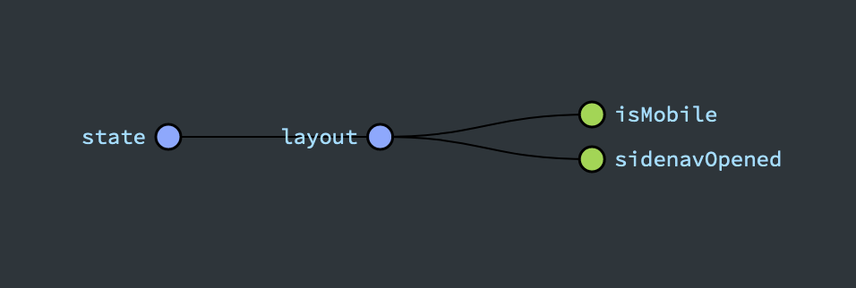

# core-cms-layout-data-access

- [core-cms-layout-data-access](#core-cms-layout-data-access)
  - [Description](#description)
  - [State](#state)
    - [How to use](#how-to-use)
  - [Token services](#token-services)
    - [CORE_CMS_LAYOUT_HEADER_CONFIG](#core_cms_layout_header_config)
    - [VIEW_CONFIG](#view_config)
  - [Running unit tests](#running-unit-tests)

## Description

A library with state segment and facade service to manage CMS layout properties and some global service tokens to add init configuration to cms-layout libraries.

## State

```typescript
export interface State {
  isMobile: boolean;
  sidenavOpened: boolean;
}
```



### How to use

- Import `CoreCmsLayoutDataAccessModule` into parent module or standalone component.

```typescript
import { CoreCmsLayoutDataAccessModule } from '@plastik/core/cms-layout/data-access';

@NgModule({
  imports: [CoreCmsLayoutDataAccessModule],
})
export class ParentModule {}
```

- Inject `LayoutFacade` in any smart component to manage @ngrx subscription selectors and actions dispatching related with layout state.

```typescript
import { LayoutFacade } from '@plastik/core/cms-layout/data-access';

@Component({
  selector: 'layout-feature',

  templateUrl: './layout-feature.component.html',
  changeDetection: ChangeDetectionStrategy.OnPush,
})
export class FeatureComponent {
  readonly #facade = inject(LayoutFacade);
  sidenavOpened$ = this.facade.sidenavOpened$;
  isMobile$ = this.facade.isMobile$;

  onToggleSidenav(opened?: boolean): void {
    this.#facade.toggleSidenav(opened);
  }

  onSetIsMobile(isMobile: boolean): void {
    this.#facade.setIsMobile(isMobile);
  }

  onDispatchAction(action: () => Action): void {
    this.#facade.dispatchAction(action);
  }
}
```

## Token services

### CORE_CMS_LAYOUT_HEADER_CONFIG

Use this to inject header configuration on bootstrapping app.

> See [core-cms-layout-feature: How to use](../feature/README.md#How-to-use) for a practical example.

```typescript
export interface CoreCmsLayoutHeaderConfig {
  showToggleMenuButton: boolean;
  mainTitle: string;
  mainIcon?: SvgIconConfig;
}

export const CORE_CMS_LAYOUT_HEADER_CONFIG = new InjectionToken<CoreCmsLayoutHeaderConfig>(
  'CORE_CMS_LAYOUT_HEADER_CONFIG'
);
```

### VIEW_CONFIG

Use this to inject sidenav menu configuration on bootstrapping app.

```typescript
export const VIEW_CONFIG = new InjectionToken<ViewConfig<unknown>[]>('VIEW_CONFIG');
```

## Running unit tests

Run `nx test core-cms-layout-data-access` to execute the unit tests.
