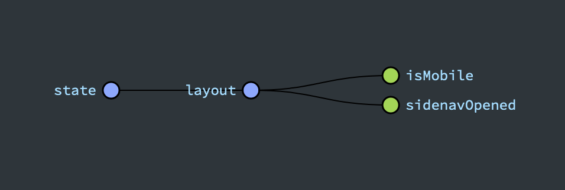

# @plastik/core/cms-layout/data-access


- [@plastik/core/cms-layout/data-access](#plastikcorecms-layoutdata-access)
  - [Description](#description)
  - [State Management](#state-management)
  - [Tokens](#tokens)
    - [`CORE_CMS_LAYOUT_HEADER_CONFIG`](#core_cms_layout_header_config)
    - [`VIEW_CONFIG`](#view_config)
  - [Usage](#usage)
    - [1. Import Module](#1-import-module)
    - [2. Use Facade](#2-use-facade)
  - [Running Unit Tests](#running-unit-tests)

## Description

Manages **CMS Layout State** (e.g., sidenav status, mobile detection) and provides configuration tokens for layout features.

## State Management

**Interface:**

```typescript
export interface State {
  isMobile: boolean;
  sidenavOpened: boolean;
}
```



## Tokens

### `CORE_CMS_LAYOUT_HEADER_CONFIG`

Injects header configuration (title, icon, buttons).

```typescript
export const CORE_CMS_LAYOUT_HEADER_CONFIG = new InjectionToken<CoreCmsLayoutHeaderConfig>(
  'CORE_CMS_LAYOUT_HEADER_CONFIG'
);
```

### `VIEW_CONFIG`

Injects the sidenav menu configuration.

```typescript
export const VIEW_CONFIG = new InjectionToken<ViewConfig<unknown>[]>('VIEW_CONFIG');
```

## Usage

### 1. Import Module

```typescript
import { CoreCmsLayoutDataAccessModule } from '@plastik/core/cms-layout/data-access';

@NgModule({
  imports: [CoreCmsLayoutDataAccessModule],
})
export class ParentModule {}
```

### 2. Use Facade

Inject `LayoutFacade` to interact with the state:

```typescript
@Component({ ... })
export class FeatureComponent {
  private facade = inject(LayoutFacade);
  sidenavOpened$ = this.facade.sidenavOpened$;
  isMobile$ = this.facade.isMobile$;

  toggleSidenav(opened?: boolean) {
    this.facade.toggleSidenav(opened);
  }
}
```

## Running Unit Tests

Run `nx test core-cms-layout-data-access` to execute the unit tests.
