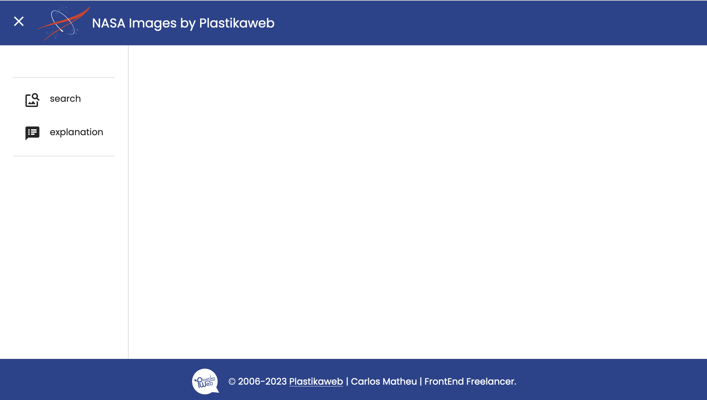
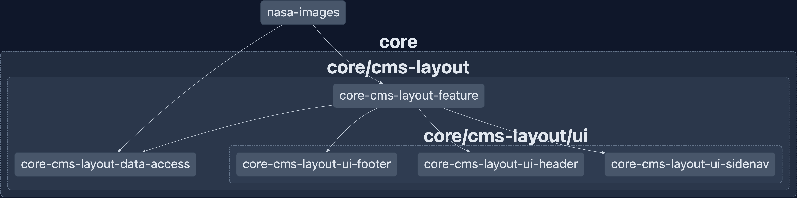

# core-cms-layout-feature

- [core-cms-layout-feature](#core-cms-layout-feature)
  - [Description](#description)
    - [UI](#ui)
    - [Data Access](#data-access)
  - [Inputs](#inputs)
  - [How to use](#how-to-use)
  - [Running unit tests](#running-unit-tests)

## Description

A customizable and shareable layout for CMS apps.

> An example applied to nasa-images app
> 
>
> graph
> 

### UI

It has three child components:

- a header: [core-cms-layout-ui-header](../../cms-layout/ui/header/README.md).
- a footer: [core-cms-layout-ui-footer](../../cms-layout/ui/footer/README.md).
- a sidenav with main content: [core-cms-layout-ui-sidenav](../../cms-layout/ui/sidenav/README.md).

### Data Access

It uses a store segment for layout related state:

- data-access: [core-cms-layout-data-access](../../cms-layout/data-access/README.md).

## Inputs

| Name              | Type            | Description                                                 | Default |
| ----------------- | --------------- | ----------------------------------------------------------- | ------- |
| `sidenavPosition` | "start" / "end" | Position sidenav to the left or to the right in the layout. | "start" |

## How to use

- Create the header and sidenav configuration objects.

```typescript
// apps/my-app/src/app/cms-layout-config.ts

export const headerConfig: CoreCmsLayoutHeaderConfig = {
  showToggleMenuButton: true,
  mainTitle: 'Main Title',
  mainIcon: { iconPath: 'assets/img/logo.svg', svgClass: 'bg-white text-black w-[80px]' },
};

export const viewConfig: ViewsConfigRecord<NasaImagesViews> = {
  [AppViews.WELCOME]: {
    title: AppViews.WELCOME,
    icon: 'welcome',
    route: [`/${AppViews.WELCOME}`],
    includedInNavigation: true,
  },
  [AppViews.FAQS]: {
    title: AppViews.FAQS,
    icon: 'faq',
    route: [`/${AppViews.FAQS}`],
    includedInNavigation: true,
  },
};
```

- Add the header and sidenav configurations as arguments to the `CoreCmsLayoutDataAccessModule.withConfig` static method imported into the providers list in main.app file.

```typescript
// apps/my-app/src/main.ts

import { CoreCmsLayoutFeatureModule } from '@plastik/core/cms-layout';

bootstrapApplication(AppComponent, {
  providers: [importProvidersFrom(CoreCmsLayoutFeatureModule.withConfig<AppViews>(headerConfig, viewConfig))],
});
```

- Import `CoreCmsLayoutFeatureComponent` into the app root standalone component.

```typescript
// apps/my-app/src/app/app.component.ts

import { Component } from '@angular/core';
import { CoreCmsLayoutFeatureComponent } from '@plastik/core/cms-layout';

@Component({
  standalone: true,
  selector: 'ng-root',
  imports: [CoreCmsLayoutFeatureComponent],
  templateUrl: './app.component.html',
})
export class AppComponent {}
```

- Add the template tag into `app.component.html`.

```html
<!-- apps/my-app/src/app/app.component.html -->

<plastik-core-cms-layout-feature></plastik-core-cms-layout-feature> >
```

## Running unit tests

Run `nx test core-cms-layout-feature` to execute the unit tests.
