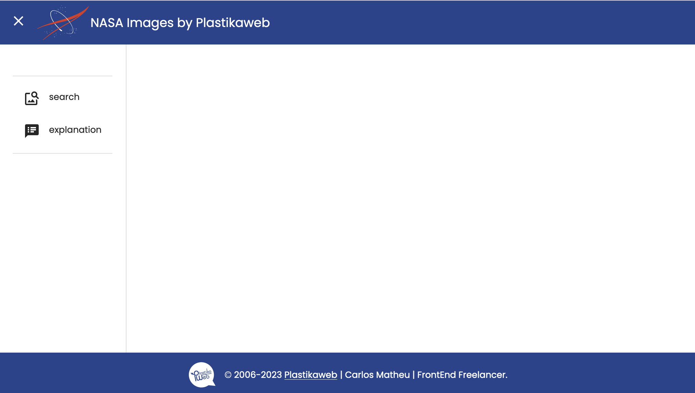
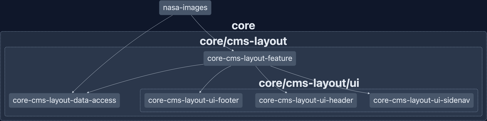

# @plastik/core/cms-layout


- [@plastik/core/cms-layout](#plastikcorecms-layout)
  - [Description](#description)
  - [Architecture](#architecture)
    - [UI Components](#ui-components)
    - [Data Access](#data-access)
  - [Inputs](#inputs)
  - [Usage](#usage)
    - [1. Configuration](#1-configuration)
    - [2. Setup (main.ts)](#2-setup-maints)
    - [3. Implementation (AppComponent)](#3-implementation-appcomponent)
  - [Running Unit Tests](#running-unit-tests)

## Description

A **Customizable and Shareable Layout** for CMS applications. It orchestrates the header, footer, sidenav, and content area, providing a consistent structure for dashboard-like interfaces.

> **Example:** NASA Images App Layout
>
> 

## Architecture



### UI Components

- **Header**: [core-cms-layout-ui-header](../../cms-layout/ui/header/README.md)
- **Footer**: [core-cms-layout-ui-footer](../../cms-layout/ui/footer/README.md)
- **Sidenav**: [core-cms-layout-ui-sidenav](../../cms-layout/ui/sidenav/README.md)
- **Snackbar**: Integrated notifications via `plastikSnackbar`.

### Data Access

Managed by [core-cms-layout-data-access](../../cms-layout/data-access/README.md) for layout state (mobile detection, sidenav toggle).

## Inputs

| Name              | Type              | Description                              | Default   |
| :---------------- | :---------------- | :--------------------------------------- | :-------- |
| `sidenavPosition` | `"start" / "end"` | Position of the sidenav (left or right). | `"start"` |

## Usage

### 1. Configuration

Define your header and view (sidenav) configuration:

```typescript
// cms-layout-config.ts
export const headerConfig: CoreCmsLayoutHeaderConfig = {
  showToggleMenuButton: true,
  mainTitle: 'Main Title',
  mainIcon: { iconPath: 'assets/img/logo.svg', svgClass: 'bg-white text-black w-[80px]' },
};

export const viewConfig: ViewsConfigRecord<AppViews> = {
  [AppViews.WELCOME]: {
    title: AppViews.WELCOME,
    icon: 'welcome',
    route: [`/${AppViews.WELCOME}`],
    includedInNavigation: true,
  },
  // ... other views
};
```

### 2. Setup (main.ts)

Import the module and provide configurations:

```typescript
import { CoreCmsLayoutDataAccessModule } from '@plastik/core/cms-layout/data-access';

bootstrapApplication(AppComponent, {
  providers: [
    importProvidersFrom(CoreCmsLayoutDataAccessModule),
    { provide: CORE_CMS_LAYOUT_HEADER_CONFIG, useValue: headerConfig },
    {
      provide: VIEW_CONFIG,
      useValue: getVisibleNavigationList(viewConfig), // Filters only visible nav items
    },
  ],
});
```

### 3. Implementation (AppComponent)

```typescript
import { CoreCmsLayoutFeatureComponent } from '@plastik/core/cms-layout';

@Component({
  selector: 'ng-root',
  imports: [CoreCmsLayoutFeatureComponent],
  template: `<plastik-core-cms-layout-feature></plastik-core-cms-layout-feature>`,
})
export class AppComponent {}
```

## Running Unit Tests

Run `nx test core-cms-layout-feature` to execute the unit tests.
