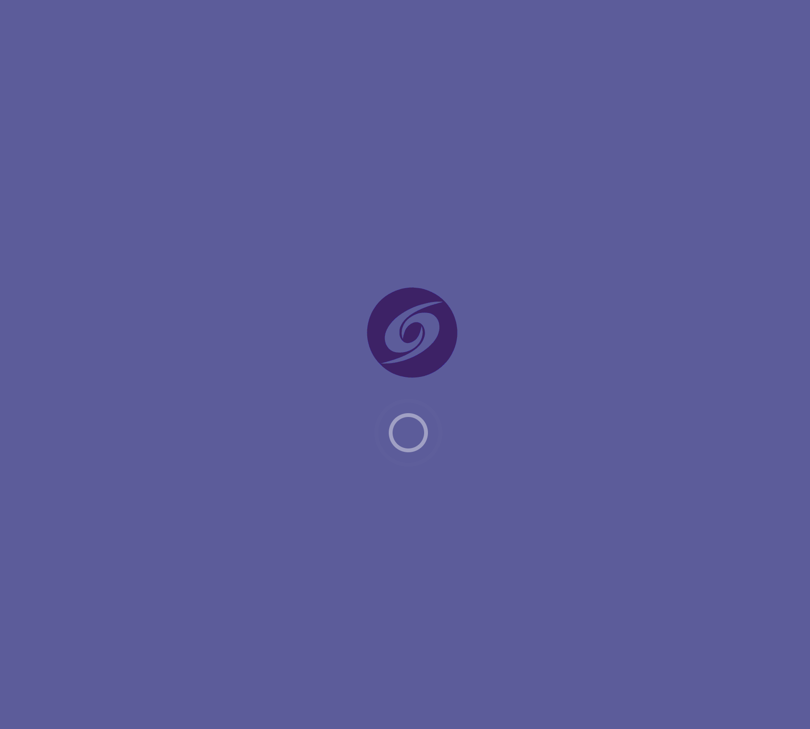

# @plastik/core/ng-entry-html


- [@plastik/core/ng-entry-html](#plastikcoreng-entry-html)
  - [Description](#description)
  - [Single Index HTML](#single-index-html)
  - [Configuration Steps](#configuration-steps)

## Description

A collection of configuration files to share and avoid DRY between Angular applications, focusing on a robust **Single Entry HTML** strategy.



> Initial loading example (e.g., nasa-images)

## Single Index HTML

We use a shared `index.html` file for bootstrapping all Angular applications. This ensures consistent meta tags, loading states, and structure.

## Configuration Steps

When creating a new application:

1. **Remove Default File**: Delete the automatically created `index.html` in `{new-app}/src`.
2. **Update `project.json`**: Point the build `index` property to the shared file:

   ```json
   "index": "libs/core/ng-entry-html/util/src/index.html",
   ```

3. **Update `app.component.ts`**: Set the selector to match the shared root (e.g., `plastik-root`):

   ```typescript
   @Component({
     selector: 'plastik-root',
     templateUrl: './app.component.html',
   })
   export class AppComponent {}
   ```

4. **Add Favicon**: Ensure a `favicon.svg` exists in your app's assets directory. This is used by the preloader and as the browser favicon.

   ```typescript
   // Path expected by the shared index.html
   assets / img / favicon.svg;
   ```
