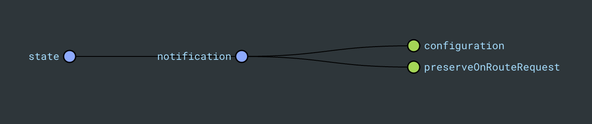

# core-notification-data-access

- [core-notification-data-access](#core-notification-data-access)
  - [Description](#description)
  - [Notification State Object](#notification-state-object)
  - [How to use](#how-to-use)
    - [Notification Actions](#notification-actions)
    - [Use it with @ngrx Effects](#use-it-with-ngrx-effects)
  - [Running unit tests](#running-unit-tests)

## Description

A `@ngrx` state segment and services to control the configuration and visibility of valuable notifications that gives users information about any app state change, including any errors or warnings.

## Notification State Object



```typescript
interface State {
  configuration: MatSnackBarConfig | null;
  preserveOnRouteRequest: boolean;
}
```

## How to use

- Import `CoreNotificationDataAccessModule` into your main bootstrap entry point.

### Notification Actions

```typescript
// injects a configuration object with data about the content and styling of the notification box.
// The preserve parameter handles if the notification should be preserved on route change.
// By default on route change, if any notification is present in the UI, it is hidden.

this.store.dispatch(
  notificationActions.show({
    configuration: {
      data: { type: 'ERROR', notification: 'Error!' },
      duration: 2500,
    },
    preserve: true,
  }),
);

// removes notification configuration after notification box dismisses.

this.store.dispatch(notificationActions.dismiss());
```

### Use it with @ngrx Effects

- Inside `ui-messaging-config.ts` we have the different `NotificationType` (Error, Success, Warning and Info) notification box configuration.
- It uses the `NotificationConfigService -> getInstance` method to get the final configuration for the box notifications.

```typescript
@Injectable()
export class FeatureEffects {
  private readonly notificationService = inject(NotificationConfigService);

  showError$ = createEffect(() =>
    this.actions$.pipe(
      ofType(loadEntitiesFailure),
      map(({ error: notification }) =>
        notificationActions.show({
          configuration: this.messagingService.getInstance('ERROR'),
        }),
      ),
    ),
  );
}
```

## Running unit tests

Run `nx test core-notification-data-access` to execute the unit tests.
