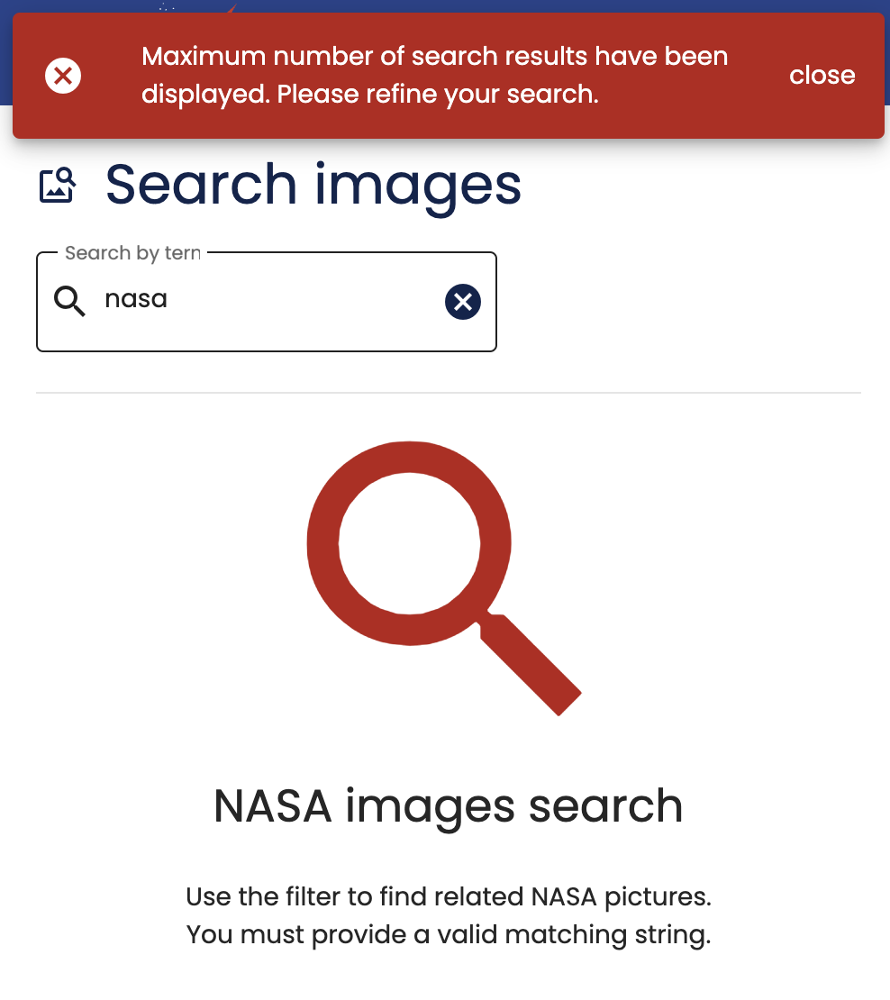

# core-notification-ui-mat-snackbar

## Description

A visual notification using material snackbar to warn users about different important information in some state change.



It has by default 4 different states:

- `Error`: Important information that blocks the user flow and/or needs to take some action.
- `Warning`: Information with no blocking state.
- `Success`: Information about any action or state change that succeeds.
- `Info`: Other relevant not blocking information that we want to share with the user and doesn't need any further action.

## HTML elements

It exposes the `CoreNotificationUiMatSnackbarDirective` to use.

`[plastikSnackbar]`

## Inputs

| Name                         | Type                              | Description                                   | Default |
| ---------------------------- | --------------------------------- | --------------------------------------------- | ------- |
| `plastikSnackbar` (`config`) | `MatSnackBarConfig<Notification>` | The configuration to styling the notification |         |

## Outputs

| Name          | Type                 | Description                             |
| ------------- | -------------------- | --------------------------------------- |
| `sendDismiss` | `EventEmitter<void>` | emitted when the snackBar is dismissed. |

## How to use

### 1. Import CoreNotificationUiMatSnackbarModule module into your feature module

```typescript
import { CoreNotificationUiMatSnackbarModule } from '@plastik/core/notification/ui/mat-snackbar';

@NgModule({
  imports: [
    // other imports...
    CoreNotificationUiMatSnackbarModule.forRoot({
      // You can overwrite partly the default configuration
      duration: 3000,
      horizontalPosition: 'right',
      verticalPosition: 'top',
    }),
  ],
})
export class FeatureModule {}
```

### 2. Add it to your feature component

```html
<!-- feature.component.html -->

<div [plastikSnackbar]="snackBarConfiguration" (sendDismiss)="onNotificationDismiss()"></div>
```

```typescript
// feature.component.ts
import { Notification } from '@plastik/core/notification/entities';

@Component({
  selector: 'plastik-feature',
  standalone: true,
  imports: [CoreNotificationUiMatSnackbarDirective],
})
export class CoreCmsLayoutFeatureComponent {
  snackBarConfiguration: Notification = {
    type: MessageType.Info,
    message: 'Test',
    action: 'close',
  };

  onNotificationDismiss() {
    // dispatch any action when snackBar is dismissed
    console.log('RESET');
  }
}
```

### 3. Styling

You can overwrite the styles from your main application declaring these CSS variables in your app `styles/_theme.scss` file:

```css
- --plastik-error-notification-box-color: rgb(195, 6, 6);
- --plastik-info-notification-box-color: rgb(14, 122, 190);
- --plastik-warning-notification-box-color: rgb(221, 148, 20);
- --plastik-success-notification-box-colors: rgb(22, 134, 40);
```

## Running unit tests

Run `nx test core-notification-ui-mat-snackbar` to execute the unit tests.

## Useful links

- [MatSnackBar](https://material.angular.io/components/snack-bar)
