# @plastik/core/api-base

- [Description](#description)
- [Core Concepts](#core-concepts)
- [Usage Patterns](#usage-patterns)
- [Architecture](#architecture)

## Description

**Common API Utilities** providing a base service class and configuration tokens for standardized data access. It decouples the application from specific API implementations.

### Key Benefits

- 🔌 **Decoupled**: Application logic is independent of data provider implementation.
- 🎯 **Type-safe**: Full TypeScript support with generics.
- 🧩 **Modular**: Choose only the operations you need (list, get, crud).
- 🔄 **Swappable**: Easy to switch between HTTP, PocketBase, Firebase, or mock implementations.

## Core Concepts

### Service Interfaces

Three main service patterns aligned with common use cases:

| Interface                                   | Purpose                    | Methods                                                     |
| :------------------------------------------ | :------------------------- | :---------------------------------------------------------- |
| `DataGetList<T, TList, PARAMS>`             | Fetch lists only           | `getList(params?)`                                          |
| `DataGetOne<T>`                             | Fetch single items         | `getOne(id)`                                                |
| `DataGet<T, TList, PARAMS>`                 | Fetch lists + single items | `getList(params?)`, `getOne(id)`                            |
| `DataCrud<T, TList, PARAMS, DATA, OPTIONS>` | Full CRUD operations       | `getList()`, `getOne()`, `create()`, `update()`, `delete()` |

> **Note:** `DATA` is the **input type** for `create()` and `update()` operations (defaults to `Omit<T, 'id'>` since IDs are backend-generated).

### Injection Tokens

Factory functions to create type-safe injection tokens:

- `createDataGetListServiceToken<T, TList, PARAMS>(description)`
- `createDataGetOneServiceToken<T>(description)`
- `createDataGetServiceToken<T, TList, PARAMS>(description)`
- `createDataCrudServiceToken<T, TList, PARAMS, DATA, OPTIONS>(description)`

## Usage Patterns

### Pattern 1: List Only (`DataGetList`)

**Use when:** You only need to fetch collections of data (e.g., dropdown options, search results).

### Pattern 2: Get Single Item (`DataGetOne`)

**Use when:** You only need to fetch individual items by ID (e.g., detail pages).

### Pattern 3: Full CRUD (`DataCrud`)

**Use when:** You need complete create, read, update, delete functionality.

## Architecture

```mermaid
graph TB
    subgraph "Application Layer"
        A[Component/Store]
    end

    subgraph "Contract Layer (api-base)"
        B[DataGetList]
        C[DataGet]
        D[DataGetWithList]
        E[DataCrud]
        F[Injection Tokens]
    end

    subgraph "Implementation Layer"
        G[HTTP Service]
        H[PocketBase Service]
        I[Firebase Service]
        J[Mock Service]
    end

    A -->|inject via token| F
    F -->|provides| B
    F -->|provides| C
    F -->|provides| D
    F -->|provides| E

    B -.implements.- G
    B -.implements.- H
    C -.implements.- I
    E -.implements.- J

    style A fill:#333333
    style B fill:#013341
    style C fill:#013341
    style D fill:#013341
    style E fill:#013341
    style F fill:#333366
```

**Flow:**

1. **Application** injects service via token (decoupled from implementation).
2. **Token** provides the contract interface.
3. **Implementation** (HTTP/PocketBase/Firebase) implements the contract.
4. **Swappable** implementations without changing application code.
