# api-base

- [api-base](#api-base)
  - [📚 Overview](#-overview)
  - [🎯 Core Concepts](#-core-concepts)
    - [Service Interfaces](#service-interfaces)
    - [Injection Tokens](#injection-tokens)
    - [Base Service](#base-service)
  - [🚀 Usage Patterns](#-usage-patterns)
    - [Pattern 1: List Only (`DataGetList`)](#pattern-1-list-only-datagetlist)
    - [Pattern 2: Get Single Item (`DataGetOne`)](#pattern-2-get-single-item-datagetone)
    - [Pattern 3: Get with List (`DataGet`)](#pattern-3-get-with-list-dataget)
    - [Pattern 4: Full CRUD (`DataCrud`)](#pattern-4-full-crud-datacrud)
  - [🧩 Architecture](#-architecture)

## 📚 Overview

This library provides **foundational contracts and utilities** for data access in the application.
It defines _what_ a data service looks like, without mandating _how_ it is implemented (e.g., HTTP, PocketBase, Firebase).

**Key Benefits:**

- 🔌 **Decoupled**: Application logic is independent of data provider implementation
- 🎯 **Type-safe**: Full TypeScript support with generics
- 🧩 **Modular**: Choose only the operations you need (list, get, crud)
- 🔄 **Swappable**: Easy to switch between HTTP, PocketBase, Firebase, or mock implementations

## 🎯 Core Concepts

### Service Interfaces

Three main service patterns aligned with common use cases:

| Interface                                   | Purpose                    | Methods                                                     |
| ------------------------------------------- | -------------------------- | ----------------------------------------------------------- |
| `DataGetList<T, TList, PARAMS>`             | Fetch lists only           | `getList(params?)`                                          |
| `DataGetOne<T>`                             | Fetch single items         | `getOne(id)`                                                |
| `DataGet<T, TList, PARAMS>`                 | Fetch lists + single items | `getList(params?)`, `getOne(id)`                            |
| `DataCrud<T, TList, PARAMS, DATA, OPTIONS>` | Full CRUD operations       | `getList()`, `getOne()`, `create()`, `update()`, `delete()` |

> **Note:** `DATA` is the **input type** for `create()` and `update()` operations (defaults to `Omit<T, 'id'>` since IDs are backend-generated). The service returns the complete `T` entity with ID.

### Injection Tokens

Factory functions to create type-safe injection tokens:

- `createDataGetListServiceToken<T, TList, PARAMS>(description)`
- `createDataGetOneServiceToken<T>(description)`
- `createDataGetServiceToken<T, TList, PARAMS>(description)`
- `createDataCrudServiceToken<T, TList, PARAMS, DATA, OPTIONS>(description)`

### Base Service

`BaseDataService` provides common utilities:

- `handleError<E>(error: E)`: Standardized error handling for HTTP and custom backends
- `cacheTime`: Configurable cache duration (default: 1 day)

## 🚀 Usage Patterns

### Pattern 1: List Only (`DataGetList`)

**Use when:** You only need to fetch collections of data (e.g., dropdown options, search results).

```typescript
// 1. Create token
import { createDataGetListServiceToken } from '@plastik/core/util/api-base';

interface ProductSearchParams {
  page?: number;
  limit?: number;
  sort?: { [key: string]: 'asc' | 'desc' };
  filter?: { [key: string]: string };
  search?: string;
}

export const PRODUCT_LIST_SERVICE = createDataGetListServiceToken<{
  data: Product[];
  count: number;
}>('PRODUCT_LIST_SERVICE');

// 2. Implement service
import { Injectable } from '@angular/core';
import { HttpClient } from '@angular/common/http';
import { DataGetList } from '@plastik/core/util/api-base';

@Injectable()
export class ProductListService
  implements DataGetList<{ data: Product[]; count: number }, ProductSearchParams>
{
  constructor(private http: HttpClient) {}

  getList(params?: ProductSearchParams) {
    return this.http.get<{ data: Product[]; count: number }>(`/api/products`, { params });
  }
}

// 3. Provide
providers: [{ provide: PRODUCT_LIST_SERVICE, useClass: ProductListService }];

// 4. Inject and use
export class ProductListComponent {
  private productService = inject(PRODUCT_LIST_SERVICE);
  products$ = this.productService.getList({
    page: 1,
    limit: 10,
    sort: { name: 'asc' },
    filter: { category: 'electronics' },
  });
}
```

### Pattern 2: Get Single Item (`DataGetOne`)

**Use when:** You only need to fetch individual items by ID (e.g., detail pages).

```typescript
// 1. Create token
export const PRODUCT_GET_SERVICE = createDataGetOneServiceToken<Product>('PRODUCT_GET_SERVICE');

// 2. Implement service
@Injectable()
export class ProductGetService implements DataGetOne<Product> {
  constructor(private http: HttpClient) {}

  getOne(id: IdType<Product>) {
    return this.http.get<Product>(`/api/products/${id}`);
  }
}

// 3. Use
export class ProductDetailComponent {
  private productService = inject(PRODUCT_GET_SERVICE);
  product$ = this.productService.getOne(this.productId);
}
```

### Pattern 3: Get with List (`DataGet`)

**Use when:** You need both list and detail fetching (e.g., master-detail views).

```typescript
// 1. Create token
export const PRODUCT_SERVICE = createDataGetServiceToken<Product, Product[], ProductSearchParams>(
  'PRODUCT_SERVICE'
);

// 2. Implement service
@Injectable()
export class ProductService implements DataGet<Product, Product[], ProductSearchParams> {
  constructor(private http: HttpClient) {}

  getList(params?: ProductSearchParams) {
    return this.http.get<Product[]>('/api/products', { params });
  }

  getOne(id: IdType<Product>) {
    return this.http.get<Product>(`/api/products/${id}`);
  }
}
```

### Pattern 4: Full CRUD (`DataCrud`)

**Use when:** You need complete create, read, update, delete functionality.

````typescript
// 1. Create token
export const PRODUCT_CRUD_SERVICE = createDataCrudServiceToken<
  Product,
  { data: Product[]; count: number },
  ProductSearchParams
>('PRODUCT_CRUD_SERVICE');

// 2. Implement service
@Injectable()
export class ProductCrudService
  extends BaseDataService
  implements DataCrud<Product, { data: Product[]; count: number }, ProductSearchParams>
{
  private http = inject(HttpClient);

  getList(params?: ProductSearchParams) {
    return this.http
      .get<{ data: Product[]; count: number }>(`/api/products`, { params })
      .pipe(catchError(this.handleError));
  }

  getOne(id: IdType<Product>) {
    return this.http.get<Product>(`/api/products/${id}`).pipe(catchError(this.handleError));
  }

  create(data: Partial<Product>) {
    return this.http.post<Product>('/api/products', data).pipe(catchError(this.handleError));
  }

  update(id: IdType<Product>, data: Partial<Product>) {
    return this.http.put<Product>(`/api/products/${id}`, data).pipe(catchError(this.handleError));
  }

  delete(id: IdType<Product>) {
    return this.http.delete<boolean>(`/api/products/${id}`).pipe(catchError(this.handleError));
  }
}

// 3. Use with Signal Store
export const ProductStore = signalStore(
  withHttpCrud<Product, ProductCrudService>({
    featureName: 'products',
    dataServiceType: ProductCrudService,
  })
);

**Advanced: Using `DATA` for custom input type**

When you need a specific input structure for create/update operations (e.g., strict validation, required fields):

```typescript
// 1. Define custom input type
interface ProductCreateData {
  name: string;
  description: string;
  price: number;
  categoryId: string;
}

// 2. Create token with DATA
export const PRODUCT_CRUD_SERVICE = createDataCrudServiceToken<
  Product,
  { data: Product[]; count: number },
  ProductSearchParams,
  ProductCreateData,  // DATA parameter - custom input type
  unknown
>('PRODUCT_CRUD_SERVICE');

// 3. Implement service
@Injectable()
export class ProductCrudService
  extends BaseDataService
  implements DataCrud<Product, { data: Product[]; count: number }, ProductSearchParams, ProductCreateData, unknown>
{
  private http = inject(HttpClient);

  create(data: ProductCreateData): Observable<Product> {
    return this.http.post<Product>('/api/products', data).pipe(catchError(this.handleError));
  }

  update(id: IdType<Product>, data: ProductCreateData): Observable<Product> {
    return this.http.put<Product>(`/api/products/${id}`, data).pipe(catchError(this.handleError));
  }

  // ... other methods
}
````

## 🧩 Architecture



```mermaid
graph TB
    subgraph "Application Layer"
        A[Component/Store]
    end

    subgraph "Contract Layer (api-base)"
        B[DataGetList]
        C[DataGet]
        D[DataGetWithList]
        E[DataCrud]
        F[Injection Tokens]
    end

    subgraph "Implementation Layer"
        G[HTTP Service]
        H[PocketBase Service]
        I[Firebase Service]
        J[Mock Service]
    end

    A -->|inject via token| F
    F -->|provides| B
    F -->|provides| C
    F -->|provides| D
    F -->|provides| E

    B -.implements.- G
    B -.implements.- H
    C -.implements.- I
    E -.implements.- J

    style A fill:#333333
    style B fill:#013341
    style C fill:#013341
    style D fill:#013341
    style E fill:#013341
    style F fill:#333366
```

**Flow:**

1. **Application** injects service via token (decoupled from implementation)
2. **Token** provides the contract interface
3. **Implementation** (HTTP/PocketBase/Firebase) implements the contract
4. **Swappable** implementations without changing application code
