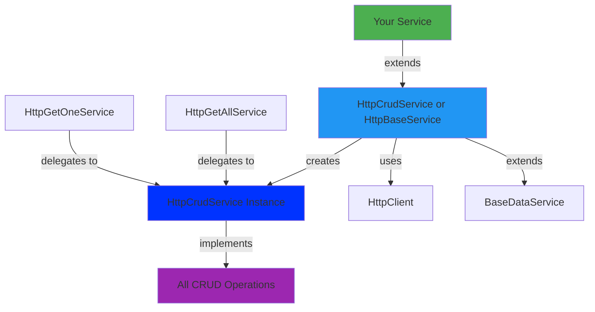

# api-http

- [api-http](#api-http)
  - [📦 What's Inside](#-whats-inside)
  - [🎯 Quick Start](#-quick-start)
    - [Option 1: Full CRUD Service](#option-1-full-crud-service)
    - [Option 2: Get all service](#option-2-get-all-service)
    - [Option 3: Get one service](#option-3-get-one-service)
    - [Option 4: Full get service](#option-4-full-get-service)
  - [Usage in Components/Stores](#usage-in-componentsstores)
  - [🏗️ Architecture](#️-architecture)
  - [� Configuration](#-configuration)
    - [Environment Setup](#environment-setup)
    - [Custom URL Segment](#custom-url-segment)
    - [Custom Response Mapping](#custom-response-mapping)
    - [Custom Error Handling](#custom-error-handling)

**HTTP/REST API utilities** for building type-safe data services.

## 📦 What's Inside

Base classes that implement common HTTP CRUD operations using a **composition pattern**:

- **`HttpCrudService`** - Complete CRUD implementation (recommended for full CRUD)
- **`HttpBaseService`** - Base class with HTTP client, URL configuration, and factory method
- **`HttpGetAllService`** - GET list with filtering, pagination, sorting
- **`HttpGetOneService`** - GET single item by ID
- **`HttpGetService`** - GET list and get one

All individual services delegate to `HttpCrudService` internally, ensuring consistent behavior and a single source of truth.

## 🎯 Quick Start

### Option 1: Full CRUD Service

Use `HttpCrudService` when you need all CRUD operations:

```typescript
// product-http.service.ts
import { Injectable } from '@angular/core';
import { HttpCrudService } from '@plastik/core/api-http';
import { Product } from './product.model';

@Injectable({ providedIn: 'root' })
export class ProductHttpService extends HttpCrudService<Product> {
  protected override resourceUrlSegment() {
    return 'products';
  }
}
```

### Option 2: Get all service

Use `HttpGetAllService` when you need to get a list of data:

```typescript
// product-http.service.ts
import { Injectable } from '@angular/core';
import { HttpGetAllService } from '@plastik/core/api-http';
import { Product } from './product.model';

@Injectable({ providedIn: 'root' })
export class ProductHttpService extends HttpGetAllService<Product> {
  protected override resourceUrlSegment() {
    return 'products';
  }
}
```

### Option 3: Get one service

Use `HttpGetOneService` when you need to get a single item by ID:

```typescript
// product-http.service.ts
import { Injectable } from '@angular/core';
import { HttpGetOneService } from '@plastik/core/api-http';
import { Product } from './product.model';

@Injectable({ providedIn: 'root' })
export class ProductHttpService extends HttpGetOneService<Product> {
  protected override resourceUrlSegment() {
    return 'products';
  }
}
```

### Option 4: Full get service

Use `HttpGetService` when you need all get operations:

```typescript
// product-http.service.ts
import { Injectable } from '@angular/core';
import { HttpGetService } from '@plastik/core/api-http';
import { Product } from './product.model';

@Injectable({ providedIn: 'root' })
export class ProductHttpService extends HttpGetService<Product> {
  protected override resourceUrlSegment() {
    return 'products';
  }
}
```

## Usage in Components/Stores

```typescript
@Component({ ... })
export class ProductListComponent {
  private productService = inject(ProductHttpService);

  // Get list
  products$ = this.productService.getList({
    page: 1,
    limit: 10
  });

  // Get one
  product$ = this.productService.getOne('product-id');

  // Create
  createProduct(data: Partial<Product>) {
    this.productService.create(data).subscribe();
  }

  // Update
  updateProduct(id: string, data: Partial<Product>) {
    this.productService.update(id, data).subscribe();
  }

  // Delete
  deleteProduct(id: string) {
    this.productService.delete(id).subscribe();
  }
}
```

## 🏗️ Architecture



**Key Design Pattern**: Individual operation services (like `HttpGetAllService`) delegate to `HttpCrudService` through a factory method in `HttpBaseService`. This ensures:

- Single source of truth for CRUD logic
- Consistent behavior across all operations
- Shared response mapping and error handling

## 🔧 Configuration

### Environment Setup

Your environment must include the base API URL:

```typescript
// environment.ts
export const environment = {
  baseApiUrl: 'https://api.example.com/v1',
};
```

### Custom URL Segment

Override `resourceUrlSegment()` to define your endpoint:

```typescript
protected override resourceUrlSegment() {
  return 'products'; // → https://api.example.com/v1/products
}
```

### Custom Response Mapping

Override mapping methods in `HttpBaseService` to transform API responses:

```typescript
@Injectable({ providedIn: 'root' })
export class ProductHttpService extends HttpCrudService<Product> {
  protected override resourceUrlSegment() {
    return 'products';
  }

  // Map list responses
  protected override mapListResponse(data: unknown): Product[] {
    const response = data as { items: Product[] };
    return response.items;
  }

  // Map individual item responses
  protected override mapItemResponse(data: unknown): Product {
    const item = data as Product;
    return {
      ...item,
      // Transform data as needed
      price: Number(item.price),
    };
  }
}
```

### Custom Error Handling

Inherited from `BaseDataService`:

```typescript
this.productService.getList().pipe(
  catchError(error => {
    // Errors are already formatted by BaseDataService.handleError()
    console.error('Failed to load products:', error);
    return of([]);
  })
);
```
