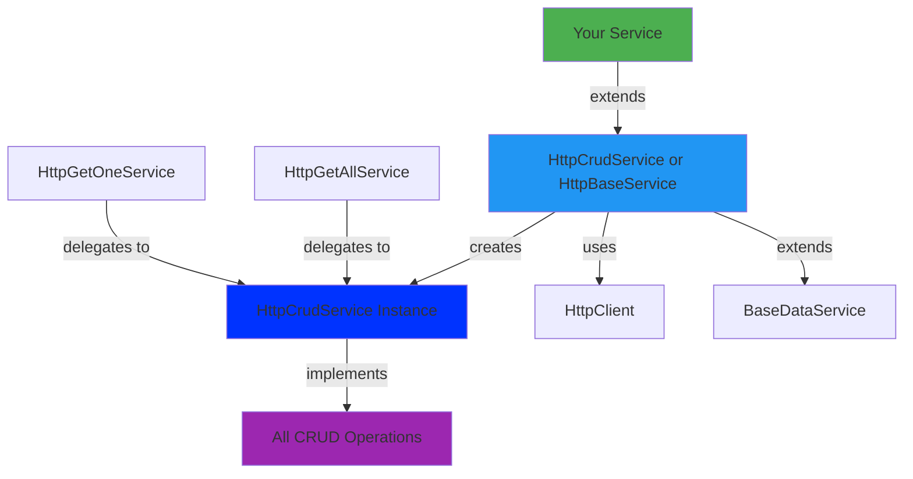

# @plastik/core/api-http


- [@plastik/core/api-http](#plastikcoreapi-http)
  - [Description](#description)
  - [Features](#features)
  - [Quick Start](#quick-start)
    - [Option 1: Full CRUD Service](#option-1-full-crud-service)
    - [Option 2: Read-Only Services](#option-2-read-only-services)
  - [Usage](#usage)
  - [Architecture](#architecture)
  - [Configuration](#configuration)
    - [Environment Setup](#environment-setup)
    - [Providers](#providers)
    - [Custom URL Segment](#custom-url-segment)
    - [Custom Response Mapping](#custom-response-mapping)
  - [Caching](#caching)

## Description

**HTTP REST API Implementation** using Angular's HttpClient. It implements the standard ApiBase contract for RESTful services, providing consistent error handling.

## Features

- **Composition Pattern**: Individual operation services delegate to a core CRUD service.
- **Type Safety**: Fully typed requests and responses.
- **Flexibility**: Base classes for List-only, Get-only, or Full CRUD operations.
- **Consistency**: Centralized error handling and response mapping.

## Quick Start

### Option 1: Full CRUD Service

Use `HttpCrudService` when you need all CRUD operations:

```typescript
// product-http.service.ts
import { Injectable } from '@angular/core';
import { HttpCrudService } from '@plastik/core/api-http';
import { Product } from './product.model';

@Injectable({ providedIn: 'root' })
export class ProductHttpService extends HttpCrudService<Product> {
  protected override resourceUrlSegment() {
    return 'products';
  }
}
```

### Option 2: Read-Only Services

- **Get All**: Extend `HttpGetAllService<T>`
- **Get One**: Extend `HttpGetOneService<T>`
- **Get Both**: Extend `HttpGetService<T>`

## Usage

```typescript
@Component({ ... })
export class ProductListComponent {
  private productService = inject(ProductHttpService);

  // Get list
  products$ = this.productService.getList({
    page: 1,
    limit: 10
  });

  // Get one
  product$ = this.productService.getOne('product-id');

  // Create
  createProduct(data: Partial<Product>) {
    this.productService.create(data).subscribe();
  }

  // Update
  updateProduct(id: string, data: Partial<Product>) {
    this.productService.update(id, data).subscribe();
  }

  // Delete
  deleteProduct(id: string) {
    this.productService.delete(id).subscribe();
  }
}
```

## Architecture



**Key Design Pattern**: Individual operation services (like `HttpGetAllService`) delegate to `HttpCrudService` through a factory method in `HttpBaseService`. This ensures:

- Single source of truth for CRUD logic
- Consistent behavior across all operations
- Shared response mapping and error handling

## Configuration

### Environment Setup

Your environment must include the base API URL:

```typescript
// environment.ts
import { EnvironmentWithApiUrl } from '@plastik/core/environments';

export const environment: EnvironmentWithApiUrl = {
  production: false,
  name: 'my-app',
  environment: 'development',
  baseApiUrl: 'https://api.example.com/v1',
};
```

### Providers

Provide the environment using the helper from `@plastik/core/environments`:

```typescript
import { ApplicationConfig } from '@angular/core';
import { provideWithApiEnv } from '@plastik/core/environments';
import { environment } from '../environments/environment';

export const appConfig: ApplicationConfig = {
  providers: [provideWithApiEnv(environment)],
};
```

### Custom URL Segment

Override `resourceUrlSegment()` to define your endpoint:

```typescript
protected override resourceUrlSegment() {
  return 'products'; // → https://api.example.com/v1/products
}
```

### Custom Response Mapping

Override mapping methods in `HttpBaseService` to transform API responses.

## Caching

- `getList` caches using `share({ connector: () => new ReplaySubject(1), resetOnComplete: () => timer(cacheTime) })`.
- Default `cacheTime` comes from `BaseDataService` (1 day).
- Override `cacheTime` in your service when you need a different window.
