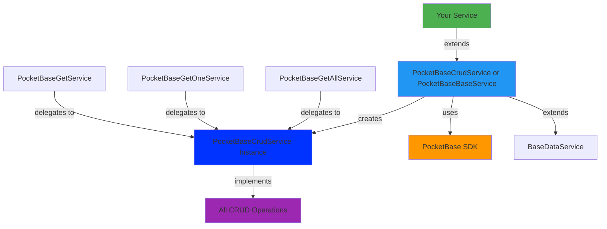

# api-pocketbase

- [api-pocketbase](#api-pocketbase)
  - [📦 What's Inside](#-whats-inside)
  - [🎯 Quick Start](#-quick-start)
    - [Option 1: Full CRUD Service](#option-1-full-crud-service)
    - [Option 2: Get all service](#option-2-get-all-service)
    - [Option 3: Get one service](#option-3-get-one-service)
    - [Option 4: Full get service](#option-4-full-get-service)
  - [Usage in Components/Stores](#usage-in-componentsstores)
  - [🏗️ Architecture](#️-architecture)
  - [🔧 Configuration](#-configuration)
    - [Environment Setup](#environment-setup)
    - [Collection Name](#collection-name)
    - [Custom Response Mapping](#custom-response-mapping)
    - [Custom Error Handling](#custom-error-handling)
  - [📚 Available Operations](#-available-operations)
    - [Get All (with Pagination)](#get-all-with-pagination)
    - [Get One](#get-one)
    - [Create](#create)
    - [Update](#update)
    - [Delete](#delete)
  - [💡 Advanced Usage](#-advanced-usage)
    - [Custom Methods](#custom-methods)
    - [Realtime Subscriptions](#realtime-subscriptions)
    - [File Uploads](#file-uploads)
  - [🔗 Related Libraries](#-related-libraries)
  - [📖 PocketBase Filter Syntax](#-pocketbase-filter-syntax)

**PocketBase API utilities** for building type-safe data services with PocketBase backend.

## 📦 What's Inside

Base classes that implement PocketBase CRUD operations using a **composition pattern**:

- **`PocketBaseCrudService`** - Complete CRUD implementation (recommended for full CRUD)
- **`PocketBaseBaseService`** - Base class with PocketBase client configuration
- **`PocketBaseGetAllService`** - List with filtering, pagination, sorting
- **`PocketBaseGetOneService`** - Get single record by ID
- **`PocketBaseGetService`** - Get list and get one

All individual services delegate to `PocketBaseCrudService` internally, ensuring consistent behavior and a single source of truth.

## 🎯 Quick Start

### Option 1: Full CRUD Service

Use `PocketBaseCrudService` when you need all CRUD operations:

```typescript
// product-pocketbase.service.ts
import { Injectable } from '@angular/core';
import { PocketBaseCrudService } from '@plastik/core/api-pocketbase';
import { Product } from './product.model';

@Injectable({ providedIn: 'root' })
export class ProductPocketBaseService extends PocketBaseCrudService<Product> {
  protected override collectionName() {
    return 'products';
  }
}
```

### Option 2: Get all service

Use `PocketBaseGetAllService` when you need to get a list of data:

```typescript
// product-pocketbase.service.ts
import { Injectable } from '@angular/core';
import { PocketBaseGetAllService } from '@plastik/core/api-pocketbase';
import { Product } from './product.model';

@Injectable({ providedIn: 'root' })
export class ProductPocketBaseService extends PocketBaseGetAllService<Product> {
  protected override collectionName() {
    return 'products';
  }
}
```

### Option 3: Get one service

Use `PocketBaseGetOneService` when you need to get a single item by ID:

```typescript
// product-pocketbase.service.ts
import { Injectable } from '@angular/core';
import { PocketBaseGetOneService } from '@plastik/core/api-pocketbase';
import { Product } from './product.model';

@Injectable({ providedIn: 'root' })
export class ProductPocketBaseService extends PocketBaseGetOneService<Product> {
  protected override collectionName() {
    return 'products';
  }
}
```

### Option 4: Full get service

Use `PocketBaseGetService` when you need all get operations (List + One):

```typescript
// product-pocketbase.service.ts
import { Injectable } from '@angular/core';
import { PocketBaseGetService } from '@plastik/core/api-pocketbase';
import { Product } from './product.model';

@Injectable({ providedIn: 'root' })
export class ProductPocketBaseService extends PocketBaseGetService<Product> {
  protected override collectionName() {
    return 'products';
  }
}
```

## Usage in Components/Stores

```typescript
@Component({ ... })
export class ProductListComponent {
  private productService = inject(ProductPocketBaseService);

  // Get paginated list with filter
  products$ = this.productService.getList({
    page: 1,
    perPage: 20,
    filter: 'category="electronics"',
    sort: '-created'
  });

  // Get single item
  product$ = this.productService.getOne('RECORD_ID');

  // Create new item
  createProduct(data: Partial<Product>) {
    this.productService.create({ name: 'New Product', price: 99.99 }).subscribe();
  }

  // Update
  updateProduct(id: string, data: Partial<Product>) {
    this.productService.update(id, data).subscribe();
  }

  // Delete
  deleteProduct(id: string) {
    this.productService.delete(id).subscribe();
  }
}
```

## 🏗️ Architecture



**Key Design Pattern**: Individual operation services (like `PocketBaseGetAllService`) delegate to `PocketBaseCrudService` through a factory method in `PocketBaseBaseService`. This ensures:

- Single source of truth for CRUD logic
- Consistent behavior across all operations
- Shared response mapping and error handling

## 🔧 Configuration

### Environment Setup

The service automatically injects the PocketBase client. Make sure `environment.baseApiUrl` is defined in your environment files.

```typescript
// environment.ts
export const environment = {
  baseApiUrl: 'https://pocketbase.example.com',
};
```

### Collection Name

Override `collectionName()` to define your PocketBase collection:

```typescript
protected override collectionName() {
  return 'products';
}
```

### Custom Response Mapping

Override mapping methods in `PocketBaseCrudService` (or your service) to transform API responses:

```typescript
@Injectable({ providedIn: 'root' })
export class ProductPocketBaseService extends PocketBaseCrudService<Product> {
  protected override collectionName() {
    return 'products';
  }

  // Map individual item responses
  protected override mapResponse(data: Product): Product {
    return {
      ...data,
      // Transform data as needed
      price: Number(data.price),
    };
  }
}
```

### Custom Error Handling

Inherited from `BaseDataService`:

```typescript
this.productService.getList().pipe(
  catchError(error => {
    // Errors are already formatted by BaseDataService.handleError()
    console.error('Failed to load products:', error);
    return of([]);
  })
);
```

## 📚 Available Operations

### Get All (with Pagination)

```typescript
getList(params?: {
  page?: number;
  perPage?: number;
  filter?: string;  // PocketBase filter syntax
  sort?: string;    // e.g., '-created,name'
  expand?: string;  // Relations to expand
}): Observable<ListResult<T>>
```

**Example:**

```typescript
// Get active products, sorted by price
this.productService.getList({
  filter: 'active=true && price>0',
  sort: '-price',
  perPage: 50,
});
```

### Get One

```typescript
getOne(id: string, options?: RecordOptions): Observable<T>
```

**Example:**

```typescript
// Get product with category relation expanded
this.productService.getOne('xyz123', { expand: 'category' });
```

### Create

```typescript
create(data: Partial<T>): Observable<T>
```

### Update

```typescript
update(id: string, data: Partial<T>): Observable<T>
```

### Delete

```typescript
delete(id: string): Observable<boolean>
```

## 💡 Advanced Usage

### Custom Methods

Add domain-specific methods to your service:

```typescript
@Injectable({ providedIn: 'root' })
export class ProductPocketBaseService extends PocketBaseCrudService<Product> {
  protected override collectionName() {
    return 'products';
  }

  getByCategory(categoryId: string) {
    return this.getList({
      filter: `category="${categoryId}"`,
      sort: 'name',
    });
  }

  getFeatured() {
    return this.getList({
      filter: 'featured=true',
      sort: '-created',
      perPage: 10,
    });
  }
}
```

### Realtime Subscriptions

PocketBase supports realtime updates.

```typescript
// Subscribe to changes
this.pb.collection('products').subscribe('*', e => {
  console.log(e.action); // create, update, delete
  console.log(e.record); // the changed record
});
```

### File Uploads

```typescript
create(data: Partial<Product>, file?: File) {
  const formData = new FormData();
  if (file) {
    formData.append('image', file);
  }
  Object.entries(data).forEach(([key, value]) => {
    formData.append(key, value as string | Blob);
  });

  return from(this.pb.collection(this.collectionName()).create(formData));
}
```

## 🔗 Related Libraries

- **`@plastik/core/api-base`** - Base interfaces and contracts
- **`@plastik/signal-state/pocketbase`** - NgRx Signal Store integration for PocketBase

## 📖 PocketBase Filter Syntax

Common filter examples:

```typescript
// Exact match
filter: 'status="active"';

// Comparison
filter: 'price > 100';

// Multiple conditions
filter: 'active=true && price > 0';

// Text search
filter: 'name ~ "phone"';

// Date comparison
filter: 'created >= "2024-01-01"';

// Relations
filter: 'category.name = "Electronics"';
```

[Full PocketBase filter documentation](https://pocketbase.io/docs/api-rules-and-filters/)
