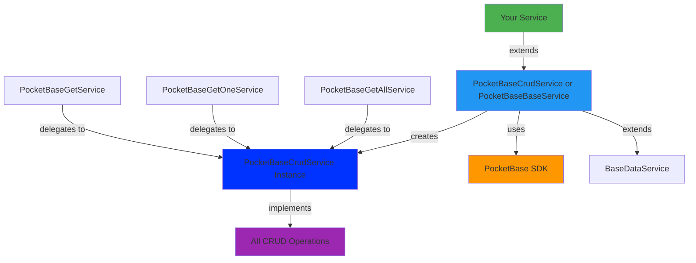

# @plastik/core/api-pocketbase


- [@plastik/core/api-pocketbase](#plastikcoreapi-pocketbase)
  - [Description](#description)
  - [Features](#features)
  - [Architecture](#architecture)
  - [Installation](#installation)
  - [Usage](#usage)
    - [Option 1: Full CRUD Service](#option-1-full-crud-service)
    - [Option 2: Read-Only Services](#option-2-read-only-services)
    - [Option 3: Component Usage](#option-3-component-usage)
  - [Configuration](#configuration)
    - [Environment Setup](#environment-setup)
    - [Providers](#providers)
  - [Available Operations](#available-operations)
    - [Get All (with Pagination)](#get-all-with-pagination)
    - [CRUD Operations](#crud-operations)
  - [PocketBase Filter Syntax](#pocketbase-filter-syntax)
  - [Caching](#caching)

## Description

The **PocketBase API Utilities** library provides a robust, type-safe foundation for building data services with a PocketBase backend.
It implements a set of base classes and utilities to streamline CRUD operations, ensuring consistency and reducing boilerplate.

## Features

- **Composition Pattern**: Flexible service architecture using delegation.
- **Type Safety**: Generic interfaces for fully typed requests and responses.
- **Automated Caching**: Built-in `shareReplay` caching for read operations.
- **Error Handling**: Centralized error management via `BaseDataService`.
- **Realtime**: Support for PocketBase realtime subscriptions.

## Architecture



**Key Design Pattern**: Individual operation services (like `PocketBaseGetAllService`) delegate to `PocketBaseCrudService` through a factory method in `PocketBaseBaseService`. This ensures:

- Single source of truth for CRUD logic
- Consistent behavior across all operations
- Shared response mapping and error handling

## Installation

This library is part of the core utilities. It should be imported into your data access libraries.

## Usage

### Option 1: Full CRUD Service

Use `PocketBaseCrudService` when you need all CRUD operations:

```typescript
// product-pocketbase.service.ts
import { Injectable } from '@angular/core';
import { PocketBaseCrudService } from '@plastik/core/api-pocketbase';
import { Product } from './product.model';

@Injectable({ providedIn: 'root' })
export class ProductPocketBaseService extends PocketBaseCrudService<Product> {
  protected override collectionName() {
    return 'products';
  }
}
```

### Option 2: Read-Only Services

- **Get All**: Extend `PocketBaseGetAllService<T>`
- **Get One**: Extend `PocketBaseGetOneService<T>`
- **Get Both**: Extend `PocketBaseGetService<T>`

### Option 3: Component Usage

```typescript
@Component({ ... })
export class ProductListComponent {
  private productService = inject(ProductPocketBaseService);

  // Get paginated list with filter
  products$ = this.productService.getList({
    page: 1,
    perPage: 20,
    filter: 'category="electronics"',
    sort: '-created'
  });
}
```

## Configuration

### Environment Setup

Use an environment that includes the PocketBase URL:

```typescript
// environment.ts
import { EnvironmentPocketBase } from '@plastik/core/environments';

export const environment: EnvironmentPocketBase = {
  production: false,
  name: 'eco-store',
  environment: 'development',
  baseApiUrl: 'https://pocketbase.example.com',
  client: 'eco-store',
  languages: ['en', 'ca'],
  defaultLanguage: 'en',
};
```

### Providers

Register the environment and the PocketBase client in your application providers:

```typescript
import { ApplicationConfig } from '@angular/core';
import {
  POCKETBASE_INSTANCE,
  pocketBaseFactory,
  providePocketBaseEnv,
} from '@plastik/core/api-pocketbase';
import { environment } from '../environments/environment';

export const appConfig: ApplicationConfig = {
  providers: [
    providePocketBaseEnv(environment),
    { provide: POCKETBASE_INSTANCE, useFactory: pocketBaseFactory },
  ],
};
```

## Available Operations

### Get All (with Pagination)

```typescript
getList(params?: {
  page?: number;     // Page number
  perPage?: number;  // Items per page
  filter?: string;   // PocketBase filter syntax
  sort?: string;     // e.g., '-created,name'
  expand?: string;   // Relations to expand
}): Observable<ListResult<T>>
```

### CRUD Operations

- **Get One**: `getOne(id: string, options?: RecordOptions)`
- **Create**: `create(data: Partial<T>, options?: RecordOptions)`
- **Update**: `update(id: string, data: Partial<T>, options?: RecordOptions)`
- **Delete**: `delete(id: string)`

## PocketBase Filter Syntax

Common filter examples:

```typescript
filter: 'active=true && price > 0'; // Multiple conditions
filter: 'name ~ "phone"'; // Text search
filter: 'created >= "2024-01-01"'; // Date comparison
```

[Full PocketBase filter documentation](https://pocketbase.io/docs/api-rules-and-filters/)

## Caching

- Reads are cached for **5 minutes** by default using `shareReplay`.
- Override `cacheTime` in your service to customize duration.

```typescript
protected override cacheTime = 1000 * 60 * 1; // 1 minute
```
