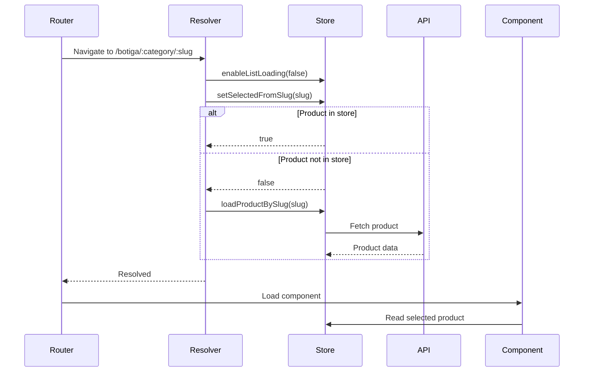

# @plastik/eco-store/products/feature/detail


- [@plastik/eco-store/products/feature/detail](#plastikeco-storeproductsfeaturedetail)
  - [Description](#description)
  - [Features](#features)
  - [Architecture](#architecture)
  - [Usage](#usage)
    - [Route Configuration](#route-configuration)
    - [Resolver](#resolver)
  - [Running unit tests](#running-unit-tests)

## Description

The **Eco Store Product Detail Feature** library provides the product detail page functionality for the Eco Store application.
It handles loading individual products by their URL slug and displays detailed product information.

Part of the [**Eco-Store**](../../../../../../../apps/eco-store/README.md) application.

## Features

- **Slug-based product loading**: Products are loaded by their normalized name (URL-friendly slug).
- **Smart caching**: First checks if the product is already in the store, avoiding unnecessary API calls.
- **Lazy loading support**: Disables list loading when viewing details to prevent unnecessary data fetching.
- **Error handling**: Redirects to home page if product is not found.
- **Resolver-based data loading**: Ensures product data is available before component renders.

## Architecture

The feature uses a resolver that:

1. Disables list loading (`enableListLoading(false)`)
2. Checks if product exists in store (`setSelectedFromSlug`)
3. If not found, fetches from API (`loadProductBySlug`)
4. Redirects to home if product doesn't exist



## Usage

### Route Configuration

The feature is typically used as a lazy-loaded route:

```typescript
{
  path: ':category/:slug',
  loadChildren: () => import('@plastik/eco-store/products/feature/detail')
    .then(m => m.ecoStoreProductFeatureRoutes),
}
```

### Resolver

The resolver (`ecoStoreProductResolver`) handles:

- Extracting `slug` from route parameters
- Disabling list loading for efficiency
- Loading product from store or API
- Redirecting on errors

## Running unit tests

Run `nx test eco-store-product-feature` to execute the unit tests via [Jest](https://jestjs.io/).
