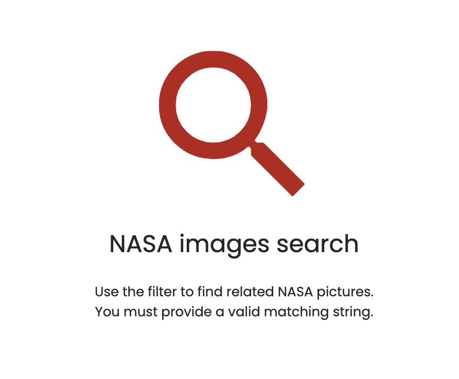

# nasa-images-search-ui-no-results

- [nasa-images-search-ui-no-results](#nasa-images-search-ui-no-results)
  - [Description](#description)
  - [How to use](#how-to-use)
  - [Running unit tests](#running-unit-tests)

## Description

A custom message for no results found when a query returns no results and we want to inform the user while hiding the results table.

## How to use

It uses content projection to clearly encapsulate HTML structure and main CSS styles.

| Selector    | Description                           |
| ----------- | ------------------------------------- |
| `[icon]`    | The icon to show in the UI            |
| `[title]`   | The title to show in the UI           |
| `[message]` | A secondary message to show in the UI |

## Running unit tests

Run `nx test nasa-images-search-ui-no-results` to execute the unit tests.
