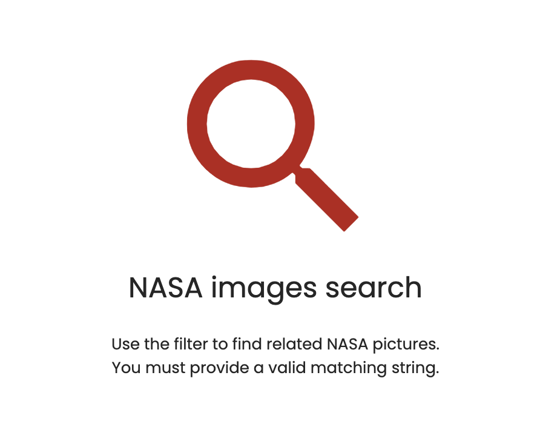

# @plastik/nasa-images/search/ui/no-results

- [@plastik/nasa-images/search/ui/no-results](#plastiknasa-imagessearchuino-results)
  - [Description](#description)
  - [How to use](#how-to-use)
  - [Running unit tests](#running-unit-tests)

## Description

This library provides a **UI component** to display a friendly message when **no search results** are found in the **NASA Images** application, ensuring a good user experience even when data is missing.

## How to use

It uses **content projection** to clearly encapsulate HTML structure and main CSS styles.

| Selector    | Description                           |
| ----------- | ------------------------------------- |
| `[icon]`    | The icon to show in the UI            |
| `[title]`   | The title to show in the UI           |
| `[message]` | A secondary message to show in the UI |

## Running unit tests

Run `nx test nasa-images-search-ui-no-results` to execute the unit tests.
