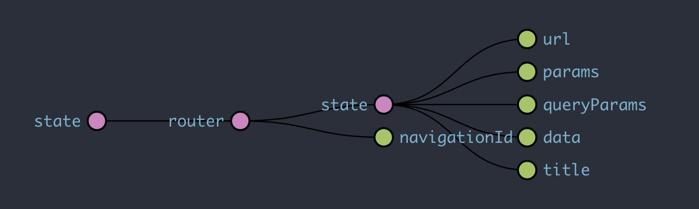

# router-state

- [router-state](#router-state)
  - [Description](#description)
  - [What happens when router state isn’t part of your central store](#what-happens-when-router-state-isnt-part-of-your-central-store)
    - [Code Duplication](#code-duplication)
    - [Inconsistency](#inconsistency)
    - [Unmaintainable](#unmaintainable)
  - [Router State Object](#router-state-object)
  - [How to use](#how-to-use)
    - [RouterState Actions](#routerstate-actions)
    - [Router title and Navigation](#router-title-and-navigation)
      - [Router title with app name prefix](#router-title-with-app-name-prefix)
      - [Custom router title](#custom-router-title)
    - [Selectors](#selectors)
  - [Running unit tests](#running-unit-tests)
  - [Useful links](#useful-links)

## Description

This library compiles common router state management using @ngrx/router.

The router is inserted in the store as a `router` segment, so any action that involves getting router URL, params, query params and any action that involves a route change must use this router store.

- Common actions (navigate, back, forward).
- Serialized state ({url, params, queryParams, title}).
- Update page title dynamically.
- Automatic scroll to top on router navigation.
- Internal unit testing.

## What happens when router state isn’t part of your central store

### Code Duplication

Letting components to extract path/query params from navigation/router-state and then use it to select respective state slices and/or dispatch actions we end up with:

- lot of code duplication between sibling components.
- unnecessary coupling between parent and children components where a child component may need a router param extracted by parent component alongside its own.

### Inconsistency

Users may navigate to a nested route directly, for example by clicking on a shared link, bookmark or even typing in route in the browser's navigation bar.
We need route params to establish/select the state for target component trees mounted in one or more the `<route-outlets/>` before anything meaningful can render.

### Unmaintainable

We can’t replay or jump across state snapshots using the redux dev tools as route changes if weren’t reduced by NgRx, can’t be jumped-to or re-played.

## Router State Object



```typescript
interface RouterStateUrl {
  url: any;
  params: Params;
  queryParams: Params;
  data: Record<string, unknown>;
  title: string;
}
```

## How to use

Changes to your imports on your app root module (app.module).

- Use `routerReducers` const into the StoreModule.
- Add StoreRouterConnectingModule with the custom serializer provided by the library ( `CustomRouterSerializer` ).
- Import `RouterStateEffects` to EffectsModule.forRoot.

```typescript
import {
    CustomRouterSerializer, routerReducers, RouterStateEffects
} from '@tvav/router-state';

StoreModule.forRoot(
      { reducers,...routerReducers },
      // ... other configuration parameters
    ),
    StoreRouterConnectingModule.forRoot({
      serializer: CustomRouterSerializer,
    }),
    EffectsModule.forRoot([RouterStateEffects]),
```

Every time a route change is dispatched, the local state will be updated.

### RouterState Actions

```typescript
// navigate to a given URL. Any segment must be part of the path param array

this.store.dispatch(go({ path: ['section'], params: {id: 1}, queryParams: {name: 'test'} }));

// navigate back

this.store.dispatch(back());

// navigate forward

this.store.dispatch(forward();

```

> On component templates, **always use routerLink directive** over a class store router `Go` action dispatch.
>
> Example: `<a [routerLink]="['new']">Add new user</a>`

### Router title and Navigation

For a specific title on any route, set a title property.

```typescript
{
  path: 'some-route',
  loadChildren: () => import('./containers/some/some.module').then(m => m.SomeModule),
  title: 'Some Title',
},
```

#### Router title with app name prefix

If you want to prefix your routes with the specific app name:

- you must have a name property in your Environment object as the main app name.
- you must provide `PrefixTitleService` as a TitleStrategy service and provide it in your root module.

```typescript
NgModule({
  providers: [
    {
      provide: ENVIRONMENT,
      useValue: environment,
    },
    {
      provide: TitleStrategy,
      useClass: PrefixTitleService,
    },
  ],
});
export class AppModule {}
```

#### Custom router title

For more complex title cooking, use @ngrx Effects like this:

```typescript
Injectable();
export class EntityEffects {
  updateTitle$ = createEffect(
    () => {
      return this.actions$.pipe(
        ofType(loadEntitySuccess),
        concatLatestFrom(() => [this.store.select(selectEntitySelected)]),
        filter(([, data]) => !!data && !isEmpty(data) && !isNil(data)),
        tap(([, data]) => {
          // this is the default title, with the defined route title and any TitleStrategy service applied.
          const mainTitle = this.titleService.getTitle();
          // the specific string to add to the main title. It could be a name, an ID that references that unique entity.
          const dataTitle = ' - ' + data?.title || 'no title';
          return this.titleService.setTitle(`${mainTitle}${avWorkTitle}`);
        }),
      );
    },
    { dispatch: false },
  );

  constructor(private readonly store: Store, private readonly titleService: Title) {}
}
```

You can see a working example here: [AvWorksEffects](../../libs/vod-panel/data-request/av-work/src/lib/+state/av-work.effects.ts)

### Selectors

You can listen to these selectors to use the router state parameters within your application:

- selectRouteUrl
- selectRouteParams
- selectRouteQueryParams
- selectRouteData
- selectRouteDataName

## Running unit tests

Run `nx test router-state` to execute the unit tests.

## Useful links

- [@ngrx/router-store](https://ngrx.io/guide/router-store)
- [NgRx Router Store | Reduce & Select Route Params](https://medium.com/simars/ngrx-router-store-reduce-select-route-params-6baff607dd9)
