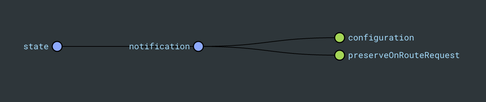

# shared-notification-data-access

- [shared-notification-data-access](#shared-notification-data-access)
  - [Description](#description)
  - [How to use](#how-to-use)
    - [Notification Service](#notification-service)
    - [Notification Store](#notification-store)
  - [Error Handler](#error-handler)
  - [Running unit tests](#running-unit-tests)
  - [Useful links](#useful-links)

## Description

A `@ngrx/signals` state segment and services to control the configuration and visibility of valuable notifications that gives users information about any app state change, including any errors or warnings.

## How to use

### Notification Service

Inject the `NotificationConfigService` and use the `getInstance` method to get the final configuration for the box notifications.

```typescript
export class CustomComponent {
  private readonly notificationService = inject(NotificationConfigService);

  constructor() {
    this.notificationService.getInstance({
      type: 'ERROR',
      message: '¡Error!',
      action: 'Cerrar',
      duration: 2500,
      preserve: true,
    });
  }
}
```

### Notification Store



```typescript
export interface NotificationState {
  configuration: Notification | null;
  preserveOnRouteRequest: boolean;
}
```

Inject the `notificationStore` and use the `show` and `dismiss` methods to control the visibility of the notification box.

```typescript
import { notificationStore } from './+state/notification.store';

class CustomComponent {
  private readonly notificationStore = inject(notificationStore);

  showError(error: Error | string) {
    this.notificationStore.show({
      type: 'ERROR',
      message: error instanceof Error ? error.message : error,
      action: 'Cerrar',
      preserve: true,
    });
  }

  dismissError() {
    this.notificationStore.dismiss();
  }
}
```

## Error Handler

Add the `ErrorHandlerService` to the providers array of the app.config.ts file using the native ErrorHandler token.

```typescript
export const appConfig: ApplicationConfig = {
  providers: [
    // other providers
    {
      provide: ErrorHandler,
      useClass: ErrorHandlerService,
    },
  ],
};
```

Any error thrown in the application will be caught by the `ErrorHandlerService` and a notification will be shown in the UI using the `notificationStore` and the `NotificationConfigService`.

```typescript
throw new Error('This is an error'); // This will show a notification of type `error` in the UI with the error message `This is an error`
```

## Running unit tests

Run `nx test shared-notification-data-access` to execute the unit tests.

## Useful links

- [Angular ErrorHandler](https://angular.io/api/core/ErrorHandler)
