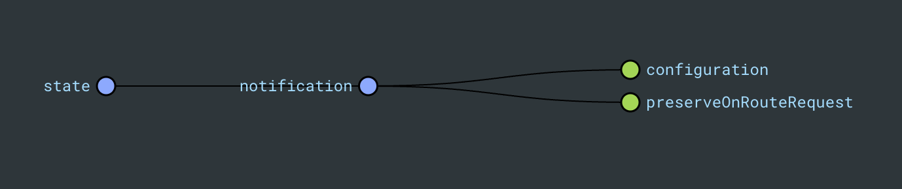

# @plastik/shared/notification/data-access


- [@plastik/shared/notification/data-access](#plastiksharednotificationdata-access)
  - [Description](#description)
  - [Architecture](#architecture)
  - [How to use](#how-to-use)
    - [Notification Service](#notification-service)
    - [Notification Store](#notification-store)
  - [Error Handler](#error-handler)
  - [Running unit tests](#running-unit-tests)
  - [Resources](#resources)

## Description

A `@ngrx/signals` state segment and services to control the configuration and visibility of notifications. It provides feedback to users about app state changes, errors, or warnings.

## Architecture



**State Interface:**

```typescript
export interface NotificationState {
  configuration: Notification | null;
  preserveOnRouteRequest: boolean;
}
```

## How to use

### Notification Service

Inject `NotificationConfigService` to generate standard notification configurations.

```typescript
@Component({ ... })
export class CustomComponent {
  private readonly notificationService = inject(NotificationConfigService);

  constructor() {
    const config = this.notificationService.getInstance({
      type: 'ERROR',
      message: 'Error!',
      action: 'Close',
      duration: 2500,
      preserve: true,
    });
  }
}
```

### Notification Store

Inject `notificationStore` to control the visibility of the notification box.

```typescript
import { notificationStore } from './+state/notification.store';

@Component({ ... })
export class FeatureComponent {
  private readonly notificationStore = inject(notificationStore);

  showError(error: Error | string) {
    this.notificationStore.show({
      type: 'ERROR',
      message: error instanceof Error ? error.message : error,
      action: 'Close',
      preserve: true,
    });
  }

  dismiss() {
    this.notificationStore.dismiss();
  }
}
```

## Error Handler

Add `ErrorHandlerService` to `app.config.ts` to automatically catch errors and show notifications.

```typescript
export const appConfig: ApplicationConfig = {
  providers: [
    {
      provide: ErrorHandler,
      useClass: ErrorHandlerService,
    },
  ],
};
```

> **Note:** Any thrown error will be caught, and a notification of type `error` will be displayed.

## Running unit tests

Run `nx test shared-notification-data-access` to execute the unit tests.

## Resources

- [Angular ErrorHandler](https://angular.io/api/core/ErrorHandler)
