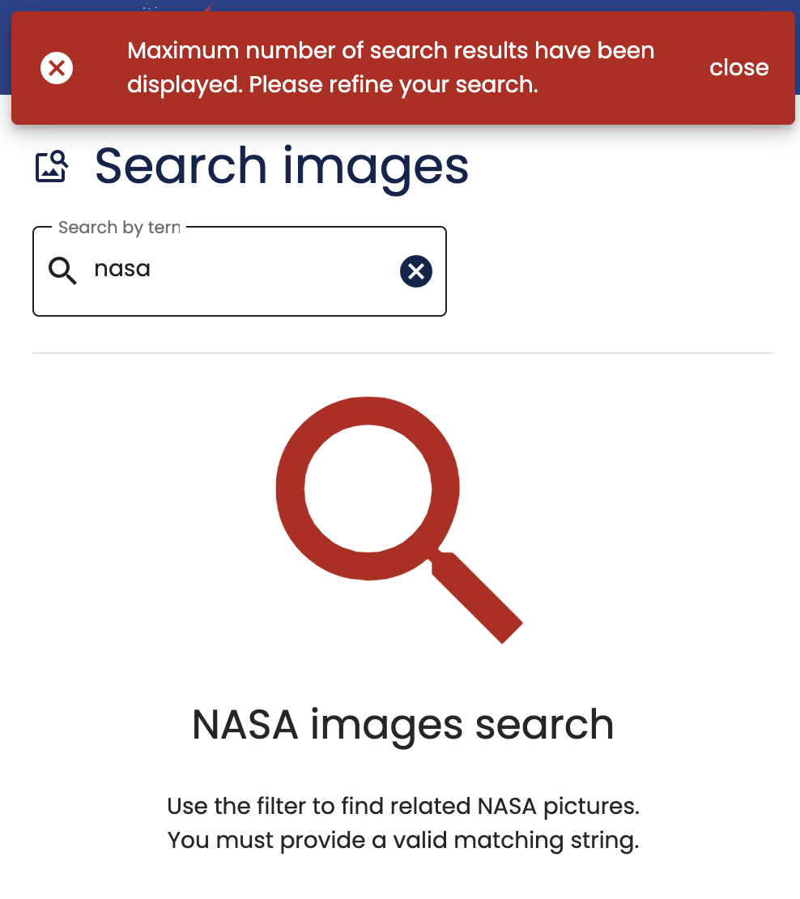

# @plastik/shared/notification/ui/mat-snackbar


- [@plastik/shared/notification/ui/mat-snackbar](#plastiksharednotificationuimat-snackbar)
  - [Description](#description)
  - [HTML elements](#html-elements)
  - [Inputs](#inputs)
  - [Outputs](#outputs)
  - [How to use](#how-to-use)
    - [1. Add it to your feature component](#1-add-it-to-your-feature-component)
    - [2. Styling](#2-styling)
    - [3. Snackbar configuration (optional)](#3-snackbar-configuration-optional)
  - [Running unit tests](#running-unit-tests)
  - [Resources](#resources)

## Description

A visual notification using **Material Snackbar** to warn users about different important information in some state change.



It has by default 4 different states:

- `Error`: Important information that blocks the user flow and/or needs to take some action.
- `Warning`: Information with no blocking state.
- `Success`: Information about any action or state change that succeeds.
- `Info`: Other relevant not blocking information that we want to share with the user and doesn't need any further action.

## HTML elements

It exposes the `NotificationUiMatSnackbarDirective` to use.

`[plastikSnackbar]`

## Inputs

| Name                         | Type                              | Description                                   | Default |
| :--------------------------- | :-------------------------------- | :-------------------------------------------- | :------ |
| `plastikSnackbar` (`config`) | `MatSnackBarConfig<Notification>` | The configuration to styling the notification |         |

## Outputs

| Name          | Type                 | Description                             |
| :------------ | :------------------- | :-------------------------------------- |
| `sendDismiss` | `EventEmitter<void>` | Emitted when the snackBar is dismissed. |

## How to use

### 1. Add it to your feature component

```html
<!-- feature.component.html -->

<div [plastikSnackbar]="snackBarConfiguration" (sendDismiss)="onNotificationDismiss()"></div>
```

```typescript
// feature.component.ts
import { Notification } from '@plastik/shared/notification/entities';

@Component({
  selector: 'plastik-feature',
  imports: [NotificationUiMatSnackbarDirective],
})
export class CoreCmsLayoutFeatureComponent {
  snackBarConfiguration: Notification = {
    type: MessageType.Info,
    message: 'Test',
    action: 'close',
  };

  onNotificationDismiss() {
    // dispatch any action when snackBar is dismissed
    console.log('RESET');
  }
}
```

### 2. Styling

You can overwrite the styles from your main application declaring these CSS variables in your app `styles/_theme.scss` file:

```css
- --plastik-error-notification-box-color: rgb(195, 6, 6);
- --plastik-info-notification-box-color: rgb(14, 122, 190);
- --plastik-warning-notification-box-color: rgb(221, 148, 20);
- --plastik-success-notification-box-colors: rgb(22, 134, 40);
```

### 3. Snackbar configuration (optional)

If you want to adjust some of the snackbar material component properties, use the [`MAT_SNACK_BAR_DEFAULT_OPTIONS`](https://material.angular.io/components/snack-bar/api#MAT_SNACK_BAR_DEFAULT_OPTIONS) token.

```typescript
// apps/my-app/src/main.ts
import { MAT_SNACK_BAR_DEFAULT_OPTIONS } from '@angular/material/snack-bar';

bootstrapApplication(AppComponent, {
  providers: [
    {
      provide: MAT_SNACK_BAR_DEFAULT_OPTIONS,
      useValue: {
        verticalPosition: 'top',
        politeness: 'assertive',
      },
    },
  ],
});
```

## Running unit tests

Run `nx test shared-notification-ui-mat-snackbar` to execute the unit tests.

## Resources

- [MatSnackBar](https://material.angular.io/components/snack-bar)
