# Data Access Firebase

- [Data Access Firebase](#data-access-firebase)
  - [📚 Overview](#-overview)
  - [🏗️ Architecture](#️-architecture)
  - [🚀 Usage](#-usage)
    - [1. Create a Store Feature](#1-create-a-store-feature)
    - [2. Use in a Component](#2-use-in-a-component)
  - [🔧 Configuration](#-configuration)
  - [� Related Libraries](#-related-libraries)

## 📚 Overview

`data-access-firebase` provides **Signal Store features** that wrap the generic Firebase CRUD services from `@plastik/core/util/api-firebase`.
It connects the **NgRx Signal Store** pattern with reusable Firebase base services, giving you a ready‑to‑use store for any entity.

## 🏗️ Architecture

```mermaid
graph TD
    A[StoreFirebaseCrudState] -->|uses| B[EntityFireService]
    A -->|provides| C[Signal Store Feature]
    B -->|calls| D[AngularFire Firestore]
    style A fill:#003600
    style B fill:#003699
    style D fill:#333366
```



## 🚀 Usage

### 1. Create a Store Feature

```typescript
// product-store.feature.ts
import { createFeature, withFirebaseCrud } from '@plastik/signal-state/firebase';
import { ProductFireService } from '@plastik/core/api-firebase';

export const PRODUCT_STORE = createFeature({
  name: 'product',
  providers: [ProductFireService],
  feature: withFirebaseCrud<Product, ProductFireService>({
    featureName: 'product',
    dataServiceType: ProductFireService,
  }),
});
```

### 2. Use in a Component

```typescript
@Component({ ... })
export class ProductListComponent {
  private store = inject(PRODUCT_STORE);
  products$ = this.store.selectAll();

  ngOnInit() {
    this.store.load(); // triggers EntityFireService.getAll()
  }
}
```

## 🔧 Configuration

- **Environment**: Ensure Firebase is initialized in your app module.
- **Collection Name**: Override `getCollectionName()` in your Firebase service to point to the correct Firestore collection.

## 🔗 Related Libraries

- `@plastik/core/api-firebase` – generic Firebase CRUD base services.
- `@plastik/signal-state/firebase` – Signal Store wrappers for Firebase.
- `@plastik/core/api-base` – contract interfaces used by the Firebase services.
