# data-access-http

- [data-access-http](#data-access-http)
  - [📚 Overview](#-overview)
  - [🏗️ Architecture](#️-architecture)
  - [🚀 Usage](#-usage)
    - [Option 1: Read-Only List (`withHttpGetList`)](#option-1-read-only-list-withhttpgetlist)
    - [Option 2: List + Detail (`withHttpGet`)](#option-2-list--detail-withhttpget)
    - [Option 3: Full CRUD (`withHttpCrud`)](#option-3-full-crud-withhttpcrud)
  - [🔧 Configuration](#-configuration)
  - [💡 Advanced Usage](#-advanced-usage)
    - [Automatic Entity Management](#automatic-entity-management)
    - [Entity Selectors (from `withEntities`)](#entity-selectors-from-withentities)
    - [State Properties](#state-properties)
    - [Notifications](#notifications)
  - [🔗 Related Libraries](#-related-libraries)

## 📚 Overview

`data-access-http` provides **3 simplified Signal Store features** for different use cases:

1. **`withHttpGetList`** - Read-only list (display only)
2. **`withHttpGet`** - List + detail view (read operations)
3. **`withHttpCrud`** - Full CRUD (create, read, update, delete)

**Key Features:**

- Uses `withEntities` from `@ngrx/signals/entities` for efficient entity management
- Provides entity selectors (`entities`, `entityMap`, `ids`)
- Built-in state tracking (`initiallyLoaded`, `count`, `selectedItemId`)
- Automatic notifications for success/error states
- Supports `HttpListResult<T>` format (`{ items: T[], total: number }`)

## 🏗️ Architecture

```mermaid
graph TD
    A[withHttpGetList] -->|read-only| B[getList]
    C[withHttpGet] -->|read| D[getList + getOne]
    E[withHttpCrud] -->|full CRUD| F[getList + getOne + create + update + delete]

    B --> G[withEntities]
    D --> G
    F --> G

    G --> H[entities, entityMap, ids]

    style A fill:#003600
    style C fill:#003600
    style E fill:#003600
    style G fill:#003699
```



## 🚀 Usage

### Option 1: Read-Only List (`withHttpGetList`)

Use when you only need to **display a list** of items (no detail view, no mutations).

```typescript
// product-list.store.ts
import { signalStore } from '@ngrx/signals';
import { withHttpGetList } from '@plastik/signal-state/http';
import { ProductHttpService } from './product-http.service';

export const ProductListStore = signalStore(
  { providedIn: 'root' },
  withHttpGetList<Product, ProductHttpService>({
    featureName: 'productList',
    dataServiceType: ProductHttpService,
  })
);

// component
@Component({ ... })
export class ProductListComponent {
  store = inject(ProductListStore);

  products = this.store.entities;        // Signal<Product[]>
  count = this.store.count;              // Signal<number>
  loaded = this.store.initiallyLoaded;   // Signal<boolean>

  ngOnInit() {
    this.store.getList({ page: 1, limit: 10 });
  }
}
```

### Option 2: List + Detail (`withHttpGet`)

Use when you need to **display a list AND view individual item details**.

```typescript
// product.store.ts
import { signalStore } from '@ngrx/signals';
import { withHttpGet } from '@plastik/signal-state/http';
import { ProductHttpService } from './product-http.service';

export const ProductStore = signalStore(
  { providedIn: 'root' },
  withHttpGet<Product, ProductHttpService>({
    featureName: 'product',
    dataServiceType: ProductHttpService,
  })
);

// list component
@Component({ ... })
export class ProductListComponent {
  store = inject(ProductStore);
  products = this.store.entities;

  ngOnInit() {
    this.store.getList({ page: 1, limit: 10 });
  }
}

// detail component
import { computed } from '@angular/core';

@Component({ ... })
export class ProductDetailComponent {
  store = inject(ProductStore);
  route = inject(ActivatedRoute);

  selectedId = this.store.selectedItemId;      // Signal<string | null>
  selectedProduct = computed(() => {           // Computed from entityMap
    const id = this.selectedId();
    return id ? this.store.entityMap()[id] : null;
  });

  ngOnInit() {
    const id = this.route.snapshot.params['id'];
    this.store.getOne(id);
  }
}
```

### Option 3: Full CRUD (`withHttpCrud`)

Use when you need **complete create, read, update, delete functionality**.

```typescript
// product.store.ts
import { signalStore } from '@ngrx/signals';
import { withHttpCrud } from '@plastik/signal-state/http';
import { ProductHttpService } from './product-http.service';

export const ProductStore = signalStore(
  { providedIn: 'root' },
  withHttpCrud<Product, ProductHttpService>({
    featureName: 'product',
    dataServiceType: ProductHttpService,
  })
);

// component
@Component({ ... })
export class ProductManagementComponent {
  store = inject(ProductStore);

  products = this.store.entities;        // Signal<Product[]>
  count = this.store.count;              // Signal<number>
  loaded = this.store.initiallyLoaded;   // Signal<boolean>

  ngOnInit() {
    this.store.getList({ page: 1, limit: 10 });
  }

  createProduct(data: Partial<Product>) {
    this.store.create(data);
    // Entity is automatically added to the collection
    // Success/error notifications are shown automatically
  }

  updateProduct(id: string, data: Partial<Product>) {
    this.store.update({ id, data });
    // Entity is automatically updated in the collection (if returned by API)
    // Success/error notifications are shown automatically
  }

  deleteProduct(id: string) {
    this.store.delete(id);
    // Entity is automatically removed from the collection
    // Success/error notifications are shown automatically
  }
}
```

## 🔧 Configuration

**Service Requirements:**

Your HTTP service must implement the appropriate interface from `@plastik/core/api-base`:

- `DataGetList<T, HttpListResult<T>>` for `withHttpGetList`
- `DataGet<T, HttpListResult<T>>` for `withHttpGet`
- `DataCrud<T, HttpListResult<T>>` for `withHttpCrud`

**Response Format:**

All list operations must return `HttpListResult<T>`:

```typescript
interface HttpListResult<T> {
  items: T[];
  total: number;
}
```

**Parameter Type:**

Use `Record<string, unknown>` for list parameters (e.g., pagination, filters).

## 💡 Advanced Usage

### Method Behavior

All data-fetching methods use `rxMethod` from `@ngrx/signals/rxjs-interop`:

- **`getList()`**: Debounced (300ms) and deduplicated list fetching
- **`getOne()`**: Immediate single-item fetching (no debounce)
- **`create()`, `update()`, `delete()`**: Immediate mutations (no debounce)

### Automatic Entity Management

All stores use `@ngrx/signals/entities` for optimized entity operations:

- **Create**: Adds entity to collection with `addEntity()` and increments `count`
- **Update**: Updates entity with `updateEntity()` if API returns updated entity (supports `T | void`)
- **Delete**: Removes entity with `removeEntity()` and decrements `count`

### Entity Selectors (from `withEntities`)

All stores provide these entity selectors:

- **`entities()`** - Signal with array of all entities
- **`entityMap()`** - Signal with dictionary of entities by ID
- **`ids()`** - Signal with array of entity IDs

### State Properties

**Common to all stores:**

- **`initiallyLoaded`** - `Signal<boolean>` - Has the list been loaded at least once?
- **`count`** - `Signal<number>` - Total count from API response

**Additional in `withHttpGet` and `withHttpCrud`:**

- **`selectedItemId`** - `Signal<IdType<T> | null>` - ID of the selected item (set by `getOne()`)

**Note:** For `withHttpCrud`, state for `creating`, `updating`, `deleting` has been removed. Use the automatic notifications system instead.

### Notifications

All stores automatically show notifications via `notificationStore`:

- **Success** notifications on successful operations
- **Error** notifications on failed operations with error messages

## 🔗 Related Libraries

- `@plastik/core/api-http` – generic HTTP CRUD base services.
- `@plastik/signal-state/http` – Signal Store wrappers for HTTP.
- `@plastik/core/api-base` – contract interfaces used by the HTTP services.
- `@ngrx/signals/entities` – Entity management utilities.
