# data-access-pocketbase

- [data-access-pocketbase](#data-access-pocketbase)
  - [📚 Overview](#-overview)
  - [🏗️ Architecture](#️-architecture)
  - [🚀 Usage](#-usage)
    - [1. Available Features](#1-available-features)
    - [2. Create a Store Feature](#2-create-a-store-feature)
    - [3. Use in a Component](#3-use-in-a-component)
    - [4. Entity Selectors](#4-entity-selectors)
  - [🔧 Configuration](#-configuration)
  - [💡 Advanced Usage](#-advanced-usage)
  - [🔗 Related Libraries](#-related-libraries)

## 📚 Overview

`data-access-pocketbase` provides **Signal Store features** that wrap the generic PocketBase CRUD services from `@plastik/core/util/api-pocketbase`.
It connects the **NgRx Signal Store** pattern with reusable PocketBase base services, giving you a ready‑to‑use store for any entity.

**Key Features:**

- **Modular Design**: Composable features for List, GetOne, and CRUD operations.
- **Entity Management**: Uses `withEntities` from `@ngrx/signals/entities` for efficient state management.
- **Built-in Logic**: Pagination, filtering, sorting, and error handling out of the box.
- **Reactive**: Fully signal-based architecture.

## 🏗️ Architecture

The library is built on a modular architecture where specific functionalities are encapsulated in reusable features:

- **`withPocketBaseListFeature`**: Handles list operations (pagination, sorting, filtering) and entity state.
- **`withPocketBaseGetOneFeature`**: Handles single item retrieval and selection state.
- **`withPocketBaseCrud`**: Composes the above features and adds `create`, `update`, and `delete` methods.

```mermaid
graph TD
    A[withPocketBaseCrud] -->|composes| B[withPocketBaseListFeature]
    A -->|composes| C[withPocketBaseGetOneFeature]
    B -->|manages| D[Entities & Pagination]
    C -->|manages| E[Selected Item]
    A -->|adds| F[Create/Update/Delete]
    style A fill:#003600
    style B fill:#333366
    style C fill:#333366
    style D fill:#333333
    style E fill:#333333
    style F fill:#995533
```



## 🚀 Usage

### 1. Available Features

Choose the feature that fits your needs:

- **`withPocketBaseGetList`**: Read-only list operations.
- **`withPocketBaseGet`**: List operations + Get One (Read-only).
- **`withPocketBaseCrud`**: Full CRUD operations (List, GetOne, Create, Update, Delete).

### 2. Create a Store Feature

```typescript
// product-store.feature.ts
import { signalStore, type } from '@ngrx/signals';
import { withPocketBaseCrud } from '@plastik/shared/signal-state/data-access-pocketbase';
import { ProductPocketBaseService } from '@plastik/core/api-pocketbase';
import { Product } from './product.model';

export const ProductStore = signalStore(
  { providedIn: 'root' },
  withPocketBaseCrud<Product, ProductPocketBaseService>({
    featureName: 'product',
    dataServiceType: ProductPocketBaseService,
  })
);
```

### 3. Use in a Component

```typescript
@Component({ ... })
export class ProductListComponent {
  readonly store = inject(ProductStore);

  // Entity selectors from withEntities
  products = this.store.entities;        // Signal<Product[]>
  productMap = this.store.entityMap;     // Signal<Record<string, Product>>

  // State selectors
  count = this.store.count;
  isLoaded = this.store.initiallyLoaded;
  selectedId = this.store.selectedItemId;

  ngOnInit() {
    // Automatically loads list on init
  }

  filterProducts(category: string) {
    this.store.setParams({ filter: { category } });
  }

  changePage(page: number) {
    this.store.setParams({ pagination: { page, perPage: 10 } });
  }

  selectProduct(id: string) {
    this.store.getOne(id);
  }
}
```

### 4. Entity Selectors

The store uses `withEntities` which provides:

- **`entities()`** - Array of all entities.
- **`entityMap()`** - Dictionary of entities by ID.
- **`ids()`** - Array of entity IDs.
- **`count()`** - Total count from API.
- **`initiallyLoaded()`** - Whether data has been loaded (initial load).
- **`selectedItemId()`** - ID of the currently selected item (if using Get/Crud).

## 🔧 Configuration

- **Environment**: Ensure any required PocketBase configuration (URL, auth) is provided in your app module.
- **Custom Collection Name**: Override `collectionName` in your PocketBase service to point to the correct collection.

## 💡 Advanced Usage

- **Composability**: You can mix these features with your own custom store features.
- **Custom Actions**: The `rxMethod`s (`getList`, `getOne`, etc.) are exposed and can be triggered manually or reactively.
- **State Updates**: `setParams` allows partial updates to pagination, sort, or filter state, triggering a reload of the list.

## 🔗 Related Libraries

- `@plastik/core/api-pocketbase` – generic PocketBase CRUD base services.
- `@plastik/shared/signal-state/data-access-pocketbase` – Signal Store wrappers for PocketBase.
- `@plastik/core/api-base` – contract interfaces used by the PocketBase services.
- `@ngrx/signals/entities` – Entity management utilities.
